# 310ga Ühendamise Juhend

## <span style="color: red;">NB! TÄHTIS! ENNE LABORIT LOE JUHEND HOOLIKALT LÄBI!</span>

## Seadmed ja materjalid, mida vajad

### 1. Serveriruum
https://et.wikipedia.org/wiki/Seadmep%C3%BCstik  
ehk serverikapp on tugevatest metallraamidest koosnev standardsete mõõtudega raamistik, mille külge on võimalik kinnitada erinevaid telekommunikatsiooniseadmeid – eelkõige võrguseadmeid ja servereid, kuid ka palju muid seadmeid. Igat kinnitatud seadet nimetatakse mooduliks. Seadmepüstiku levinuim standard on 19-tolline seadmepüstik, millele kinnitatavate moodulite esipaneeli laius koos kinnituskohtadega on 19 tolli.

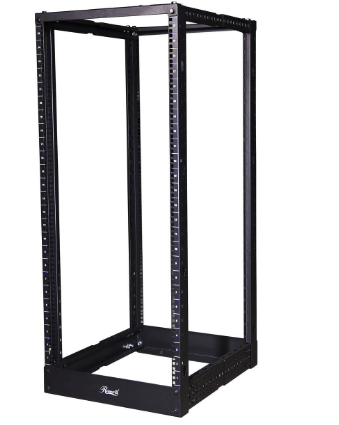

*Serveriruumis asuv kapp K1, kuhu on ühendatud klassiruumi 310 kaablid.*

### 2. Patch-paneelid
Patch-paneelid on passiivsed ühendusseadmed, mis võimaldavad luua ühenduse erinevate võrgukomponentide vahel.

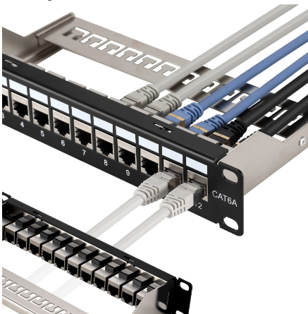

*Patch-paneel serveriruumis. Siniste kaablitega ühendatud pordid on saadaval kasutamiseks.*

### 3. Kommutaatorid (Switch-id)
Võrgu kommutaatorid, mida kasutad laboratoorses töös.

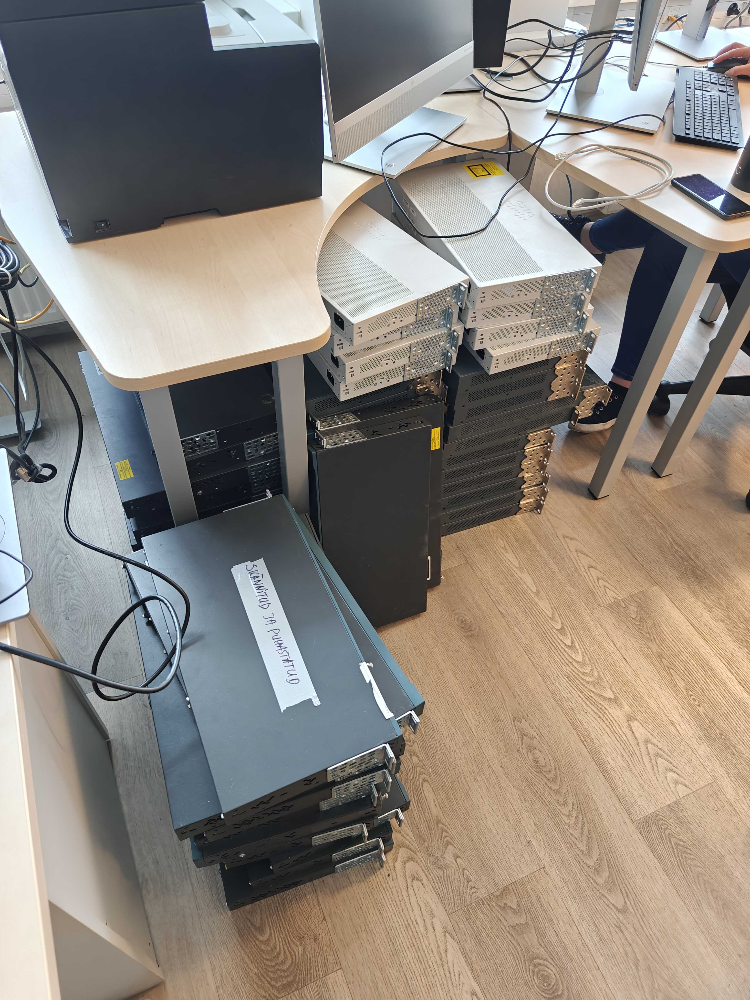

Toitekaablid on siin:

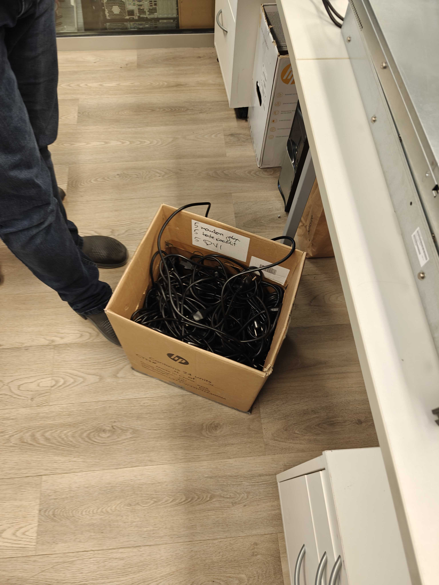

*Vabad kommutaatorid õpetaja laua juures, kui serverirackis pole vabu seadmeid.*

### 4. Konsoolikaablid
Erinevat tüüpi kaablid kommutaatoriga ühendumiseks:
- USB-to-Serial konsoolikaablid
- RJ45-to-Serial konsoolikaablid
- USB-to-RJ45 konsoolikaablid

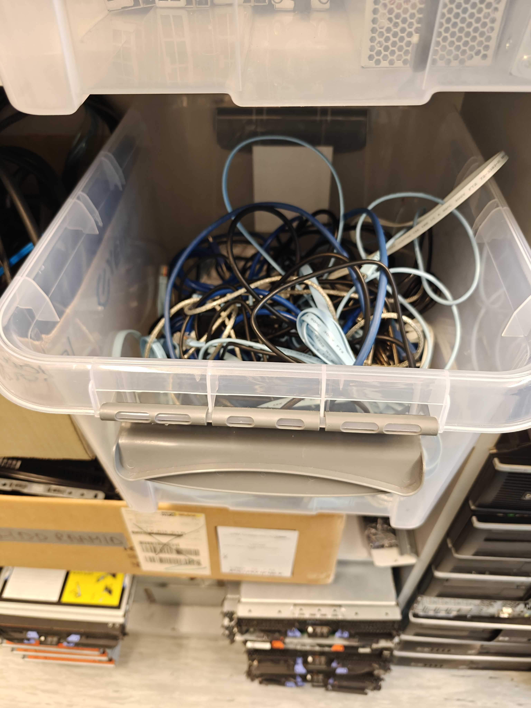

*Kast konsoolikaablitega.*

### 5. Patch-kaablid
Võrgukaablid seadmete ühendamiseks patch-paneeliga.

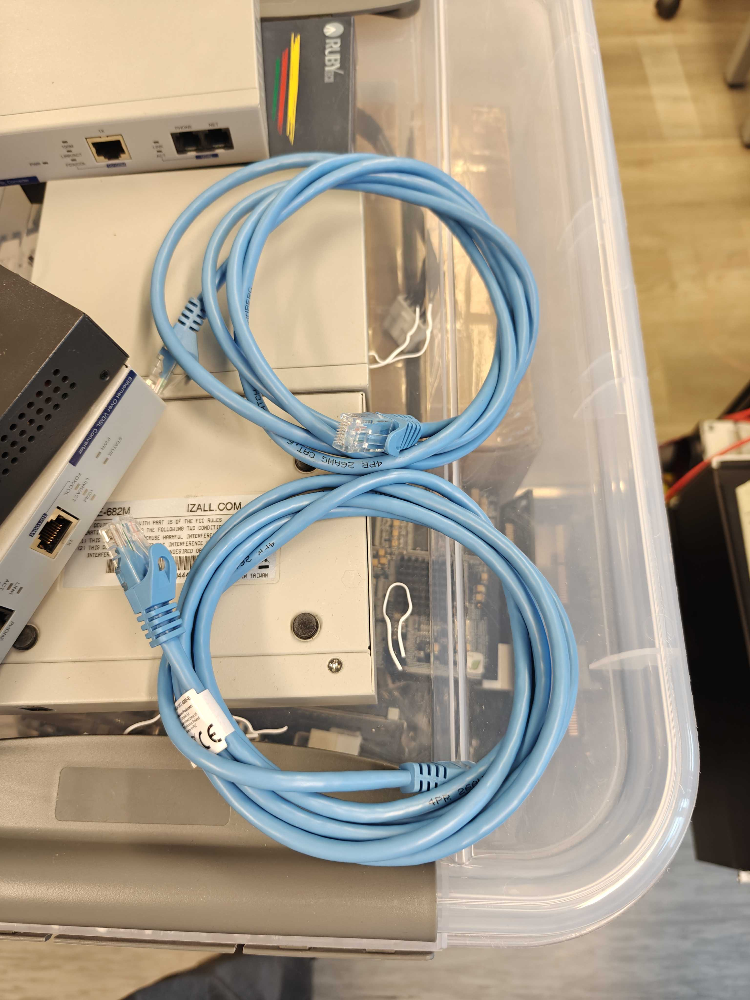

*Kast patch-kaablitega.*

## Ühenduste loomine serveriruumis

### 1. Tuvasta oma töökoha pordi number
Kontrolli oma töölaua all või ääres olevat pordi numbrit (näiteks port 21.1). 

<span style="color: orange; font-weight: bold;">HOIATUS: Kõrval sa näed pordi, mis on juba võetud (pildil port 21), see on juba võetud (Klassi Internet) - ÄRA TEE MIDAGI SELLEGA!!!</span>

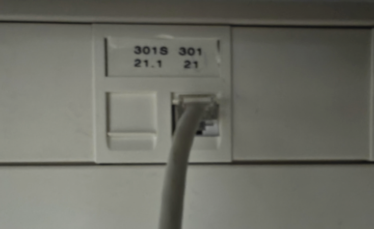

### 2. Leia serveriruumis vastav patch-paneeli port
Mine serveriruumi ja leia kapis K1 patch-paneelil vastav port, mis vastab sinu töökoha numbrile. Serveriruumis - kapp K1, esimese panel (kahest).

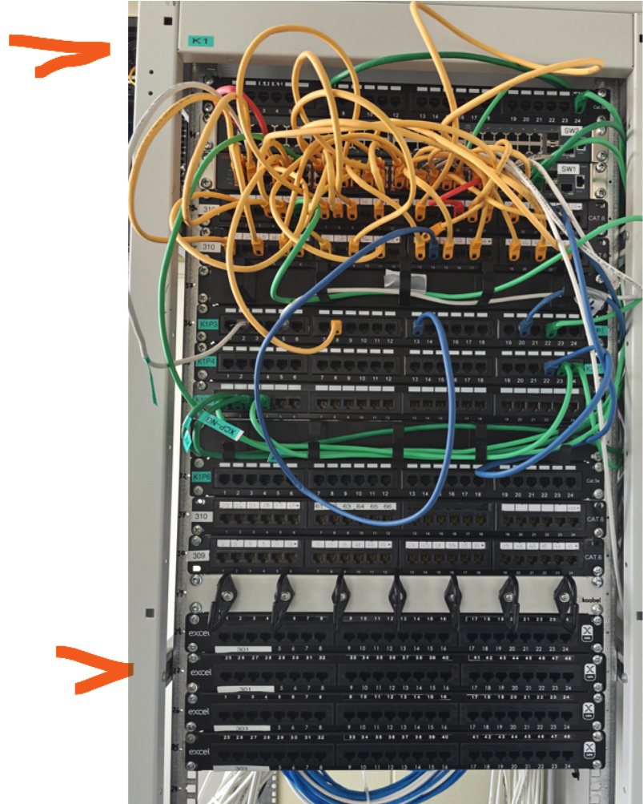

*Patch-paneeli pordid on nummerdatud.*

### 3. Leia vaba kommutaator
Otsi serveriruumis vaba kommutaatorit. Kui racki-s pole vabu seadmeid, võid leida kommutaatoreid õpetaja laua juurest.

### 4. Ühenda kommutaator patch-paneeliga
Kasuta patch-kaablit, et ühendada kommutaatori port patch-paneeli pordiga, mis vastab sinu töökoha numbrile:

| Ühenduse Tüüp | Konsool-kaabel | Ethernet-kaabel | Märkused |
|---------------|----------------|-----------------|----------|
| **Konfigureerimise Faas** | ✓ KASUTATAV | ✗ EI KASUTATA | Konsool-kaabel ainult seadme algseadistuseks |
| **Tööfaas** | ✗ EI KASUTATA | ✓ KASUTATAV | Ethernet-kaabel igapäevaseks võrguühenduseks |
| **Pordi Asukoht** | Konsool-port | Ethernet-port | Erinevad füüsilised pordid seadmel |
| **Kaabli Vahetus** | Eemalda peale konfiguratsimist | Ühenda püsivalt | Kaablid vahetatakse erinevates tööfaasides |

- **Konsool-kaabel**: 
  - Ainult seadme algseadistamiseks
  - Ühendatakse konsool-porti
  - Eemaldatakse peale konfigureerimist

- **Ethernet-kaabel**:
  - Igapäevane võrguühendus
  - Ühendatakse Ethernet-porti
  - Jääb püsivalt ühendatuks

**Sinise kaabli konsooli konsooli pordi sisse ja teise otsa patch paneeli sisse**

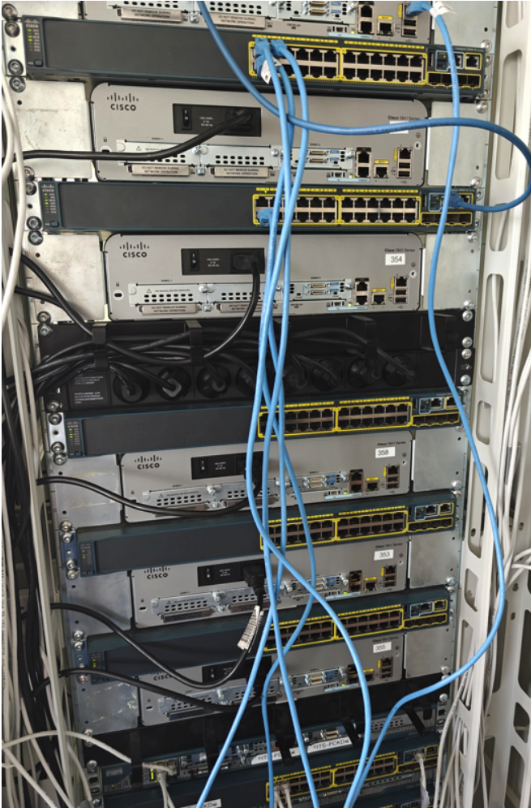
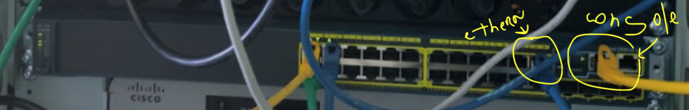

*Näide kommutaatori ühendamisest patch-paneeliga.*

### 5. Ühenda konsoolikaabel kommutaatoriga
Ühenda konsoolikaabli üks ots kommutaatori konsooli porti. Näiteks *Ühendan kaabliga ruuteri konsooli port ja port 21.1 (sõltub kumba pordi võtsid)*

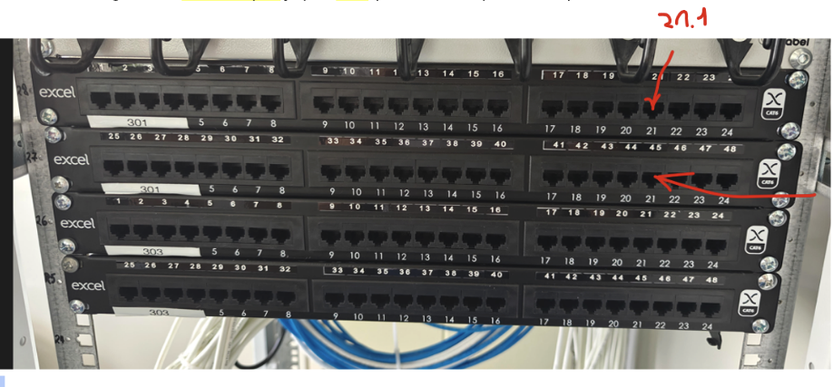

*Kommutaatori konsooli port.*

### 6. Kontrolli, kas kommutaator vajab lähtestamist
Kui kommutaator ei reageeri või sisaldab varasemaid seadistusi, kasuta reset nuppu:
- Hoia reset nuppu all 15 sekundit
- Oota, kuni tuled vilguvad oranži värvi

#### Füüsilised Resetimise Võimalused
1. **Reset-nupp**
   - Tavaliselt väike nupp seadme korpusel
   - Vajuta ja hoia 5-15 sekundit
   - Oota, kuni tuled vilguvad oranži värvi
   - Taastab vaikseaded ilma täieliku kustutamiseta

2. **Toite väljalülitamine**
   - Eemalda toitejuhe
   - Oota 30 sekundit
   - Ühenda toitejuhe tagasi

#### Konsooli Kaudu Resetimine
1. **Täielik seadete kustutamine**
   ```
   switch> enable
   switch# erase startup-config
   switch# reload
   ```

2. **Osalise konfiguratsiooni lähtestamine**
   ```
   switch# write erase
   switch# reload
   ```

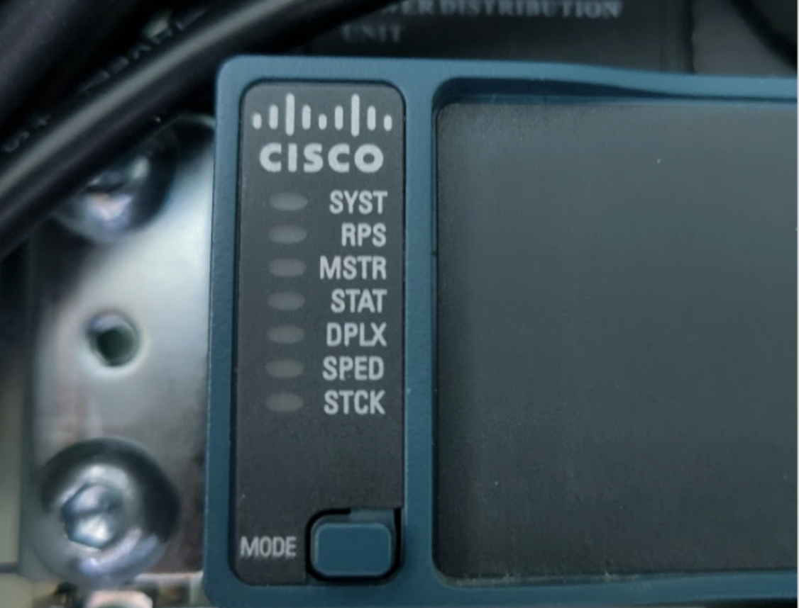

*Kommutaatori reset nupp.*


## Ühenduste loomine klassiruumis

### 1. Ühenda konsoolikaabel arvutiga
Ühenda konsoolikaabli USB-ots oma arvuti USB porti.

### 2. Ava PuTTY programm
Käivita PuTTY terminaliprogramm oma arvutis.

🔴 [SIIN: Cisco Konsooli Ühenduse TÄPNE Juhend; VAATA!!!](https://www.cisco.com/c/en/us/support/docs/smb/switches/cisco-small-business-300-series-managed-switches/smb4984-access-the-cli-via-putty-using-a-console-connection-on-300-a.html)

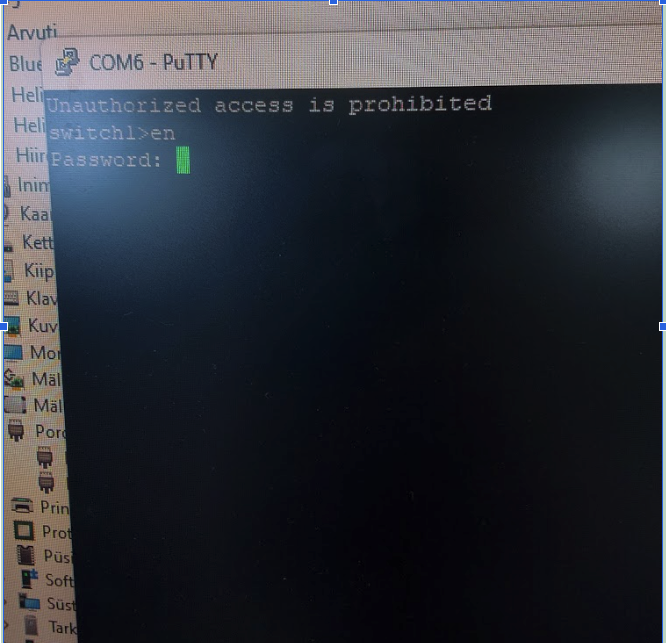

*PuTTY programm.*

### 3. Seadista PuTTY ühendus
Seadista PuTTY järgmiste parameetritega:
- Connection type: Serial
- Serial line: COM1 (või muu saadaolev COM port)
- Speed: 9600
- Data bits: 8
- Stop bits: 1
- Parity: None
- Flow control: None

### 4. Loo ühendus
Klõpsa "Open" nupule ja kontrolli, kas saad ühenduse kommutaatoriga.

### 5. Teise arvuti ühendamine
Laboratoorne töö nõuab ka teise arvuti ühendamist:
- Leia teine vaba arvuti klassis
- Ühenda see ethernet-kaabliga seinas olevasse vaba pessasse, mis on ühendatud serverruumis kommutaatori teise pordiga (näiteks F0/7)
- Seadista arvuti võrguseaded vastavalt laboratoorse töö juhendile

## Võimalikud probleemid ja lahendused

### Konsoolikaabli probleemid
- **Probleem**: Konsoolikaabel ei tööta
- **Lahendus**: Proovi teist kaablit või kontrolli, kas kasutad õiget kaablitüüpi

### Kommutaatori probleemid
- **Probleem**: Kommutaator ei reageeri
- **Lahendus**: Kontrolli, kas kommutaator on sisse lülitatud või tee lähtestamine

### COM pordi probleemid
- **Probleem**: PuTTY ei leia õiget COM porti
- **Lahendus**: Kontrolli Seadmehaldurist õiget COM porti või proovi järgmisi COM porte (COM1, COM2, COM3, jne)

## <span style="color: red;">MEELESPEA:</span>

1. <span style="color: red;">Ära eemalda teiste ühendatud kaableid ilma loata. Märgi ära enda omad, kui tahad. Küsi Raini käest.</span>
Rain näeb nii välja: 

3. <span style="color: red;">Pärast praktikumi lõpetamist taasta seadme algseadistus, et see oleks valmis järgmisele kasutajale.</span>


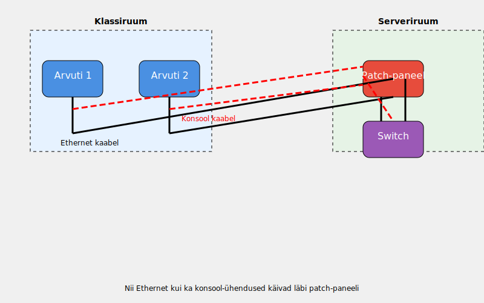
