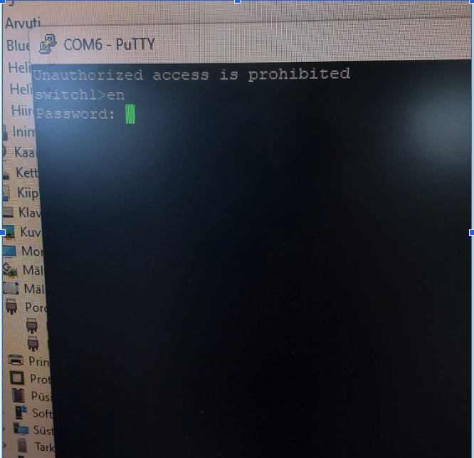

# Lab 7: Switch ja MAC Aadressi Tabel

**Eeldused:** Lab 6 (Ethernet kaablid), Loeng Week 6 (OSI Layer 1-2)  
**Asukoht:** Klass 310 + Serveriruum  
**Kestus:** 75 min  
**Grupitöö:** 2 inimest

---

## MIDA ME TÄNA ÕPIME?

### OSI Mudeli Perspektiiv

| Layer | Lab | Õpime |
|-------|-----|-------|
| Layer 1 (Physical) | Lab 6 | Kaablid, elektrisignaalid, pinging |
| **Layer 2 (Data Link)** | **Lab 7 - TÄNA** | **Switch, MAC aadressid, õppimine** |
| Layer 3 (Network) | Lab 8 | IP aadressid, routing |

### Põhiküsimus

**Probleem:** Klassis on 30 PC-d, kõik ühendatud switchiga. PC1 tahab saata faili PC15-le.  
**Küsimus:** Kuidas switch teab, millises pordis PC15 on?  
**Lahendus:** MAC Address Table - switch õpib iga kaadri (frame) pealt!

> 💡 **Fun fact:** Switch on nagu kooli sekretär - teab täpselt, kes millises klassis on. Aga kui sa tõmbad vale kaabli välja serveriruum, siis sekretär kaotab mälu ja kogu kool on kaoses! 📋➡️🔥

### Täna saame

1. Kuhu Lab 6 kaablid füüsiliselt lähevad (serveriruum)
2. Kuidas switch õpib MAC aadresse automaatselt
3. ARP protokolli töös
4. Layer 2 edastamisotsuse päriselt

---

## EESMÄRGID

Selle labori lõpuks oskate:

**Praktiline:**
- Navigeerida serveriruumi keskkonnas
- Ühendada seadmeid rackis
- Konfigureerida Cisco switchi
- Lugeda MAC address table'it

**Teoreetiline:**
- Selgitada switchi õppimise protsessi
- Eristada Layer 1 ja Layer 2 funktsioone
- Mõista ARP protokolli rolli
- Analüüsida kaadrite edastamist

---

## SERVERIRUUM - MIS SEE ON?

### Füüsiline Topoloogia

```
[Sinu laud, Klass 310] 
    ↓
[Seinaport 21.1]
    ↓
[Kaabel seinas] ← Lab 6 tegite sarnase
    ↓
[SERVERIRUUM - Kapp K1]
    ↓
[Patch-paneel]
    ↓
[Switch]
```

> 🗺️ **Navigatsioon:** Kui sa pole serveriruumis varem käinud, võta kaasa kogenud sõber. Nagu dungeoniga - vaja party't! Ära lähe solo! 🛡️

### Komponendid


| Komponent | Kirjeldus | Layer | Funktsioon |
|-----------|-----------|-------|------------|
| Rack | 19" metallkapp | - | Füüsiline paigutus |
| Patch-paneel | Passiivne panel | 1 | Kaablite korraldus |
| Switch | Cisco 2960 | 2 | MAC õppimine, forwarding |
| Router | (hiljem) | 3 | IP routing |


---

## TURVALISUS SERVERIRUUM

**KRIITILNE:** See pole harjutusruum - siin töötab kooli võrk!

| Lubatud | Keelatud |
|---------|----------|
| Sinised patch-kaablid | Mustad/kollased kaablid |
| Oma switchi toide | Teiste seadmete puudutamine |
| Küsida kahtluse korral | "Proovin ise" mentaliteet |

**Tagajärg:** Üks vale tõmme = kogu kool ilma internetita ( tegelikult mitte, see ei ole kooli serveriruum)

> 🎯 **Remember:** Serveriruum versioonis: "With great access comes great ability to f*** up everything" - Rain, 2024 🕷️

---

## SETUP KIRJELDUS

Igal grupil **2 PC-d, 1 switch:**

```
Alguses:
PC1 (sinu laud)  ──[USB Console]──→ Switch Console
PC2 (kaaslane)   ──[Ethernet]─────→ Switch Fa0/2

Peale konfiguratsiooni:
PC1 ──[Ethernet]──→ Switch Fa0/1
PC2 ──[Ethernet]──→ Switch Fa0/2
```

**Rollid:**
- PC1: Konfigureerimise terminal (alguses konsool, hiljem võrgus)
- PC2: Klient (kohe võrgus)

---

## DOKUMENTEERIMINE

**Google Docs Template - Classroomist:**

1. Ava Google Classroom → Lab 7
2. Kopeeri template oma Drive'i
3. Jaga grupi liikmega (edit õigused)
4. Täida laabori ajal (koos)
5. Esita Classroomis

**Template struktuur:**

```
LAB 7: SWITCH JA MAC TABEL
Grupp: ______  Kuupäev: ______  Õpilased: ______

ÜHENDUSED
├─ Klassi pordid (PC1, PC2)
├─ Patch-paneel port
├─ Switch mudel ja pordid
└─ COM port number

KONFIGURATSIOON
├─ Hostname
├─ Enable secret
├─ Console password
└─ Banner tekst

MAC AADRESSID JA IP-d
├─ PC1: MAC, IP, Port
├─ PC2: MAC, IP, Port
└─ Switch MAC table output (screenshot)

KONTROLLKÜSIMUSED (6 küsimust)
```

---

## OSA 1: FÜÜSILISED ÜHENDUSED (20 min)

### 1.1 Leia Klassi Pordid


Töölaua all või peal olevad pordid (näiteks 21.1, 21.2).

**OLULINE:** Märgi see number - kasutame seda IP aadresside jaoks!

**Hoiatus:** Ära puutu porti, kus juba kaabel sees - see on klassi internet!

> 🎮 **Gaming reference:** Need pordinumbrid on nagu su spawn point. Kirjuta üles või respawnid vales kohas! 🗺️

**Google Docs:**
```
PC1 port: ____.____
PC2 port: ____.____
```

**Näide:**
```
PC1 port: 21.1
PC2 port: 21.2
```

### 1.2 Serveriruum - Patch-paneel


Leia samad numbrid patch-paneelis (Kapp K1).

**Google Docs:**
```
Patch-paneel: ____.____
```

**Reaalsuse check:** Kui sa ei leia oma numbrit, ÄRA hakka juhuslikult kaableid tõmbama! Küsi abi! Rain on tavaliselt serveriruumi lähedal või klassis 310. Ta on näinud kõike ja ta ei hammusta. 😊

### 1.3 Vali Switch

**Variant A:** Vali vaba switch rackist  
**Variant B:** Otsi kuskil ja lisa ise

**ENNE ÜHENDAMIST - kontrolli porti nimesid!**

Vaata switchi ette - pordid on märgitud:
- **FastEthernet (Fa0/1, Fa0/2...)** - 100 Mbps pordid (tavalisemad)
- **GigabitEthernet (Gi0/1, Gi0/2...)** - 1000 Mbps pordid (uuemad switchid)

> 🔍 **OLULINE:** Kirjuta üles, mis SINU switch kasutab! Hiljem kasutame neid nimesid käskudes!

**Google Docs:**
```
Switch mudel: Cisco ____
Pordi tüüp: FastEthernet / GigabitEthernet (ring ümber õigele!)
```

> 💰 **Fun fact:** uus switch maksab umbes nagu paar iPhone. Ära kukuta maha! 📱💸

### 1.4 Ühenda PC2 (Ethernet)

```
Switch Fa0/2 ←[sinine patch]→ Patch-paneel ____.2 → PC2
```


> 🎣 **ProTip:** Kaabel läheb peale nagu LEGO. Kui peab liiga palju jõudu kasutama, siis midagi on valesti! Gentle force, not brute force! 💪➡️👌

### 1.5 Ühenda PC1 (Konsool)


```
PC1 USB ←[konsoolikaabel]→ Switch Console port
```

**Console porti leidmine:**

Console port on **SININE** (RJ45 port, eraldi teistest!):
- Võib olla switchi **EES** (koos teiste portidega)
- Võib olla switchi **TAGANT** (eraldi panel)
- Märgistus: "CONSOLE" või "CON"


**Näpunäited:**
- Sinine värv = console port ✅
- Sama suurus nagu Ethernet port (RJ45)
- ERINEVALT ethernet portidest - ainult üks!

**Praegu:**
```
PC1 ─[Console]→ Switch ←[Eth]─ PC2
```

> 🎨 **Värvi kood:** Cisco armastab värve! Sinine = console, oranž/must = ethernet, kollane = gigabit. Nagu jõulukaunistused! 🎄

---

## OSA 2: TERMINAL (10 min)

### 2.1 Leia COM Port

**Device Manager:**

1. Win + X → Device Manager
2. Ports (COM & LPT)
3. Otsi USB Serial Port (COM_)

**OLULINE:** Nimi võib olla erinev sõltuvalt kaablist:
- USB Serial Port (COM3)
- Prolific USB-to-Serial Comm Port (COM4)
- Silicon Labs CP210x USB to UART Bridge (COM5)

**Näide:**
```
Ports (COM & LPT)
  ├─ USB Serial Port (COM3) ← SEE VÕIB OLLA SINU!
  ├─ Prolific USB-to-Serial (COM4) ← VÕI SEE!
  └─ Communications Port (COM1) ← ignoreeri (see on PC enda)
```

**Google Docs:** COM_____

> 🎰 **Loterii:** Sul võib olla COM3, COM4, COM5... See on nagu parklat otsida - iga kord erinev number! Kirjuta see üles! 🅿️
> 
> 💡 **Kui sa näed MITU USB Serial porti:** Tõmba console kaabel välja ja vaata, kumb kaob Device Managerist. See oli sinu! 🔌

### 2.2 PuTTY Ühendus



| Parameeter | Väärtus |
|------------|---------|
| Connection type | Serial |
| Serial line | COM3 (või sinu number) |
| Speed | 9600 |

Category → Connection → Serial:
```
Baud: 9600
Data bits: 8
Stop bits: 1
Parity: None
Flow control: None
```

> 🕰️ **History lesson:** 9600 baud = 9600 bits per second. Netflix 4K vajab umbes 25,000,000 bits per second. Yeah, see on AEGLANE. Aga switchile piisab! 🐌

### 2.3 Kontrolli

Peaks nägema:
```
Switch>
```
või
```
Press RETURN to get started!
```

Tühi ekraan → vajuta Enter.

**Ikka tühi?** 
1. Check: Kas console kaabel on kinni?
2. Check: Kas COM port õige?
3. Check: Kas switchi toide sees?
4. Kui ikka ei tööta → Rain serveriruumi lähedal või Mario klassis 309! 🆘. Ok, ok ma saan ka aidata, ma olen siiski su õpetaja.

> 🎬 **Movie moment:** Kui näed "Switch>" prompti, siis sa oled SEES! Nagu Matrix - welcome to the real world! 😎

---

## OSA 3: SWITCH RESET (10 min)

**Miks?** Eelmine grupp võis seadistada paroole/confige. Reset annab puhta aluse.

> 🎮 **Gaming analogy:** See on nagu New Game+ - tahad alustada puhtalt, ilma eelmise mängija salvest! 🔄

### 3.1 Mode Nupp Protseduur


| Samm | Tegevus |
|------|---------|
| 1 | Tõmba toide välja |
| 2 | Oota 5 sek |
| 3 | Hoia Mode nuppu all |
| 4 | Ühenda toide (HOIA nupp!) |
| 5 | Hoia 15 sek |
| 6 | Vabasta nupp |

**LED-id vilguvad oranžiks = õnnestus.**

> ⚡ **ProTip:** See on nagu Ctrl+Alt+Del Windowsis... aga füüsiline versioon! Mode nupp = nuclear option! ☢️

### 3.2 Kustuta Config

Terminal näitab:
```
switch: 
```

**Kirjuta:**
```
switch: flash_init
switch: del flash:vlan.dat
switch: del flash:config.text
switch: boot
```

Switch taaskäivitub.

**Dialoog:**
```
Would you like to enter initial configuration dialog? [yes/no]: no
```

Tulemus:
```
Switch>
```

> 🧹 **Clean slate:** Sa just kustutasid KOGU eelmise konfiguratsiooni. Switch on nüüd nagu uus sünnitud beebi - ei tea mitte midagi! 👶

---

## OSA 4: BAASKONFIGURATSIOON (20 min)

**Kontekst:** Need seadistused on IT tööstuses standard turvapraktikad.

### 4.1 Hostname

**Miks?**

| Probleem | Lahendus |
|----------|----------|
| 20 switchi rackis, kõik sarnased | Hostname identifitseerib |
| Logides - mis seade seda tegi? | SW-Korruse3-Klass310 |
| Dokumentatsioon - viited | Selge viide |

**Real-world:** Naming convention - asukoht + funktsioon + number.

**Ülesanne:**
```
Switch> enable
Switch# configure terminal
Switch(config)# hostname SW-[gruppinimi]
SW-Vikerkaar(config)#
```

**Google Docs:** Hostname: _____

> 💡 **Easter egg:** Pane midagi meeldejäävat! Järgmine grupp võib su nime näha ja naerda. Legacy! 🏆

### 4.2 Enable Secret

**Miks?**

Privileged mode (#) võib:
- Kustutada kogu configi
- Resetida seade
- Muuta võrguseadeid
- Blokeerida porte

Ilma paroolita = turvaauk. Tavalist Cisco laabides on see lihtsalt nimi "cisco".
Sa võid ka seda kasutada.

**Ülesanne:**
```
SW-Vikerkaar(config)# enable secret [gruppinimi]2025
```

**Test:**
```
SW-Vikerkaar(config)# exit
SW-Vikerkaar# exit
SW-Vikerkaar> enable
Password: [sisesta parool]
SW-Vikerkaar#
```

**Google Docs:** Enable secret: _____

> ⚠️ **Aga päris elus tööl:** ÄRA pane parooli "password" või "12345". Cisco sõnastik attack võtab 0.5 sekundit sellise parooli lahti murda! 🔨

### 4.3 Console Password - see ei ole sama, aga järgmine asi

**Miks?**

Füüsiline juurdepääs = kõige ohtlikum.

**Ülesanne:**
```
SW-Vikerkaar(config)# line console 0
SW-Vikerkaar(config-line)# password console123
SW-Vikerkaar(config-line)# login
SW-Vikerkaar(config-line)# exit
```

**Google Docs:** Console password: _____

> 🕵️ **Fun fact:** 80% firmade häkkimisest algab füüsilisest ligipääsust. Keegi lihtsalt ühendab ennast konsooli kaabliga. Don't be that security hole! 🚪

### 4.4 Banner

**Miks?**

Juriidiline kaitse:
- "Ei teadnud, et keelatud..." ❌
- Banner = hoiatus dokumenteeritud ✅

**Ülesanne:** sa võid enda oma ka panna, mulle lihtsalt Rain meeldib
```
SW-Vikerkaar(config)# banner motd #
Enter TEXT. End with #
*Rain jälgib serveriruum!*
```

**Google Docs:** Kopeeri banner.

> ⚖️ **Legal stuff:** USA-s kohus otsustas: kui pole bannerit, siis häkker võib öelda "ma ei teadnud, et see oli eraomand!" ja pääseda. Banner = PROOF! Eestis sama loogika! 🏛️

### 4.5 Salvesta Config

**KRIITILNE:** Ilma selleta kaob kõik restarti ajal!

```
SW-Vikerkaar# copy running-config startup-config
Destination filename [startup-config]? [Enter]
```
Vajuta koguaeg enter, ta salvesta default asukohta.

**Google Docs:** Config salvestatud ✓

> 💾 **Save your game:** See on nagu video mängus - kui ei salvesta, kaotad kogu progressi! RAM vs ROM! Restart = RIP su töö! ⚰️

---

## OSA 5: MAC ADDRESS TABLE (25 min)

**Kontekst:** See on switchi "aju" - kuidas ta teeb edastamisotsuseid.

### 5.1 Vaata Tabelit (Alguses)

```
SW-Vikerkaar# show mac address-table
```

Tühi tabel = switch pole veel õppinud midagi.

**Miks tühi?** Switch õpib ainult siis, kui saab kaadreid (source MAC field).

**Google Docs:** Alguses tühi ✓

> 🎓 **School analogy:** Switch = uus õpetaja esimesel päeval. Ei tea ühtegi õpilase nime. Pärast nädalat teab kõiki! Mingi teine õpetaja, mitte mina 📚

### 5.2 Leia PC MAC-id

**Mõlemad PC-d:**
```
ipconfig /all
```

Otsi:
```
Physical Address. . . : AA-BB-CC-DD-EE-01
```

**Google Docs:**
```
PC1 MAC: ____
PC2 MAC: ____
```

> 🆔 **Identity crisis:** MAC aadress = su bioloogiline pass. Ei saa muuta (no well, tehniliselt saab, aga see on MAC spoofing ja see on... interesting grey area 😏). Iga device OMA unikaalne!

### 5.3 Ühendame PC1 Meie Võrku

**Protseduur:**

1. Salvesta config (`copy run start`)
2. Sule PuTTY
3. Eemalda USB console kaabel
4. Võta tavalise patch-kaabel (lihtsalt varasta su PC oma, mis koolivõrgu pordis oli). Upsti, nüüd internet kadus ära, aga noh me ju ühendume sinu võrguga nüüd.
5. Ühenda: Switch Fa0/1 → Patch ____.1 → PC1

(Võibola sinul on GigabitEthernet Gi0/1, eks?, sina pead ise seda teadma 👶)

**Nüüd:**
```
PC1 ─[Eth Fa0/1]→ ┐
                   ├─ Switch
PC2 ─[Eth Fa0/2]→ ┘
```

**Google Docs:** PC1 port: Fa0/1

### 5.4 Seadista IP Aadressid

**Miks me seda teeme?**

Me vajame IP aadresse, et tekitada **ARP liiklust**. ARP on Layer 3 protokoll, aga selle tulemusena näeme Layer 2 töötamist (MAC table täitub)!

**OLULINE:** Iga grupp kasutab OMA IP aadresse (põhineb klassi pordinumbril).

**IP aadresside valem:**

```
PC1 IP: 192.168.[SINU_PORT_NR].10
PC2 IP: 192.168.[SINU_PORT_NR].20
Mask: 255.255.255.0
```

**Näide - kui sinu port on 21:**

| PC | IP Address | Subnet Mask |
|----|------------|-------------|
| PC1 | 192.168.21.10 | 255.255.255.0 |
| PC2 | 192.168.21.20 | 255.255.255.0 |

**Näide - kui sinu port on 23:**

| PC | IP Address | Subnet Mask |
|----|------------|-------------|
| PC1 | 192.168.23.10 | 255.255.255.0 |
| PC2 | 192.168.23.20 | 255.255.255.0 |

---

**Kuidas seadistada (Windows):**

1. Start → Settings
2. Network & Internet
3. Change adapter options
4. Ethernet → Right-click → Properties
5. Internet Protocol Version 4 (TCP/IPv4) → Properties
6. Vali: **Use the following IP address**
7. Sisesta:
   - IP address: `192.168.[PORT_NR].10` (PC1) või `.20` (PC2)
   - Subnet mask: `255.255.255.0`
   - Default gateway: jäta TÜHJAKS
8. OK → OK

**Kontrolli:**
```
ipconfig
```

Peaks nägema:
```
IPv4 Address: 192.168.21.10
Subnet Mask: 255.255.255.0
```

**Google Docs:**
```
PC1 IP: 192.168.__.10
PC2 IP: 192.168.__.20
```

---

### 5.5 ARP ja Switchi Õppimine

**PC1-lt pingida PC2:**

**NÄIDE - kui port 21:**
```
ping 192.168.21.20
```

**SINU PORT:**
```
ping 192.168.[PORT_NR].20
```

**Mis juhtub (kaader-kaadri haaval):**

#### ARP Request (Broadcast)

```
┌─────────────────────────────────────────┐
│ Kaader 1: ARP Request (frame)           │
├─────────────────────────────────────────┤
│ Source MAC: AA:BB:CC:DD:EE:01 (PC1)    │
│ Dest MAC:   FF:FF:FF:FF:FF:FF (bcast)  │
│ Type: ARP Request                       │
│ "Kes on 192.168.21.20?"                │
└─────────────────────────────────────────┘
```

**Switch saab kaadri:**
1. Loeb Source MAC: AA:BB:CC:DD:EE:01
2. Loeb Source Port: Fa0/1
3. **Õpib:** "AA:BB:CC:DD:EE:01 on Fa0/1 pordis" → lisab tabelisse
4. Dest on broadcast → flooding (kõikidele portidele va Fa0/1)

> 📢 **Broadcasting:** Nagu klassis karjuda "KES ON RAIN?!" - kõik kuulevad, üks vastab! 🗣️

#### ARP Reply (Unicast)

```
┌─────────────────────────────────────────┐
│ Kaader 2: ARP Reply (frame)             │
├─────────────────────────────────────────┤
│ Source MAC: BB:CC:DD:EE:FF:02 (PC2)    │
│ Dest MAC:   AA:BB:CC:DD:EE:01 (PC1)    │
│ Type: ARP Reply                         │
│ "Mina! Minu MAC on BB:CC:DD:EE:FF:02"  │
└─────────────────────────────────────────┘
```

**Switch saab kaadri:**
1. Loeb Source MAC: BB:CC:DD:EE:FF:02
2. Loeb Source Port: Fa0/2
3. **Õpib:** "BB:CC:DD:EE:FF:02 on Fa0/2 pordis" → lisab tabelisse
4. Dest MAC: AA:BB:CC:DD:EE:01 → **Teab juba!** → saadab AINULT Fa0/1

> 🎯 **Precision:** Teine kord switch ei karju enam - ta TEAB, kuhu saata! Efektiivsus! 💯

#### ICMP Echo (Ping)

Nüüd switch teab mõlemad MAC-id → forwarding töötab efektiivselt.

**Kontrolli PC-del:**
```
arp -a         # ARP cache (IP→MAC)
ipconfig /all  # Oma MAC
```

### 5.6 Kontrolli Switchi Tabelit

```
SW-Vikerkaar# show mac address-table
```

**Näed:**
```
Vlan    Mac Address       Type      Ports
----    -----------       --------  -----
   1    aabb.ccdd.ee01    DYNAMIC   Fa0/1
   1    bbcc.ddee.ff02    DYNAMIC   Fa0/2
```

**Analüüs:**

| Väli | Tähendus |
|------|----------|
| DYNAMIC | Switch õppis ise (vs STATIC - admin lisas) |
| Fa0/1 | Füüsiline port |
| Aging | Kaob peale 300 sek (default) |

**Google Docs:** Screenshot või copy-paste output.

> 🎓 **Achievement unlocked:** Switch on nüüd "tark"! Ta teab, kes kus on! Congratz, sa õpetasid masinat! 🤖📚

### 5.7 Täiendavad Käsud

```
show mac address-table dynamic
show mac address-table aging-time
show interfaces status
show interfaces Fa0/1
```

Vaata, mis infot saad.

---

## KONTROLLKÜSIMUSED

**Google Docs:**

1. **Mis on MAC aadressi aging time?**  
   Vihje: `show mac address-table aging-time`

2. **Mis juhtub, kui PC ei saada 5 minutit midagi?**  
   Vihje: Switchi tegevus agingu peale

3. **Mis on DYNAMIC vs STATIC MAC vahe?**

4. **Kuidas vaadata ainult ühe pordi MAC-e?**  
   Vihje: `show mac ... interface ...`

5. **Mis on broadcast MAC (FF:FF:FF:FF:FF:FF) ja kas näed seda tabelis?**  
   Vihje: Kas switch salvestab broadcasti?

6. **Mis vahe on ARP cache (PC) ja MAC table (switch)?**

| | ARP Cache | MAC Table |
|---|-----------|-----------|
| Device | PC | Switch |
| Layer | 3→2 mapping | 2 only |
| Sisu | IP→MAC | MAC→Port |

---

## REFLEKTSIOON

**Arutage grupis (Google Docs):**

### Layer 1 vs Layer 2

Lab 6: Kaabel = passiivne juhe (elektrisignaalid)  
Lab 7: Switch = aktiivne seade (õppimine, otsused)

### Õppimise Protsess

**Ilma MAC table'ita:**  
Switch saadaks KÕIKIDELE portidele → ebaefektiivne, broadcast storm

**MAC table'iga:**  
Switch teab, kuhu saata → efektiivne, kiire

### Real-World Paralleel

Switch = korterihoone postkastisüsteem:
- Õpib, kes elab millises korteris (MAC→Port)
- Ei tea tänavaadressi (IP)
- Edastab kirju efektiivselt

> 📬 **Eesti paneelmajade reaalsus:** Postiljon õpib, millises korteris kes elab. Aga naabrid kolivad, uued tulevad... switch sama! Aging time = kui keegi 5 min ei räägi, unustad ära! 🏢

### Järgmine Samm

**Probleem:** Kui PC1 tahab saata faili PC-le TEISES HOONES?
- MAC aadress ei tööta (ainult local network)
- Vaja IP aadresse
- Vaja routerit

**Lahendus:** Layer 3 (Lab 8 järgmisel nädalal)

---

## TROUBLESHOOTING (Valikuline)

**Real-world IT:** 90% aeg = debugging, 10% = uus seadistamine

### Stsenaarium: Ping Ei Tööta

**Debug protsess:**

| Samm | Käsk | Kontroll |
|------|------|----------|
| Layer 1 | `show interfaces status` | Fa0/1, Fa0/2 UP? LED roheline? |
| Layer 2 | `show mac address-table` | Mõlemad MAC-id tabelis? |
| PC | `ipconfig`, `arp -a` | IP õige? ARP cache's teine PC? |
| Test | `ping 192.168.[PORT].20` | Töötab? |

> 🏥 **Doctor mode:** Alusta Layer 1-st (kas kaabel kinni?). Siis Layer 2. Siis Layer 3. Ei hüppa üle! Sama nagu arst - alusta lihtsast! 🩺

### Simulatsioon

**Grupp A:** Tõmba üks patch-kaabel välja → Debug  
**Grupp B:** Pane PC1-le vale IP → Debug

---

## PUHASTAMINE (5 min)

### Kontrolli Google Docs

- Kõik väljad täidetud
- Screenshot või copy-paste switchi output
- Kontrollküsimustele vastatud
- Grupi liikmel edit õigused

### Esita

1. Google Classroom → Lab 7
2. Attach Google Doc
3. Turn In

### Eemalda Ühendused

1. Patch-kaablid (PC1, PC2)
2. Toitekaabel
3. Pane tagasi tagasi

> 🧹 **Clean up crew:** Jäta klass puhtamaks kui leidsid! Rain will remember this! 🌟

---

## 🎁 LISAÜLESANNE (**Peidetud ülesanne:**)

Kui jõudsid siia, siis oled tõeline kangelane! 🏆

> 🐱 Küsi Mariolt: "Mis on sinu kasside nimed?"

Kui saad vastuse, kirjuta see oma Google Docsisse päris lõppu (pärast hindamise tabelit).

**Miks?**
- Jõudsid laabori lõppu
- Mariole meeldib, kui temaga räägitakse
- Võibolla saad lisapunkte... või mitte... aga kassid on armsad! 😸
- **Ja ära unusta Mariot kiita!** 🌟

**Vihje:** Mario on tavaliselt klassis 309 või õpetajate toas.

---

**Mario kasside nimed:**
```
1. ________________
2. ________________
3. ________________ (kui on kolmas)
```

**Kas kiitsid Mariot?** ☐ JAH ☐ Unustasin 😅

*(PS: Kui Mario pole kohal, küsi mõnelt teiselt õpetajalt - nemad teavad ka!)* 🐈