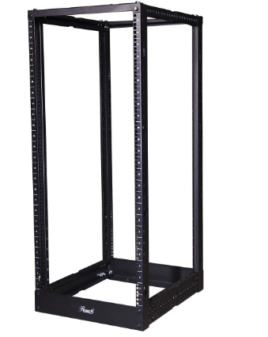
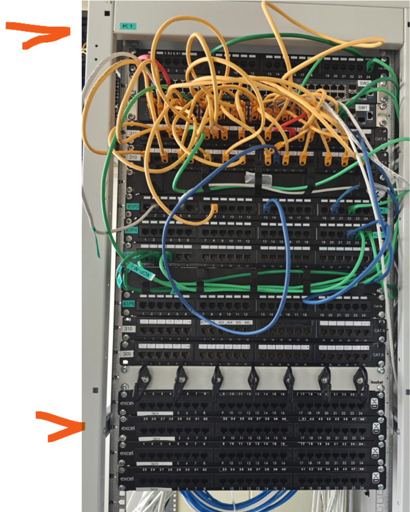
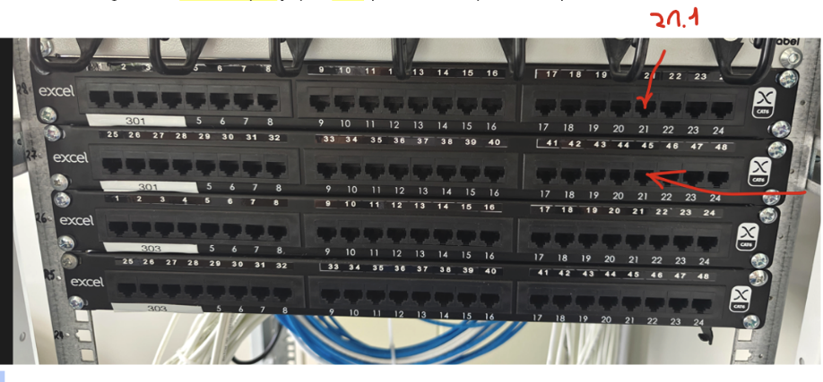

# Lab 7: Switch ja MAC Aadressi Tabel

**Eeldused:** Lab 6 (Ethernet kaablid), Loeng Week 6 (OSI Layer 1-2)  
**Asukoht:** Klass 310 + Serveriruum  
**Kestus:** 75 min  
**Grupitöö:** 2 inimest

---

## KONTEKST: MIS ME TÄNA ÕPIME?

### OSI Mudeli Perspektiiv

| Layer | Lab | Õpime |
|-------|-----|-------|
| Layer 1 (Physical) | Lab 6 | Kaablid, elektrisignaalid, pinging |
| **Layer 2 (Data Link)** | **Lab 7 - TÄNA** | **Switch, MAC aadressid, õppimine** |
| Layer 3 (Network) | Lab 8 | IP aadressid, routing |

### Põhiküsimus

**Probleem:** Klassis on 30 PC-d, kõik ühendatud switch-iga. PC1 tahab saata faili PC15-le.  
**Küsimus:** Kuidas switch teab, millisest pordist PC15 on?  
**Lahendus:** MAC Address Table - switch õpib iga frame'i pealt!

### Täna Näete

1. Kuhu Lab 6 kaablid füüsiliselt lähevad (serveriruum)
2. Kuidas switch õpib MAC aadresse automaatselt
3. ARP protokolli töös
4. Layer 2 forwarding decision'i päriselt

---

## EESMÄRGID

Selle labi lõpuks oskate:

**Praktiline:**
- Navigeerida serveriruum keskonnas
- Ühendada seadmeid rack-is
- Konfigureerida Cisco switch-i
- Lugeda MAC address table-it

**Teoreetiline:**
- Selgitada switch õppimise protsessi
- Eristada Layer 1 ja Layer 2 funktsioone
- Mõista ARP protokolli rolli
- Analüüsida frame forwarding-u

---

## SERVERIRUUM - MIS SEE ON?

### Füüsiline Topoloogia

```
[Sinu laud, Klass 310] 
    ↓
[Seinaport 21.1]
    ↓
[Kaabel seinas] ← Lab 6 tegite sarnase
    ↓
[SERVERIRUUM - Kapp K1]
    ↓
[Patch-paneel]
    ↓
[Switch]
```

### Komponendid



| Komponent | Kirjeldus | Layer | Funktsioon |
|-----------|-----------|-------|------------|
| Rack | 19" metallkapp | - | Füüsiline paigutus |
| Patch-paneel | Passiivne panel | 1 | Kaablite korraldus |
| Switch | Cisco 2960 | 2 | MAC õppimine, forwarding |
| Router | (hiljem) | 3 | IP routing |


---

## TURVALISUS SERVERIRUUM

**KRIITILNE:** See pole harjutusruum - siin töötab kooli võrk!

| Lubatud | Keelatud |
|---------|----------|
| Sinine patch-kaablid | Musta/kollased kaablid |
| Oma switch toide | Teiste seadmete puudutamine |
| Küsida kahtluse korral | "Proovin ise" mentaliteet |

**Tagajärg:** Üks vale tõmme = kogu kool ilma internetita.

---

## SETUP KIRJELDUS

Igal grupil **2 PC-d, 1 switch:**

```
Alguses:
PC1 (sinu laud)  ──[USB Console]──→ Switch Console
PC2 (kaaslane)   ──[Ethernet]─────→ Switch Fa0/2

Peale konfiguratsiooni:
PC1 ──[Ethernet]──→ Switch Fa0/1
PC2 ──[Ethernet]──→ Switch Fa0/2
```

**Rollid:**
- PC1: Konfigureerimise terminal (alguses konsool, hiljem võrgus)
- PC2: Klient (kohe võrgus)

---

## DOKUMENTEERIMINE

**Google Docs Template - Classroom-ist:**

1. Ava Google Classroom → Lab 7
2. Kopeeri template oma Drive-i
3. Jaga grupi liikmega (edit õigused)
4. Täida koos labori ajal
5. Esita Classroom-is

**Template struktuur:**

```
LAB 7: SWITCH JA MAC TABEL
Grupp: ______  Kuupäev: ______  Õpilased: ______

ÜHENDUSED
├─ Klassi pordid (PC1, PC2)
├─ Patch-paneel port
├─ Switch mudel ja pordid
└─ COM port number

KONFIGURATSIOON
├─ Hostname
├─ Enable secret
├─ Console password
└─ Banner tekst

MAC AADRESSID JA IP-d
├─ PC1: MAC, IP, Port
├─ PC2: MAC, IP, Port
└─ Switch MAC table output (screenshot)

KONTROLLKÜSIMUSED (6 küsimust)
```

---

## OSA 1: FÜÜSILISED ÜHENDUSED (20 min)

### 1.1 Leia Klassi Pordid


Töölaua all olevad pordid (näiteks 21.1, 21.2).

**OLULINE:** Märgi see number - kasutame seda IP aadresside jaoks!

**Hoiatus:** Ära puutu porti, kus juba kaabel sees - see on klassi internet!

**Google Docs:**
```
PC1 port: ____.____
PC2 port: ____.____
```

**Näide:**
```
PC1 port: 21.1
PC2 port: 21.2
```

### 1.2 Serveriruum - Patch-paneel



Leia samad numbrid patch-paneel-ist (Kapp K1).

**Google Docs:**
```
Patch-paneel: ____.____
```

### 1.3 Vali Switch

**Variant A:** Võta vaba switch rack-ist  
**Variant B:** Õpetaja laual

**Google Docs:**
```
Switch mudel: Cisco ____
```

### 1.4 Ühenda PC2 (Ethernet)

```
Switch Fa0/2 ←[sinine patch]→ Patch-paneel ____.2 → PC2
```


### 1.5 Ühenda PC1 (Konsool)


```
PC1 USB ←[konsoolikaabel]→ Switch Console port
```



**Praegu:**
```
PC1 ─[Console]→ Switch ←[Eth]─ PC2
```

---

## OSA 2: TERMINAL (10 min)

### 2.1 Leia COM Port

**Device Manager:**
1. Win + X → Device Manager
2. Ports (COM & LPT)
3. USB Serial Port (COM_)

**Näide:**
```
Ports (COM & LPT)
  ├─ USB Serial Port (COM3)
  └─ Communications Port (COM1)
```

**Google Docs:** COM_____

### 2.2 PuTTY Ühendus


| Parameeter | Väärtus |
|------------|---------|
| Connection type | Serial |
| Serial line | COM3 (või sinu number) |
| Speed | 9600 |

Category → Connection → Serial:
```
Baud: 9600
Data bits: 8
Stop bits: 1
Parity: None
Flow control: None
```

### 2.3 Kontrolli

Peaks nägema:
```
Switch>
```
või
```
Press RETURN to get started!
```

Tühi ekraan → vajuta Enter.

---

## OSA 3: SWITCH RESET (10 min)

**Miks?** Eelmine grupp võis seadistada paroole/config-e. Reset annab puhta aluse.

### 3.1 Mode Nupp Protseduur


| Samm | Tegevus |
|------|---------|
| 1 | Tõmba toide välja |
| 2 | Oota 5 sek |
| 3 | Hoia Mode nuppu all |
| 4 | Ühenda toide (HOIA nupp!) |
| 5 | Hoia 15 sek |
| 6 | Vabasta nupp |

**LED-id vilguvad oranžiks = õnnestus.**

### 3.2 Kustuta Config

Terminal näitab:
```
switch: 
```

**Kirjuta:**
```
switch: flash_init
switch: del flash:vlan.dat
switch: del flash:config.text
switch: boot
```

Switch taaskäivitub.

**Dialoog:**
```
Would you like to enter initial configuration dialog? [yes/no]: no
```

Tulemus:
```
Switch>
```

---

## OSA 4: BAASKONFIGURATSIOON (20 min)

**Kontekst:** Need seadistused on IT tööstuses standard turvapraktikad.

### 4.1 Hostname

**Miks?**

| Probleem | Lahendus |
|----------|----------|
| 20 switch-i racks, kõik sarnased | Hostname identifitseerib |
| Logides - mis seade seda tegi? | SW-Korruse3-Klass310 |
| Dokumentatsioon - viited | Selge viide |

**Real-world:** Naming convention - asukoht + funktsioon + number.

**Ülesanne:**
```
Switch> enable
Switch# configure terminal
Switch(config)# hostname SW-[gruppinimi]
SW-Vikerkaar(config)#
```

**Google Docs:** Hostname: _____

### 4.2 Enable Secret

**Miks?**

Privileged mode (#) võib:
- Kustutada kogu config
- Resetida seade
- Muuta võrguseadeid
- Blokeerida porte

Ilma paroolita = turvaauk.

**Real-world:**
- LDAP/RADIUS integratsioon
- Audit trail
- Compliance (ISO 27001)

**Ülesanne:**
```
SW-Vikerkaar(config)# enable secret [gruppinimi]2024
```

**Test:**
```
SW-Vikerkaar(config)# exit
SW-Vikerkaar# exit
SW-Vikerkaar> enable
Password: [sisesta parool]
SW-Vikerkaar#
```

**Google Docs:** Enable secret: _____

### 4.3 Console Password

**Miks?**

Füüsiline juurdepääs = kõige ohtlikum.

**Real-world:**
- Serveriruum lukustatud
- Konsool password
- Logid kõigist console login-test

**Ülesanne:**
```
SW-Vikerkaar(config)# line console 0
SW-Vikerkaar(config-line)# password console123
SW-Vikerkaar(config-line)# login
SW-Vikerkaar(config-line)# exit
```

**Google Docs:** Console password: _____

### 4.4 Banner

**Miks?**

Juriidiline kaitse:
- "Ei teadnud, et keelatud..."
- Banner = hoiatus dokumenteeritud

**Ülesanne:**
```
SW-Vikerkaar(config)# banner motd #
Enter TEXT. End with #
***********************************
* SW-Vikerkaar                    *
* Volitamata ligipääs keelatud!   *
***********************************
#
```

**Google Docs:** Kopeeri banner.

### 4.5 Salvesta Config

**KRIITILNE:** Ilma selleta kaob kõik restarti ajal!

```
SW-Vikerkaar# copy running-config startup-config
Destination filename [startup-config]? [Enter]
```

**Kontrolli:**
```
SW-Vikerkaar# show startup-config
```

**Google Docs:** Config salvestatud ✓

---

## OSA 5: MAC ADDRESS TABLE (25 min)

**Kontekst:** See on switch'i "aju" - kuidas ta teeb forwarding otsuseid.

### 5.1 Vaata Tabelit (Alguses)

```
SW-Vikerkaar# show mac address-table
```

Tühi tabel = switch pole veel õppinud midagi.

**Miks tühi?** Switch õpib ainult siis, kui saab frame'e (source MAC field).

**Google Docs:** Alguses tühi ✓

### 5.2 Leia PC MAC-id

**Mõlemad PC-d:**
```
ipconfig /all
```

Otsi:
```
Physical Address. . . : AA-BB-CC-DD-EE-01
```

**Google Docs:**
```
PC1 MAC: ____
PC2 MAC: ____
```

### 5.3 Lülita PC1 Võrku

**Protseduur:**

1. Salvesta config (`copy run start`)
2. Sule PuTTY
3. Eemalda USB console kaabel
4. Võta sinine patch-kaabel
5. Ühenda: Switch Fa0/1 → Patch ____.1 → PC1

**Nüüd:**
```
PC1 ─[Eth Fa0/1]→ ┐
                   ├─ Switch
PC2 ─[Eth Fa0/2]→ ┘
```

**Google Docs:** PC1 port: Fa0/1

### 5.4 Seadista IP Aadressid

**Miks me seda teeme?**

Me vajame IP aadresse, et tekitada **ARP liiklust**. ARP on Layer 3 protokoll, aga selle tulemusena näeme Layer 2 õppimist (MAC table täitub)!

**OLULINE:** Iga grupp kasutab OMA IP aadresse (põhineb klassi port numbril).

**IP aadresside valem:**

```
PC1 IP: 192.168.[SINU_PORT_NR].10
PC2 IP: 192.168.[SINU_PORT_NR].20
Mask: 255.255.255.0
```

**Näide - kui sinu port on 21:**

| PC | IP Address | Subnet Mask |
|----|------------|-------------|
| PC1 | 192.168.21.10 | 255.255.255.0 |
| PC2 | 192.168.21.20 | 255.255.255.0 |

**Näide - kui sinu port on 23:**

| PC | IP Address | Subnet Mask |
|----|------------|-------------|
| PC1 | 192.168.23.10 | 255.255.255.0 |
| PC2 | 192.168.23.20 | 255.255.255.0 |

---

**Kuidas seadistada (Windows):**

1. Start → Settings
2. Network & Internet
3. Change adapter options
4. Ethernet → Right-click → Properties
5. Internet Protocol Version 4 (TCP/IPv4) → Properties
6. Vali: **Use the following IP address**
7. Sisesta:
   - IP address: `192.168.[PORT_NR].10` (PC1) või `.20` (PC2)
   - Subnet mask: `255.255.255.0`
   - Default gateway: jäta TÜHJAKS
8. OK → OK

**Kontrolli:**
```
ipconfig
```

Peaks nägema:
```
IPv4 Address: 192.168.21.10
Subnet Mask: 255.255.255.0
```

**Google Docs:**
```
PC1 IP: 192.168.__.10
PC2 IP: 192.168.__.20
```

---

### 5.5 ARP ja Switch Õppimine

**PC1-lt pingida PC2:**

**NÄIDE - kui port 21:**
```
ping 192.168.21.20
```

**SINU PORT:**
```
ping 192.168.[PORT_NR].20
```

**Mis juhtub (frame-by-frame):**

#### ARP Request (Broadcast)

```
┌─────────────────────────────────────────┐
│ Frame 1: ARP Request                    │
├─────────────────────────────────────────┤
│ Source MAC: AA:BB:CC:DD:EE:01 (PC1)    │
│ Dest MAC:   FF:FF:FF:FF:FF:FF (bcast)  │
│ Type: ARP Request                       │
│ "Kes on 192.168.21.20?"                │
└─────────────────────────────────────────┘
```

**Switch saab frame:**
1. Loeb Source MAC: AA:BB:CC:DD:EE:01
2. Loeb Source Port: Fa0/1
3. **Õpib:** "AA:BB:CC:DD:EE:01 on Fa0/1 pordis" → lisab tabelisse
4. Dest on broadcast → flooding (kõikidele portidele va Fa0/1)

#### ARP Reply (Unicast)

```
┌─────────────────────────────────────────┐
│ Frame 2: ARP Reply                      │
├─────────────────────────────────────────┤
│ Source MAC: BB:CC:DD:EE:FF:02 (PC2)    │
│ Dest MAC:   AA:BB:CC:DD:EE:01 (PC1)    │
│ Type: ARP Reply                         │
│ "Mina! Minu MAC on BB:CC:DD:EE:FF:02"  │
└─────────────────────────────────────────┘
```

**Switch saab frame:**
1. Loeb Source MAC: BB:CC:DD:EE:FF:02
2. Loeb Source Port: Fa0/2
3. **Õpib:** "BB:CC:DD:EE:FF:02 on Fa0/2 pordis" → lisab tabelisse
4. Dest MAC: AA:BB:CC:DD:EE:01 → **Teab juba!** → saadab AINULT Fa0/1

#### ICMP Echo (Ping)

Nüüd switch teab mõlemad MAC-id → forwarding töötab efektiivselt.

**Kontrolli PC-del:**
```
arp -a         # ARP cache (IP→MAC)
ipconfig /all  # Oma MAC
```

### 5.6 Kontrolli Switch Tabelit

```
SW-Vikerkaar# show mac address-table
```

**Näed:**
```
Vlan    Mac Address       Type      Ports
----    -----------       --------  -----
   1    aabb.ccdd.ee01    DYNAMIC   Fa0/1
   1    bbcc.ddee.ff02    DYNAMIC   Fa0/2
```

**Analüüs:**

| Väli | Tähendus |
|------|----------|
| DYNAMIC | Switch õppis ise (vs STATIC - admin lisas) |
| Fa0/1 | Füüsiline port |
| Aging | Kaob peale 300 sek (default) |

**Google Docs:** Screenshot või copy-paste output.

### 5.7 Täiendavad Käsud

```
show mac address-table dynamic
show mac address-table aging-time
show interfaces status
show interfaces Fa0/1
```

Vaata, mis infot saad.

---

## KONTROLLKÜSIMUSED

**Google Docs:**

1. **Mis on MAC aadressi aging time?**  
   Vihje: `show mac address-table aging-time`

2. **Mis juhtub, kui PC ei saada 5 minutit midagi?**  
   Vihje: Switch tegevus aging peale

3. **Mis on DYNAMIC vs STATIC MAC vahe?**

4. **Kuidas vaadata ainult ühe pordi MAC-e?**  
   Vihje: `show mac ... interface ...`

5. **Mis on broadcast MAC (FF:FF:FF:FF:FF:FF) ja kas näed seda tabelis?**  
   Vihje: Kas switch salvestab broadcast?

6. **Mis vahe on ARP cache (PC) ja MAC table (switch)?**

| | ARP Cache | MAC Table |
|---|-----------|-----------|
| Device | PC | Switch |
| Layer | 3→2 mapping | 2 only |
| Sisu | IP→MAC | MAC→Port |

---

## REFLEKTSIOON

**Arutage grupis (Google Docs):**

### Layer 1 vs Layer 2

Lab 6: Kaabel = passiivne juhe (elektrisignaalid)  
Lab 7: Switch = aktiivne seade (õppimine, otsused)

### Õppimise Protsess

**Ilma MAC table-ita:**  
Switch saadaks KÕIKIDELE portidele → ebaefektiivne, broadcast storm

**MAC table-iga:**  
Switch teab, kuhu saata → efektiivne, kiire

### Real-World Paralleel

Switch = korterihoone postkastisüsteem:
- Õpib, kes elab millises korteris (MAC→Port)
- Ei tea tänavaadressi (IP)
- Edastab kirju efektiivselt

### Järgmine Samm

**Probleem:** Kui PC1 tahab saata faili PC-le TEISES HOONES?
- MAC aadress ei tööta (ainult local network)
- Vaja IP aadresse
- Vaja router-it

**Lahendus:** Layer 3 (Lab 8 järgmisel nädalal)

---

## TROUBLESHOOTING (Valikuline)

**Real-world IT:** 90% aeg = debugging, 10% = uus seadistamine

### Stsenaarium: Ping Ei Tööta

**Debug protsess:**

| Samm | Käsk | Kontroll |
|------|------|----------|
| Layer 1 | `show interfaces status` | Fa0/1, Fa0/2 UP? LED roheline? |
| Layer 2 | `show mac address-table` | Mõlemad MAC-id tabelis? |
| PC | `ipconfig`, `arp -a` | IP õige? ARP cache-s teine PC? |
| Test | `ping 192.168.[PORT].20` | Töötab? |

### Simulatsioon

**Grupp A:** Tõmba üks patch-kaabel välja → Debug  
**Grupp B:** Pane PC1-le vale IP → Debug

---

## PUHASTAMINE (5 min)

### Kontrolli Google Docs

- Kõik väljad täidetud
- Screenshot või copy-paste switch output
- Kontrollküsimustele vastatud
- Grupi liikmel edit õigused

### Esita

1. Google Classroom → Lab 7
2. Attach Google Doc
3. Turn In

### Eemalda Ühendused

1. Patch-kaablid (PC1, PC2)
2. Toitekaabel
3. Pane tagasi: Kaablid → kast, Switch → rack/laud

---

## HINDAMINE

| Kriteerium | Punktid |
|------------|---------|
| Google Doc täidetud | 1 |
| Füüsilised ühendused | 2 |
| Reset | 1 |
| Hostname | 1 |
| Paroolid (enable, console) | 1 |
| Banner | 1 |
| Config salvestamine | 1 |
| PC1 konsool→Ethernet | 1 |
| MAC table output | 1 |
| ARP/ping analüüs | 1 |
| Kontrollküsimused | 1 |
| Esitamine õigeaegselt | 1 |
| **KOKKU** | **13** |

---

## JÄRGMINE NÄDAL: LAYER 3

**Õpime:**
- IP aadressid ja subnetting
- Routing erinevate võrkude vahel
- Router vs Switch
- Gateway kontseptsioon

**Kodutöö:**  
Leia oma kodu routeri MAC ja IP (`ipconfig /all` → Default Gateway)  
Screenshot → lisa järgmise nädala Google Doc-i

---

**Serveriruumi korraldus:**

