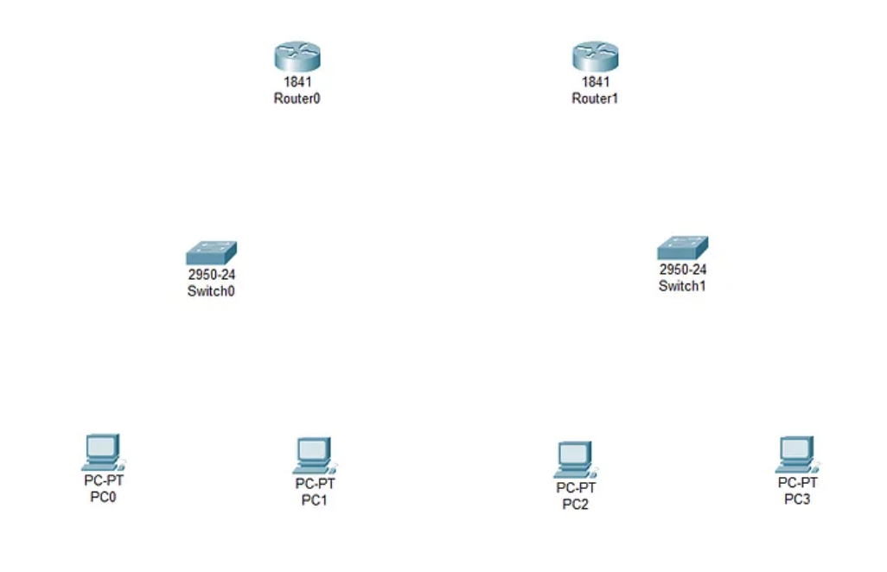
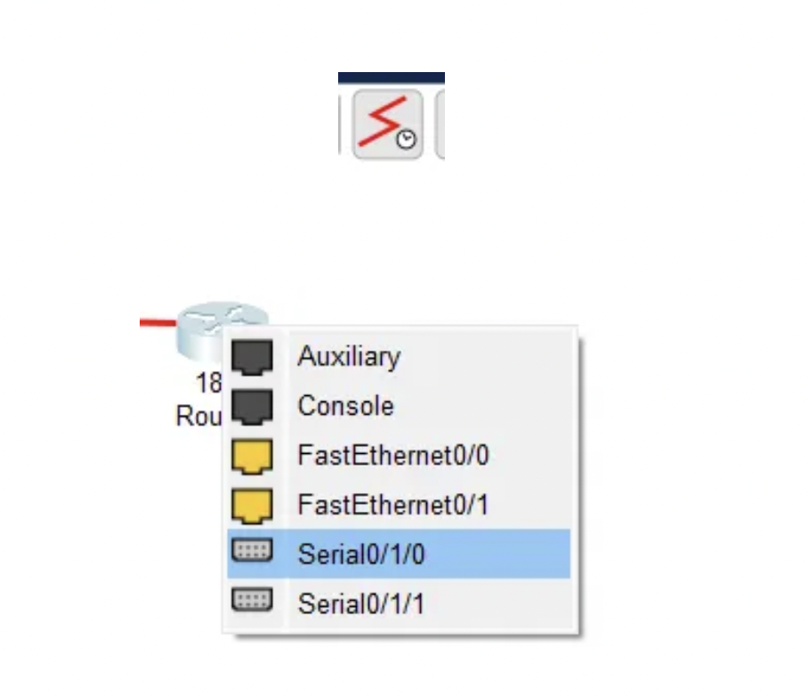
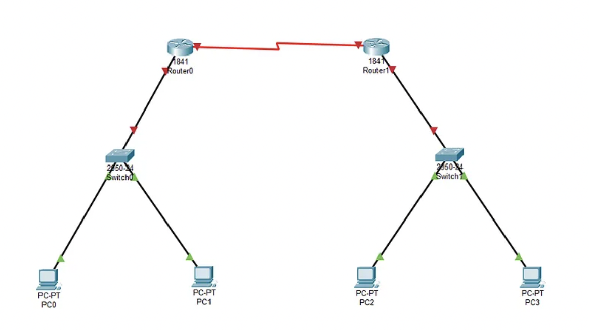
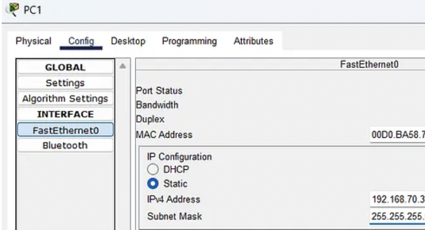
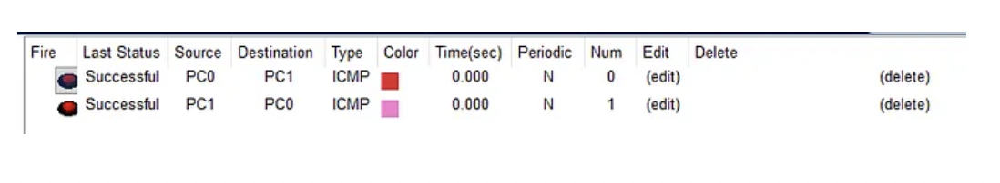
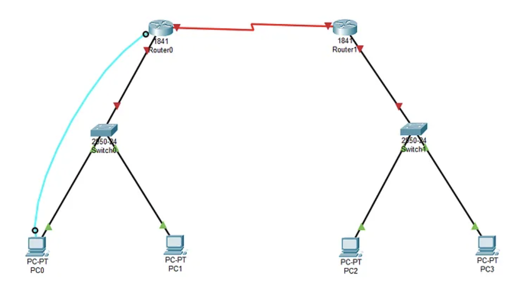
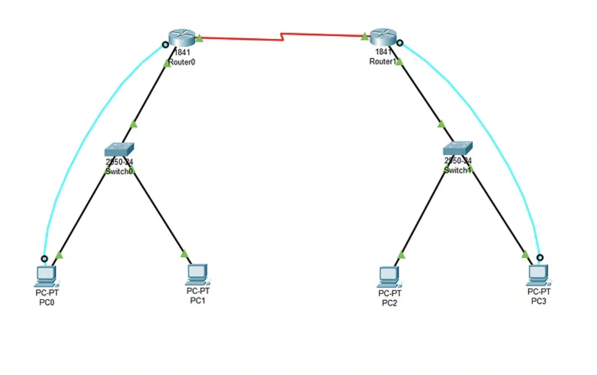

# Lab 9: Staatilise marsruutimise PT

## Esitamine

**Failid:**
1. **Packet Tracer fail:** `Perekonnanimi_StaticRouting.pkt`
2. **Print screen 1:** Topoloogia + IP aadressid
3. **Print screen 2:** `show ip route` mõlemalt ruuterilt + ping tulemused

**Tähtaeg:** ___1 nädal____________

---

## Sissejuhatus

Marsruutimine on sisuliselt protsess, mille käigus andmepakett liigub ühest võrgust teise. Võid seda võrrelda postiteenusega, mis otsustab, millisele veokile sinu pakk peab minema, et jõuda teise linna. Selles laboris sukeldud kõige fundamentaalsemasse viisi selle liikluse kontrollimiseks: staatiline marsruutimine.

---

## 1. Mis on staatiline marsruutimine?

Staatiline marsruutimine on täpselt see, mida nimi ütleb. See on meetod, kus marsruutimistabel - kaart, mida ruuter kasutab otsuste tegemiseks - konfigureeritakse käsitsi võrguadministraatori poolt.

Erinevalt dünaamilisest marsruutimisest, kus ruuterid "räägivad" omavahel, et leida parim tee, tugineb staatiline marsruutimine täielikult inimesele. Sa pead konkreetselt ütlema Ruuterile A: "Kui sa tahad jõuda Võrku B, mine läbi selle konkreetse ukse."

See on jäik, aga annab sulle täieliku kontrolli.

---

## 2. Kuidas staatiline marsruutimine töötab

Mehhanism on lihtne, aga range:

1. **Käsitsi sisestamine:** Administraator sisestab konkreetse marsruudi ruuteri konfiguratsiooni.
2. **Tabeli otsing:** Kui pakett saabub, kontrollib ruuter seda käsitsi loodud marsruutimistabelit.
3. **Edastamine:** Ruuter saadab paketi määratud liidesele või "next-hop" IP-aadressile, mis on tabelis defineeritud.

Ruuter ei "mõtle" ega uuri - ta lihtsalt järgib käske, mida sa talle andsid.

---

## 3. Plussid ja miinused

Nagu igal tööriistal, on ka staatilisel marsruutimisel omad kompromissid.

### Plussid:

**Jõudlus:** See koormab ruuteri protsessorit väga vähe, sest ruuter ei pea pidevalt arvutama keerulisi algoritme.

**Ribalaiuse efektiivsus:** Ribalaiust ei raistata "marsruutimise uuendustele" või ruuterite vahelisele suhtlusele.

**Turvalisus:** See on turvalisem, sest administraator kontrollib selgesõnaliselt iga lubatud teed. Ruuter ei õpi kogemata marsruuti halvasse võrku.

### Miinused:

**Teadmiste nõue:** Administraator peab teadma kogu võrgu täpset topoloogiat. Kui jätad ühe lingi vahele, marsruut ebaõnnestub.

**Skaleeritavus:** See on äärmiselt tüütu suurte võrkude jaoks. Kujuta ette, et pead käsitsi sisestama marsruute 100 ruuteri jaoks!

**Jäikus:** See ei tule hästi toime riketega. Kui kaabel katkeb, ei leia ruuter automaatselt varuteed; ühendus lihtsalt sureb, kuni admin selle käsitsi parandab.

---

## 4. Laboritöö

Selles laboritöös sukeldud staatilise marsruutimise maailma, kasutades Cisco Packet Tracerit. Eesmärk on käsitsi kaardistada võrguteed. Siin on samm-sammuline juhend, kuidas võrk üles ehitada ja konfigureerida.

---

### 4.1 Disain ja topoloogia

#### Riistvara: Varustuse kogumine

Aluse ehitamise alustamiseks kogu kokku vajalik riistvara. Sinu digitaalne töölaud vajab: **kaks 2911 Ruuterit**, **kaks 2960 Switchi** ja **neli PC-d**. 2911 ruuteritel on juba kolm GigabitEthernet porti olemas, nii et lisamooduleid ei ole vaja paigaldada. Ühenda ruuterid omavahel Ethernet kaabliga, ülejäänud kasutavad tavalisi straight-through kaableid.



---

#### Selgroog: Ruuterite omavaheline ühendamine

Kuna 2911 ruuteritel on GigabitEthernet pordid juba olemas, saad kohe alustada ühendamist. Ühenda Router0 ja Router1 nende G0/0 liideste kaudu, kasutades crossover kaablit. Packet Tracer tunneb kaablitüübi automaatselt ära, nii et võid kasutada ka "Automatically Choose Connection Type" valikut.



---

#### Kaabeldus: Ülejäänud seadmete ühendamine

Järgmisena ühenda ülejäänud võrk - ühendades PC-d Switchidega ja Switchid Ruuteritega. Siin on täpne ühenduste tabel:

| Ühendus | Liides ↔ Liides | Kaabel |
|---------|-----------------|--------|
| Router0 ↔ Router1 | G0/0 ↔ G0/0 | Crossover |
| Router0 ↔ Switch0 | G0/1 ↔ G0/1 | Straight-through |
| Router1 ↔ Switch1 | G0/1 ↔ G0/1 | Straight-through |
| PC0 ↔ Switch0 | Fa0 ↔ Fa0/1 | Straight-through |
| PC1 ↔ Switch0 | Fa0 ↔ Fa0/2 | Straight-through |
| PC2 ↔ Switch1 | Fa0 ↔ Fa0/1 | Straight-through |
| PC3 ↔ Switch1 | Fa0 ↔ Fa0/2 | Straight-through |

---

#### Lõplik topoloogia

Pärast kõigi ühenduste tegemist näeb sinu võrk välja selline. Punased tulukesed muutuvad roheliseks, kui lingid tulevad üles - see võtab Packet Traceris mõne sekundi aega.



---

### 4.2 IP planeerimine

#### Antud võrgud

Enne konfigureerimist pead planeerima IP aadressid. Sulle on antud kolm võrku:

| Võrk | Võrguaadress | Mitu hosti vaja? | Kirjeldus |
|------|--------------|------------------|-----------|
| LAN 1 | 192.168.70.0/24 | 2 | PC0 ja PC1 võrk |
| LAN 2 | 172.230.10.0/24 | 2 | PC2 ja PC3 võrk |
| Link | 221.123.1.0/30 | 2 | Ruuterite vaheline link |

Link võrgu jaoks kasuta /30 maski, mis annab täpselt 2 kasutatavat IP aadressi - ideaalne punkt-punkt ühenduse jaoks.

---

#### Täida IP aadresside tabel

Ruuterid saavad tavaliselt esimese kasutatava aadressi (.1), PC-d saavad järgmised.

**Mis on Default Gateway?**

Default Gateway on IP aadress, kuhu PC saadab kõik paketid, mis ei ole tema enda võrgus. See on nagu "väljapääsu uks" - kui PC0 tahab rääkida PC2-ga (teises võrgus), siis ta ei tea kuhu see võrk asub. Ta saadab paketi oma default gateway'le ja ütleb: "Sina tead paremini, saada see edasi!"

Default Gateway **peab olema ruuteri interface IP** selles võrgus:
- LAN 1 PC-de gateway = R0 G0/1 aadress
- LAN 2 PC-de gateway = R1 G0/1 aadress

Täida tabel:

**Ruuterite IP aadressid:**

| Seade | Liides | Võrk | IP-aadress | Alamvõrgumask |
|-------|--------|------|------------|---------------|
| Perekonnanimi-R0 | G0/0 | Link | 221.xxx | |
| Perekonnanimi-R0 | G0/1 | LAN 1 | 192.xxx | |
| Perekonnanimi-R1 | G0/0 | Link | 221.xxx | |
| Perekonnanimi-R1 | G0/1 | LAN 2 | 172.xxx | |

**PC-de IP aadressid:**

| Seade | IP-aadress | Alamvõrgumask | Default Gateway |
|-------|------------|---------------|-----------------|
| PC0 | | | |
| PC1 | | | |
| PC2 | | | |
| PC3 | | | |

---

### 4.3 PC-de konfigureerimine

Riistvara on paigas, nüüd on aeg loogika jaoks. IP adresseerimise skeem on valmis, nii et pead selle rakendama.

Ava PC0 konfiguratsioonileht, vali Desktop → IP Configuration ja sisesta staatiline IP aadress. Korda sama protsessi kõigi nelja PC jaoks.



---

#### Lokaalne ühenduvuse test

Pärast IP aadresside määramist pead veenduma, et kohalikud võrgud toimivad enne marsruutimise proovimist. Tee lokaalne ühenduvuse test (ping) LAN 1 sees (PC0 → PC1) ja LAN 2 sees (PC2 → PC3). 

Ava PC0-l Command Prompt ja sisesta:
```
ping 192.168.70.3
```

Mõlemad testid peavad olema edukad - see tähendab, et Layer 2 (switching) töötab korrektselt.




---

### 4.4 Router0 konfigureerimine CLI kaudu

Nüüd põhisündmuse juurde. Pead konfigureerima võrgu "aju". 

#### Console kaabli ühendamine

Selle asemel, et lihtsalt ruuterile klikkida, tee seda "päris maailma" viisil. Ühenda PC0 Router0-ga, kasutades helesinist Console kaablit. Ühenda RS-232 ots PC-sse ja Console ots ruuterisse.



---

#### Router0 CLI-le ligipääs terminali kaudu ja Interface G0/0 konfigureerimine (Link to Router1)

Ava PC0-l Desktop → Terminal. Jäta vaikimisi seaded (9600 baud) ja vajuta OK. Nüüd oled ühendatud Router0 käsureale.

Esiteks muuda ruuteri nimi, et see sisaldaks sinu perekonnanime.

Järgmisena konfigureeri interface, mis ühendab sind teise ruuteriga. See on sinu "selgroog" - link, mille kaudu liiklus liigub võrkude vahel.

Näed teadet "%LINK-5-CHANGED: Interface GigabitEthernet0/0, changed state to up" - see tähendab, et link tuli üles!

```
Router>enable
Router#configure terminal
Router(config)#hostname Perekonnanimi-R0
Perekonnanimi-R0(config)#interface g0/0
Perekonnanimi-R0(config-if)#ip address [R0 G0/0 IP tabelist] [MASK tabelist]
Perekonnanimi-R0(config-if)#no shutdown
Perekonnanimi-R0(config-if)#exit
```

☝️ **Kust numbrid tulevad:** Vaata oma täidetud tabelist "Ruuterite IP aadressid" → R0 → G0/0 rida

---

#### Interface G0/1 konfigureerimine (LAN 1)

Nüüd konfigureeri interface, mis ühendab sind kohaliku võrguga (LAN 1), kus asuvad PC0 ja PC1.

```
Perekonnanimi-R0(config)#interface g0/1
Perekonnanimi-R0(config-if)#ip address [R0 G0/1 IP tabelist] [MASK tabelist]
Perekonnanimi-R0(config-if)#no shutdown
Perekonnanimi-R0(config-if)#exit
```

☝️ **Kust numbrid tulevad:** Vaata oma täidetud tabelist "Ruuterite IP aadressid" → R0 → G0/1 rida

---

#### Staatiline marsruutimine Router0-l (UUS TEEMA! 🆕)

See on kriitiline samm - kogu labori põhipunkt! 

**Miks me seda teeme?**

Praegu teab Router0 ainult kahte võrku:
- 221.123.1.0/30 (link) - sest G0/0 on selles võrgus
- 192.168.70.0/24 (LAN 1) - sest G0/1 on selles võrgus

Aga Router0 **ei tea midagi** LAN 2 võrgust (172.230.10.0/24)! Kui PC0 saadab paketi PC2-le, siis:

1. PC0 saadab paketi oma gateway'le (R0)
2. R0 vaatab marsruutimistabelit: "Kuhu läheb 172.230.10.2?"
3. R0 ei leia vastet → **pakett visatakse minema!**

Seepärast peame ütlema R0-le: "Kui tahad jõuda võrku 172.230.10.0/24, saada pakett edasi R1-le."

**Staatilise marsruudi süntaks:**
```
ip route [SIHTKOHA VÕRGU ID] [SIHTKOHA MASK] [NEXT-HOP IP]
            ↓                    ↓              ↓
      Kuhu tahad jõuda?    Selle võrgu    Kellele annad
      (võrguaadress!)        mask        paketi edasi?
```

**Sinu käsk:**
```
Perekonnanimi-R0(config)#ip route [LAN2 võrgu ID] [LAN2 mask] [R1 G0/0 IP]
```

☝️ **Kust numbrid tulevad:**
- **Sihtkoha võrgu ID** = LAN 2 võrguaadress tabelist "Antud võrgud" → 172.230.10.0
- **Mask** = LAN 2 mask → 255.255.255.0
- **Next-hop** = R1 link interface IP tabelist "Ruuterite IP aadressid" → R1 G0/0

> ⚠️ **NB!** Sihtkoha võrgu ID on **võrguaadress** (172.230.10.0), MITTE hosti aadress (172.230.10.2)!

---

#### Konfiguratsiooni salvestamine

Ära unusta - salvesta konfiguratsioon, et see ei kaoks ruuteri taaskäivitamisel.

```
Perekonnanimi-R0#copy running-config startup-config
```

---

#### Marsruutimistabeli kontrollimine (UUS TEEMA! 🆕)

Verifitseeri oma tööd, kontrollides marsruutimistabelit:

```
Perekonnanimi-R0#show ip route
```

Pead nägema kolme marsruuti:
- **C 192.168.70.0/24** - Connected, LAN 1 (G0/1 küljes)
- **C 221.123.1.0/30** - Connected, Link (G0/0 küljes)
- **S 172.230.10.0/24 [1/0] via 221.123.1.2** - Static, sinu lisatud marsruut!

Täht **C** = Connected (automaatselt tekkinud, sest interface on selles võrgus)
Täht **S** = Static (sina lisasid käsitsi)

---

### 4.5 Router1 konfigureerimine CLI kaudu

Võrgu vasak pool on tehtud, liigu paremale poolele. Router1 konfiguratsiooni plaan on struktuurilt identne, aga IP aadressid ja sihtkoha võrk on erinevad.

#### Console kaabli ühendamine ja Router1 CLI-le ligipääs

Ühenda PC3 Router1-ga Console kaabli abil. Ava PC3-l terminali. Kui küsitakse, kas siseneda algkonfiguratsiooni dialoogi, sisesta **No**, et alustada puhtalt lehelt.

```
Router>enable
Router#configure terminal
Router(config)#hostname Perekonnanimi-R1
Perekonnanimi-R1(config)#interface g0/0
Perekonnanimi-R1(config-if)#ip address [R1 G0/0 IP tabelist] [MASK tabelist]
Perekonnanimi-R1(config-if)#no shutdown
Perekonnanimi-R1(config-if)#exit
```

☝️ **Kust numbrid tulevad:** Vaata oma täidetud tabelist "Ruuterite IP aadressid" → R1 → G0/0 rida

---

#### Interface G0/1 konfigureerimine (LAN 2)

```
Perekonnanimi-R1(config)#interface g0/1
Perekonnanimi-R1(config-if)#ip address [R1 G0/1 IP tabelist] [MASK tabelist]
Perekonnanimi-R1(config-if)#no shutdown
Perekonnanimi-R1(config-if)#exit
```

☝️ **Kust numbrid tulevad:** Vaata oma täidetud tabelist "Ruuterite IP aadressid" → R1 → G0/1 rida

---

#### Staatiline marsruutimine Router1-l

Nüüd sama loogika vastupidi! Router1 teab LAN 2 ja Link võrke, aga **ei tea midagi LAN 1 võrgust**.

Kui PC2 saadab paketi PC0-le ja R1-l pole marsruuti, siis pakett kaob ära. Isegi kui R0 saatis paketi edukalt R1-le, ei saa R1 vastust tagasi saata!

> ⚠️ **OLULINE:** Marsruutimine peab toimima **mõlemas suunas**! Muidu lähevad paketid ühele poole, aga vastused ei tule tagasi.

```
Perekonnanimi-R1(config)#ip route [LAN1 võrgu ID] [LAN1 mask] [R0 G0/0 IP]
Perekonnanimi-R1(config)#exit
Perekonnanimi-R1#copy running-config startup-config
```

☝️ **Kust numbrid tulevad:**
- **Sihtkoha võrgu ID** = LAN 1 võrguaadress tabelist "Antud võrgud" → 192.168.70.0
- **Mask** = LAN 1 mask → 255.255.255.0
- **Next-hop** = R0 link interface IP tabelist "Ruuterite IP aadressid" → R0 G0/0

---

#### Marsruutimistabeli kontrollimine

```
Perekonnanimi-R1#show ip route
```

Pead nägema:
- **C 172.230.10.0/24** - Connected, LAN 2
- **C 221.123.1.0/30** - Connected, Link
- **S 192.168.70.0/24 [1/0] via 221.123.1.1** - Static, marsruut LAN 1 suunas

---

#### Lõplik võrgu olek

Pärast mõlema ruuteri konfigureerimist näeb sinu võrk välja selline. Kõik tuled peavad olema rohelised - see tähendab, et kõik lingid on üleval!



---

### 4.6 Lõplik testimine

#### Test 1: Ping ruuterite vahel

Esimese testina kontrolli, kas ruuterid näevad üksteist üle lingi. Pingu Router0-lt Router1 link IP-d.

**Töötab?** ☐ Jah ☐ Ei

Viis hüüumärki (!!!) - kõik viis paketti jõudsid kohale!

---

#### Test 2: Ping LAN-ide vahel

Viimane tõehetk. Tee ping test LAN 1-st LAN 2-sse. Ava PC0-l Command Prompt ja pingu PC2 IP aadressi.

**Töötab?** ☐ Jah ☐ Ei

Kui ping töötab, liiguvad paketid edukalt LAN 1-st LAN 2-sse ja tagasi. Staatiline marsruutimine on edukalt konfigureeritud!

---

Kontrolli ka vastupidist suunda - PC2-lt PC0-le:

**Töötab?** ☐ Jah ☐ Ei

---

## 5. Kuidas pakett tegelikult liigub?

Nüüd kui kõik töötab, vaatame mis tegelikult juhtub, kui PC0 pingib PC2:

```
PC0 (192.168.70.2) → ping → PC2 (172.230.10.2)
```
```
Samm 1: PC0 vaatab: "Kas [PC2 IP] on minu võrgus [LAN1]?" → EI
Samm 2: PC0 saadab paketi oma Default Gateway'le [R0 G0/1 IP]
Samm 3: R0 vaatab marsruutimistabelit: "Kuhu läheb [PC2 IP]?"
Samm 4: R0 leiab: "S [LAN2 võrk] via [R1 G0/0 IP]" → saadab R1-le
Samm 5: R1 vaatab: "Kas [PC2 IP] on minu võrgus?" → JAH (G0/1)
Samm 6: R1 saadab paketi otse PC2-le
```
**Vastus tuleb tagasi sama loogikaga**, aga vastupidises suunas!

---

## 6. Kokkuvõte

**Mida sa õppisid:**

_____________________________________________________________

_____________________________________________________________

_____________________________________________________________

**Mis oli kõige raskem?**

_____________________________________________________________

_____________________________________________________________

**Olulised punktid, mida meeles pidada:**

1. Marsruudid peavad olema ______________________ suunas.

2. `show ip route` näitab: C = _____________, S = _____________

3. Ilma _________________ ei tea PC, kuhu saata pakette teistesse võrkudesse.

---

## Kontrolli enne esitamist

- ☐ .pkt faili nimi: `Perekonnanimi_StaticRouting.pkt`
- ☐ Ruuterite hostname sisaldab perekonnanime
- ☐ IP aadresside tabelid täidetud
- ☐ Static route mõlemal ruuteril
- ☐ Ping töötab LAN-ide vahel
- ☐ Kõik 3 faili esitatud (.pkt + 2x .png)
