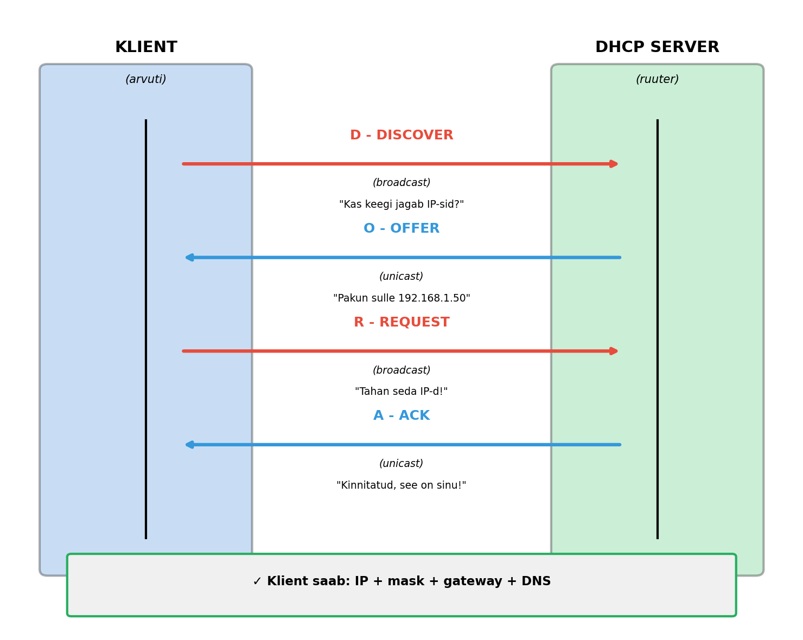
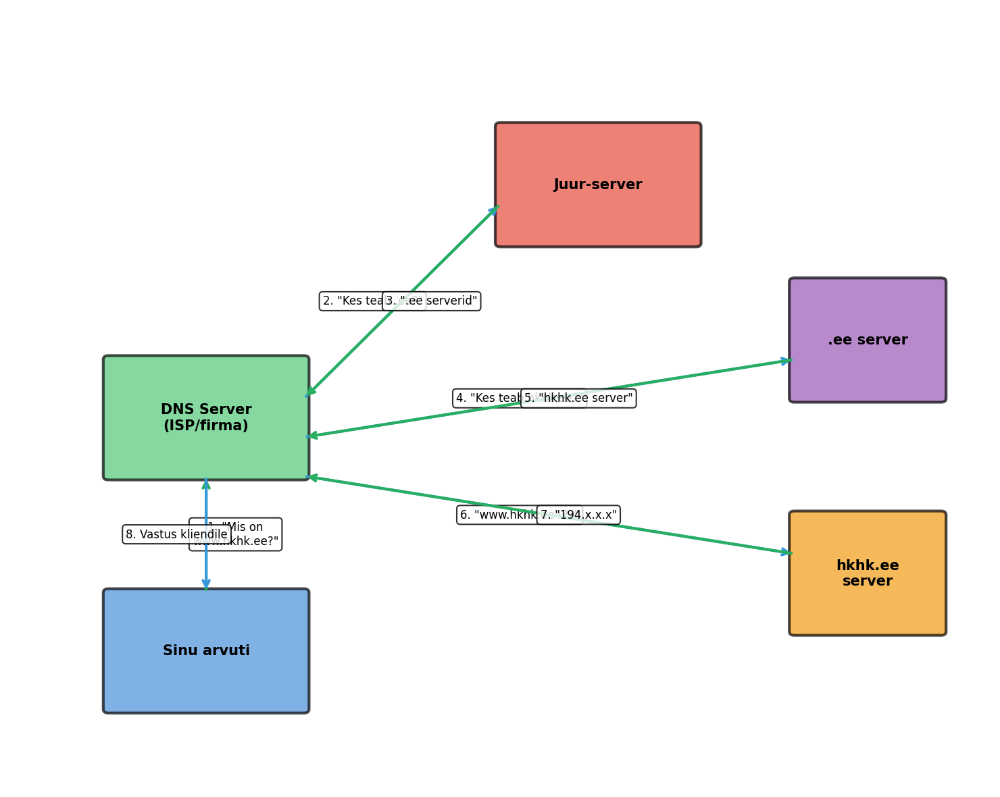
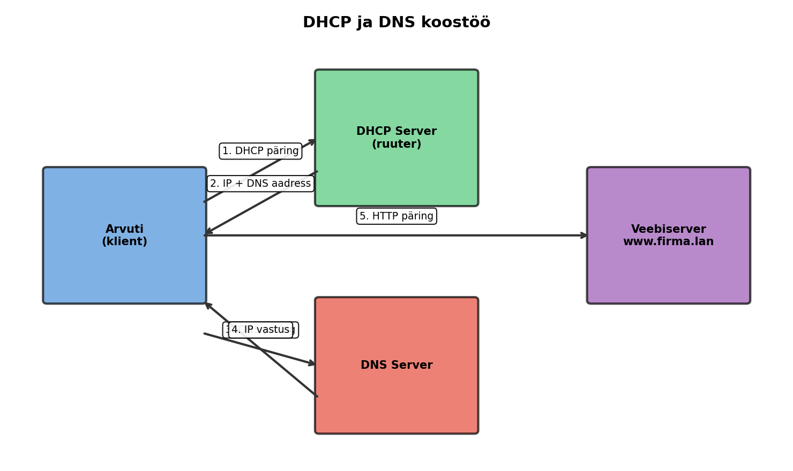

# Loeng 17 — DHCP ja DNS

*Automaatika, mis hoiab interneti töös*

---

## Sisukord

1. [Sissejuhatus](#1-sissejuhatus)
2. [DHCP — Dynamic Host Configuration Protocol](#2-dhcp--dynamic-host-configuration-protocol)
3. [DORA protsess](#3-dora-protsess)
4. [DHCP serveri seadistamine](#4-dhcp-serveri-seadistamine)
5. [DNS — Domain Name System](#5-dns--domain-name-system)
6. [DNS hierarhia ja päringud](#6-dns-hierarhia-ja-päringud)
7. [DHCP ja DNS koostöö](#7-dhcp-ja-dns-koostöö)
8. [Kokkuvõte](#8-kokkuvõte)

---

## 1. Sissejuhatus

> **Miks see oluline on?**  
> Ilma DHCP ja DNS-ita peaks iga inimene teadma peast kümneid IP-aadresse ja iga IT-mees käima käsitsi läbi sadu arvuteid. Internet, nagu me seda tunneme, lihtsalt ei toimiks.

### Mida me juba teame?

Eelmistes tundides oleme käsitsi seadistanud igale seadmele IP aadressi, alamvõrgumaski ja default gateway. See toimib hästi väikestes laborivõrkudes, kus on 3-4 arvutit.

Aga päris maailmas? Seal on asjad natuke teisiti.

### Kaks protokolli, mis muutsid kõike

1990ndatel oli internet kasvav kaos. Iga uus arvuti tähendas kellegi jaoks tundi käsitsi seadistamist. Iga uus töötaja tähendas IT-mehele peavalu.

Siis tulid kaks protokolli, mis muutsid kõike:

**DHCP** — arvuti küsib "anna mulle IP" ja saab selle automaatselt. Mitte keegi ei pea midagi käsitsi tegema.

**DNS** — inimene kirjutab "google.com" ja arvuti teab, et see tähendab 142.250.74.142. Mitte keegi ei pea numbreid meeles pidama.

Täna õpime mõlemat. Ja ma luban — pärast seda tundi vaatad sa oma koduruuterit teise pilguga.

---

## 2. DHCP — Dynamic Host Configuration Protocol

> **Miks see oluline on?**  
> DHCP on põhjus, miks sa saad kohvikusse minna, WiFi-ga ühenduda ja kohe internetti pääseda. Mitte keegi ei küsi sinult "mis IP sa tahad?" — see lihtsalt töötab.

### Probleem, millest kõik algas

Kujuta ette, et oled IT-juht suures ettevõttes. Sul on 500 töötajat, igaühel arvuti. Igale arvutile on vaja seadistada:

- IP aadress (ja see PEAB olema unikaalne!)
- Alamvõrgumask
- Default gateway
- DNS serveri aadress

See tähendab 500 × 4 = **2000 seadistust**. Üks number valesti — ja see arvuti ei tööta võrgus.

Aga oota, see pole veel kõik! Mis juhtub, kui:

- Uus töötaja tuleb tööle? Pead talle vaba IP leidma ja seadistama.
- Töötaja vahetab arvutit? Pead vana IP vabastama ja uuele seadistama.
- DNS server vahetub? Pead KÕIK 500 arvutit üle käima!
- Keegi paneb kogemata sama IP mis kolleegil? Mõlemad arvutid lakkavad töötamast.

Ma olen näinud kontorit, kus kaks inimest said kogemata sama IP. Tulemus? Mõlema arvuti võrguühendus hakkas "vilkuma" — töötas 10 sekundit, siis kadus, siis tuli tagasi. Selle debugimine võttis 2 tundi. Kaks tundi kahe töötaja tööaega, pluss IT-mehe aeg.

See oli haldamise õudusunenägu. Ja just sellepärast leiutati DHCP.

### Kuidas DHCP sind päästab

**DHCP** (Dynamic Host Configuration Protocol) idee on nii lihtne, et imestad, miks seda varem polnud:

1. Võrgus on üks DHCP **server** (võib olla ruuter, eraldiseisev server või isegi koduruuter)
2. Server teab, milliseid IP aadresse võib välja jagada
3. Kui arvuti lülitub sisse, **küsib** ta serverilt IP aadressi
4. Server **annab** arvutile IP + kõik muud vajalikud seaded

Kasutaja ei pea midagi tegema. IT-mees ei pea midagi tegema. See lihtsalt töötab.

**Huvitav fakt:** Sinu koduruuter on DHCP server! Sellepärast saavad su telefon, laptop ja nutiteleka kõik automaatselt internetti — ruuter jagab neile IP aadresse.

### Analoogia: hotelli vastuvõtt

Mõtle hotelli peale:

**Ilma DHCP-ta** oleks nagu:
- Tuled hotelli
- Valid ise toanumbri: "Ma tahan tuba 247"
- Loodad, et keegi teine pole seda valinud
- Kui valid vale numbri, ei saa ust lahti

**DHCP-ga** on nagu:
- Tuled hotelli
- Lähed vastuvõttu
- Administraator: "Teie tuba on 247, WiFi parool on 'hotell123', hommikusöök on kell 8"
- Administraator teab täpselt, millised toad on vabad

DHCP server ON see hotelli administraator — ta teab, millised "toad" (IP aadressid) on vabad ja jagab neid külalistele.

### DHCP põhimõisted

| Mõiste | Selgitus |
|--------|----------|
| **DHCP Server** | Seade, mis jagab IP aadresse. Võib olla Cisco ruuter, Windows Server, Linux server või koduruuter. |
| **DHCP Client** | Seade, mis küsib IP aadressi. Praktiliselt KÕIK tänapäevased seadmed: arvutid, telefonid, printerid, nutikellad, isegi mõned lambid ja külmkapid! |
| **DHCP Pool** | Vahemik IP aadresse, mida server saab välja jagada. Näiteks "jaga aadresse vahemikus 192.168.1.50 kuni 192.168.1.200". |
| **Lease** | "Rent" ehk kui kaua klient saab IP-d kasutada. Tüüpiliselt 8 tundi kuni 7 päeva. Miks mitte igavesti? Sest siis saaksid vabad aadressid otsa! |
| **Excluded Addresses** | IP aadressid, mida server EI JAGA. Need on reserveeritud serveritele ja ruuteritele — nemad vajavad püsivat aadressi. |

---

### ✅ Kontrolli ennast

1. Miks on DHCP parem kui käsitsi IP seadistamine?
2. Mis juhtub, kui kaks arvutit saavad sama IP aadressi?
3. Mis on DHCP "lease" ja miks see eksisteerib?

---

## 3. DORA protsess

> **Miks see oluline on?**  
> DORA on see "tants", mida su arvuti ja ruuter teevad iga kord, kui sa võrku ühendud. Kui sa tead DORA-t, siis sa MÕISTAD, kuidas võrk töötab — mitte ei õpi lihtsalt pähe.

### Neli sammu internetini

Kui arvuti lülitub sisse ja vajab IP aadressi, toimub neljasammuline "vestlus" arvuti ja DHCP serveri vahel. 

Seda nimetatakse **DORA** protsessiks — nime järgi sammude esitähtedest.

### D — Discover (Avastamine)

Arvuti lülitub sisse. Tal pole veel IP aadressi — ta ei tea isegi, kas võrgus ON DHCP serverit.

Mida ta teeb? Karjub!

Arvuti saadab **broadcast** sõnumi kogu võrku:
- Sihtaadress: 255.255.255.255 (see tähendab "KÕIGILE!")
- Sisu: "Hei! Kas keegi jagab siin IP aadresse? Palun vastake!"

See on nagu tulla pimedasse ruumi ja hüüda "Kas siin on keegi?"

Kuna see on broadcast, kuulevad seda KÕIK võrgus olevad seadmed. Aga ainult DHCP server vastab.

### O — Offer (Pakkumine)

DHCP server kuuleb karjet ja mõtleb:
- "Hmm, mul on vabad aadressid 192.168.1.50 kuni 192.168.1.200..."
- "Annan sellele arvutile 192.168.1.50"

Server saadab **Offer** sõnumi:
- "Tere! Mul on sulle pakkuda 192.168.1.50"
- "Gateway on 192.168.1.1"
- "DNS server on 192.168.1.10"
- "Saad seda kasutada 8 tundi"

See on nagu "Jah, ma olen siin! Sul võib olla tuba 247."

### R — Request (Päring)

Nüüd tuleb huvitav osa. Teoreetiliselt võiks võrgus olla MITU DHCP serverit ja arvuti võiks saada mitu pakkumist.

Arvuti valib ühe (tavaliselt esimese) ja saadab **broadcast** kinnituse:
- "Jah, ma tahan seda IP-d, mida server 192.168.1.1 mulle pakkus!"

Miks jälle broadcast? Sest arvuti tahab, et KÕIK DHCP serverid kuuleksid. Need teised serverid mõtlevad: "Aa, see klient võttis teise serveri pakkumise — ma ei pea talle IP-d reserveerima."

Viisakas, eks?

### A — Acknowledgment (Kinnitus)

Server saadab lõpliku kinnituse:
- "Selge, 192.168.1.50 on nüüd SINU!"
- "Lease algab nüüd, kestab 8 tundi"

Arvuti seadistab oma võrgukaardi ja... kõik. Valmis. Internet töötab.

**👉 Kui DORA on läbi, siis arvuti saab internetti minna. Kogu see protsess võtab vähem kui sekundi!**

### DORA kokkuvõte

| Samm | Nimi | Suund | Tüüp | Mida ütleb |
|------|------|-------|------|------------|
| **D** | Discover | Klient → Võrk | Broadcast | "Kas keegi jagab IP-sid?" |
| **O** | Offer | Server → Klient | Unicast | "Pakun sulle 192.168.1.50" |
| **R** | Request | Klient → Võrk | Broadcast | "Tahan seda IP-d!" |
| **A** | Ack | Server → Klient | Unicast | "Kinnitatud, see on sinu!" |

**Broadcast** = saadetakse kõigile võrgus  
**Unicast** = saadetakse ainult ühele seadmele

### Mis juhtub, kui lease lõpeb?

Hea küsimus! Kas arvuti kaotab ühenduse täpselt 8 tunni pärast?

Ei! Arvuti pole rumal. Ta alustab lease uuendamist ENNE tähtaega:

| Millal | Mida arvuti teeb |
|--------|------------------|
| 50% lease ajast (4h) | Proovib vaikselt uuendada sama serveriga |
| 87.5% lease ajast (7h) | Kui eelmine ei õnnestunud, proovib mis tahes serveriga |
| 100% (8h) | Alles NÜÜD kaotab IP ja alustab uuesti DORA-ga |

Praktikas, kui arvuti on pidevalt võrgus, kasutab ta sama IP-d aastaid. Server lihtsalt pikendab "renti" iga paari tunni tagant.

---

### ✅ Kontrolli ennast

1. Mida tähendab DORA lühend?
2. Miks on Discover ja Request broadcast-sõnumid, aga Offer ja Ack unicast?
3. Kui sul on 8-tunnine lease, siis millal arvuti esimest korda proovib seda uuendada?

---

## 4. DHCP serveri seadistamine

> **Miks see oluline on?**  
> See osa näitab, kuidas DHCP "telgitagustes" välja näeb — mida administraator peab otsustama, enne kui DHCP tööle hakkab. Käske harjutame laboris!

### Mida DHCP server peab teadma?

Enne kui DHCP server saab IP-sid jagama hakata, peab keegi talle ütlema:

1. **Millisest võrgust jagada?** — näiteks 192.168.1.0/24
2. **Mis on gateway?** — et kliendid teaksid, kuhu pakette saata
3. **Mis on DNS server?** — et kliendid saaksid nimesid lahendada

### Excluded Addresses — ära jaga neid!

Mõned IP aadressid EI TOHI kunagi DHCP-ga välja jagada. Miks?

- **Ruuteri aadress** — kui keegi saab selle, kukub kogu võrk kokku
- **Serverite aadressid** — serverid vajavad PÜSIVAT IP-d, mis ei muutu
- **Printerite aadressid** — et inimesed teaksid, kuhu printida

Seega öeldakse DHCP serverile: "Ära kunagi jaga aadresse .1 kuni .49" — need on reserveeritud.

**Hea praktika:**

| Vahemik | Kellele |
|---------|---------|
| .1 — .10 | Ruuterid ja switchid |
| .11 — .30 | Serverid |
| .31 — .49 | Printerid, IP-kaamerad |
| .50 — .200 | **DHCP pool** — tavalised arvutid |
| .201 — .254 | Reserv tulevikuks |

### Kuidas näha, kes mida sai?

Administraator saab alati vaadata, millised IP-d on välja jagatud — see on nagu hotelli registratuuriraamat. Näed, kes millises "toas" on ja millal "rent" lõpeb.

---

### ✅ Kontrolli ennast

1. Miks on vaja excluded addresses?
2. Mis juhtuks, kui ruuteri IP (gateway) antaks kogemata DHCP-ga kellelegi teisele?
3. Miks serverid ja printerid ei kasuta tavaliselt DHCP-d?

---

## 5. DNS — Domain Name System

> **Miks see oluline on?**  
> DNS on põhjus, miks sa kirjutad "google.com", mitte "142.250.74.142". Ilma DNS-ita oleks internet nagu telefoniraamat, kus on ainult numbrid — nimesid pole.

### Proovi seda

Proovi meelde jätta need numbrid:

- 142.250.74.142
- 31.13.76.36  
- 151.101.1.140

Raske, eks? Aga mis siis, kui ütlen:

- google.com
- facebook.com
- reddit.com

Palju lihtsam!

**Inimesed mõtlevad nimedes. Arvutid mõtlevad numbrites. DNS on tõlk nende vahel.**

### Natuke ajalugu

1983. aastal, kui internet oli veel noor, oli olemas fail nimega `HOSTS.TXT`. See oli ÜKSAINUS fail, mis sisaldas KÕIKI interneti nimesid ja IP-sid. Seda hoiti Stanford Research Institute arvutis ja KÕIK pidid selle regulaarselt alla laadima.

Probleem? Internet kasvas. 1988. aastaks oli see fail nii suur ja muutus nii tihti, et süsteem lihtsalt ei töötanud enam.

Lahendus oli DNS — hajutatud süsteem, kus mitte keegi ei pea KÕIKE teadma. Igaüks teab ainult oma osa.

### Analoogia: infotelefon

Mõtle vanale paberkandjal telefoniraamatule ja infotelefonile:

**DNS** on nagu telefoniraamat:
- Otsid nime (google.com)
- Leiad numbri (142.250.74.142)
- Helistad numbrile

**DNS server** on nagu infotelefon:
- Helistad: "Mis on Google'i number?"
- Operaator vaatab registrist
- Ütleb sulle numbri

Vahe on selles, et DNS on PALJU kiirem ja automatiseeritud.

### DNS põhimõisted

| Mõiste | Selgitus |
|--------|----------|
| **Domain** | Domeeninimi, inimloetav aadress. Näiteks: google.com, hkhk.ee |
| **DNS Server** | Server, mis teab nimede ja IP-de seoseid |
| **DNS Record** | Üks kirje DNS andmebaasis — ühe nime ja IP seos |
| **TTL** | Time To Live — kui kaua vastust "meeles hoida". Näiteks 1 tund. |

### DNS kirje tüübid

| Tüüp | Mida teeb | Näide |
|------|-----------|-------|
| **A** | Nimi → IPv4 aadress | google.com → 142.250.74.142 |
| **AAAA** | Nimi → IPv6 aadress | google.com → 2607:f8b0:... |
| **CNAME** | Alias, teine nimi | www.google.com → google.com |
| **MX** | E-posti server | google.com → mail.google.com |

**CNAME** on eriti kasulik. Näiteks `www.google.com` on tegelikult lihtsalt alias `google.com` jaoks. Mõlemad viivad samasse kohta.

---

### ✅ Kontrolli ennast

1. Miks DNS leiutati? Mis oli probleem enne?
2. Mis vahe on A ja CNAME kirjel?
3. Kui kirjutad brauserisse "facebook.com", siis mis tegelikult toimub enne, kui leht avaneb?

---

## 6. DNS hierarhia ja päringud

> **Miks see oluline on?**  
> DNS ei ole üks suur server — see on terve maailma peale laiali jagatud süsteem. Kui mõistad hierarhiat, saad aru, miks mõnikord "DNS ei tööta" ja kuidas seda parandada.

**👉 Lihtne kokkuvõte enne detaile:** DNS päring liigub läbi mitme serveri: root → .ee → hkhk.ee → www. Igaüks teab ainult järgmist sammu, mitte kogu vastust.

### DNS puu

DNS on organiseeritud nagu puu — tipus juur, sealt hargnevad oksad.

**Tipus:** Juur (root) — seda tähistatakse punktiga `.`

**Teine tase:** TLD-d (Top Level Domains) — `.com`, `.ee`, `.org`, `.net`

**Kolmas tase:** Domeenid — `google`, `hkhk`, `facebook`

**Neljas tase:** Alamdomeenid — `www`, `mail`, `api`

**Huvitav fakt:** Tegelik täielik domeeninimi lõpeb punktiga! `www.google.com.` — see viimane punkt on juur. Brauserid lihtsalt ei näita seda.

### Kuidas DNS päring tegelikult töötab

Kui sisestad brauserisse `www.hkhk.ee`, siis su arvuti EI TEA selle IP-d. Ta peab küsima.

Aga kellelt küsida? Su arvuti ei saa ju kogu maailma DNS servereid tunda!

Siin tuleb mängu **rekursiivne päring**:

| Samm | Mis toimub |
|------|------------|
| 1 | Su arvuti küsib OMA DNS serverilt (selle sai ta DHCP-st!) |
| 2 | DNS server ei tea vastust → küsib juur-serverilt: "Kes teab `.ee` domeene?" |
| 3 | Juur-server: "`.ee` eest vastutavad need serverid: [aadressid]" |
| 4 | DNS server küsib `.ee` serverilt: "Kes teab `hkhk.ee`?" |
| 5 | `.ee` server: "`hkhk.ee` eest vastutab see server: [aadress]" |
| 6 | DNS server küsib `hkhk.ee` serverilt: "Mis on `www.hkhk.ee` IP?" |
| 7 | `hkhk.ee` server: "www.hkhk.ee = 194.x.x.x" |
| 8 | DNS server saadab vastuse su arvutile |

See tundub keeruline, aga toimub vähem kui sekundi jooksul!

### DNS cache — et mitte iga kord küsida

Kujuta ette, kui iga kord `google.com` avades peaks kogu see protsess toimuma. See oleks aeglane!

Sellepärast on olemas **cache** (vahemälu). Kui DNS server on juba korra küsinud `google.com` IP-d, siis ta MÄLETAB seda mõnda aega.

**TTL** (Time To Live) määrab, kui kaua meeles pidada:

| TTL | Aeg | Millal kasutatakse |
|-----|-----|---------------------|
| 300 | 5 minutit | Kiiresti muutuvad asjad |
| 3600 | 1 tund | Tavaline |
| 86400 | 24 tundi | Harva muutuvad asjad |

**Huvitav fakt:** Kui muudad oma veebilehe serverit, siis võib minna kuni 24 tundi, enne kui KÕIK näevad uut versiooni — sest vanad DNS vastused on veel cache-s!

### DNS testimine — nslookup

Windowsis ja Linuxis on olemas käsk `nslookup`, mis küsib DNS serverilt nime IP aadressi. See on kasulik, kui tahad teada:

- Kas DNS üldse töötab?
- Mis IP on mingil nimel?
- Kas probleem on DNS-is või mujal?

Näiteks kui küsid `nslookup google.com`, saad vastuseks:
- Sinu DNS serveri nime (kelle käest küsisid)
- Google.com IP aadressi

Kui näed "Non-authoritative answer", tähendab see, et vastus tuli cache-st — keegi on seda juba varem küsinud.

**Kui miski ei tööta** ja näed "Non-existent domain", siis kas:
- Sellist nime pole olemas, VÕI
- DNS server ei tööta

---

### ✅ Kontrolli ennast

1. Miks DNS on hierarhiline (puustruktuur), mitte üks suur server?
2. Mis on cache ja miks see eksisteerib?
3. Kui `nslookup google.com` näitab "Non-authoritative answer", siis mida see tähendab?

---

## 7. DHCP ja DNS koostöö

> **Miks see oluline on?**  
> See on "aha-moment" — koht, kus kõik klõpsab kokku. DHCP ja DNS pole kaks eraldi asja, nad töötavad KOOS, et sa saaksid lihtsalt WiFi-ga ühenduda ja minna google.com peale.

### Kaks protokolli, üks eesmärk

DHCP ja DNS on erinevad protokollid, aga nad on nagu paar, kes täiendavad teineteist:

**DHCP annab sulle:**
- IP aadressi (et sa saaksid võrgus rääkida)
- Alamvõrgumaski (et sa teaksid, kes on "naabrid")
- Default gateway (et sa pääseksid välja oma võrgust)
- **DNS serveri aadressi** ← see on võtmekoht!

**DNS server** (mille aadressi sa just said) tõlgib siis sulle nimesid IP-deks.

Ilma DHCP-ta ei tea sa DNS serveri aadressi.  
Ilma DNS-ita pead kasutama IP aadresse.  
**Koos** — kõik lihtsalt töötab.

### Päris elu näide: Mati hommik

Mati tuleb hommikul kontorisse:

| Aeg | Mis toimub |
|-----|------------|
| 8:00 | Mati lülitab arvuti sisse |
| 8:00:01 | Arvuti saadab DHCP Discover |
| 8:00:02 | Ruuter vastab: IP=192.168.1.57, Gateway=192.168.1.1, DNS=192.168.1.10 |
| 8:00:03 | Arvuti seadistab end — võrk töötab |
| 8:05 | Mati avab brauseri, kirjutab "mail.firma.lan" |
| 8:05:01 | Arvuti küsib DNS-ilt (192.168.1.10): "Mis on mail.firma.lan IP?" |
| 8:05:02 | DNS vastab: "192.168.1.10" |
| 8:05:03 | Brauser avab meiliserveri |

Mati ei teadnud ühtegi IP aadressi. Ta ei seadistanud midagi. Ta lihtsalt lülitas arvuti sisse ja läks tööle.

**See on DHCP + DNS võlu.**

### Praktiline näide: kontori võrk

Väike kontor, 192.168.1.0/24 võrk:

| Seade | IP aadress | Kust saab? |
|-------|------------|------------|
| Ruuter (DHCP server) | 192.168.1.1 | Staatiline (ei muutu) |
| DNS server | 192.168.1.10 | Staatiline |
| Printer | 192.168.1.20 | Staatiline |
| Mati arvuti | 192.168.1.57 | DHCP |
| Kati arvuti | 192.168.1.58 | DHCP |
| Priidu laptop | 192.168.1.59 | DHCP |

Serverid ja printer = staatilised, sest nende aadress peab olema teada.  
Töötajate arvutid = DHCP, sest pole vahet, mis IP nad saavad.

---

### ✅ Kontrolli ennast

1. DHCP annab sulle 4 asja. Millised need on?
2. Kuidas arvuti teab, milliselt DNS serverilt küsida?
3. Miks serverid kasutavad staatilisi IP-sid, aga töötajate arvutid DHCP-d?

---

## 8. Kokkuvõte

> **Miks see oluline on?**  
> See on kiire ülevaade kõigest — ideaalne kordamiseks enne testi või laborit.

### DHCP — ühe pilguga

| Mõiste | Selgitus |
|--------|----------|
| **DHCP** | Protokoll, mis jagab automaatselt IP aadresse |
| **DORA** | Discover → Offer → Request → Ack |
| **Pool** | IP-de vahemik, mida server jagab |
| **Lease** | "Rent" — kui kaua IP-d kasutada saab |
| **Excluded** | Aadressid, mida EI jagata |

### DNS — ühe pilguga

| Mõiste | Selgitus |
|--------|----------|
| **DNS** | Protokoll, mis tõlgib nimed IP-deks |
| **A record** | Nimi → IPv4 aadress |
| **CNAME** | Alias (teine nimi samale asjale) |
| **TTL** | Kui kaua vastust cache-s hoida |
| **Cache** | Vahemälu — et mitte iga kord küsida |

### Miks mõlemad koos?

| Variant | Mis juhtub |
|---------|------------|
| Ainult DHCP | IP tuleb automaatselt, aga pead numbreid teadma |
| Ainult DNS | Nimed töötavad, aga pead käsitsi IP seadistama |
| **DHCP + DNS** | Lülitad arvuti sisse → kõik töötab |

---

### 🎯 Lõplik kontroll

1. Selgita oma sõnadega, mis on DHCP ja miks see eksisteerib.
2. Selgita DORA protsessi nagu seletaksid sõbrale.
3. Mis vahe on staatilisel IP-l ja DHCP-l? Millal kasutada kumbagi?
4. Kuidas DNS päring liigub root serverist kuni lõpliku vastuseni?
5. Miks DHCP annab ka DNS serveri aadressi, mitte ainult IP-d?

---

*Nüüd oled valmis laboriks! 🚀*
