# Loeng 18 — Transpordikiht (TCP ja UDP)

*Kuidas andmed tegelikult kohale jõuavad*

---

## Sisukord

1. [Sissejuhatus](#1-sissejuhatus)
2. [Miks transpordikiht eksisteerib?](#2-miks-transpordikiht-eksisteerib)
3. [Pordid — rakenduste aadressid](#3-pordid--rakenduste-aadressid)
4. [TCP — usaldusväärne transport](#4-tcp--usaldusväärne-transport)
5. [TCP 3-way handshake](#5-tcp-3-way-handshake)
6. [UDP — kiire transport](#6-udp--kiire-transport)
7. [TCP vs UDP — millal mida kasutada](#7-tcp-vs-udp--millal-mida-kasutada)
8. [Kokkuvõte](#8-kokkuvõte)

---

## 1. Sissejuhatus

> **Miks see oluline on?**  
> Sa oled õppinud, kuidas paketid liiguvad võrgus (IP aadressid, routing). Aga kuidas arvuti teab, kas avada veebileht või käivitada Spotify? Kuidas Netflix teab, et saadab sulle filmi, mitte sinu e-maili? Vastus on transpordikiht.

### Mida me juba teame?

Eelmistes tundides oleme õppinud:
- **IP aadress** ütleb, MILLINE arvuti
- **MAC aadress** ütleb, MILLINE võrgukaart
- **Routing** viib paketi ühest võrgust teise

Aga siin on probleem...

### Üks arvuti, palju rakendusi

Mõtle oma arvutile praegu. Sul on ilmselt korraga avatud:
- Brauser (mitu tabi)
- Spotify või YouTube
- Discord või Teams
- E-posti klient
- Võib-olla mäng taustal

Kõik need kasutavad internetti **samal ajal**. Kõik saadavad ja võtavad vastu andmeid. Kõik kasutavad **sama IP aadressi**.

Kuidas arvuti teab, et see pakett on YouTube'i jaoks, mitte e-maili jaoks?

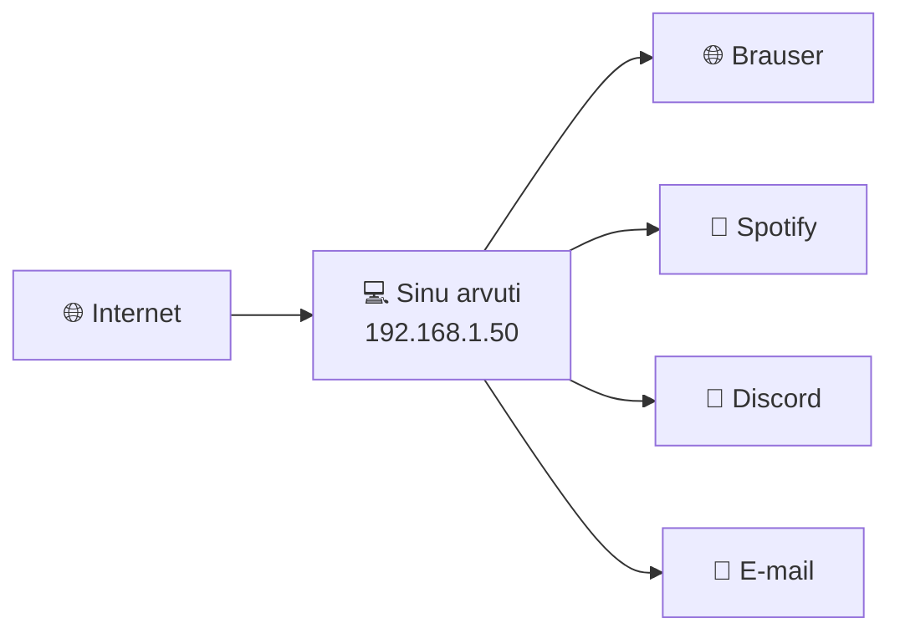

**Vastus: PORDID**

IP aadress on nagu maja aadress. Port on nagu korteri number. Ilma korteri numbrita jõuab kiri majja, aga mitte õige inimeseni.

---

## 2. Miks transpordikiht eksisteerib?

> **Miks see oluline on?**  
> Transpordikiht lahendab kaks suurt probleemi: kuidas eristada rakendusi (pordid) ja kuidas tagada, et andmed pärale jõuavad (usaldusväärsus).

### OSI mudeli kiht 4

Mäletad OSI mudelit?

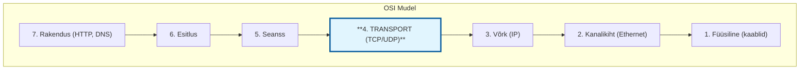

**Kiht 3 (võrgukiht/IP)** tegeleb küsimusega: kuidas pakett jõuab arvutist A arvutisse B?

**Kiht 4 (transpordikiht)** tegeleb küsimusega: kuidas andmed jõuavad RAKENDUSEST A RAKENDUSSE B?

### Kaks probleemi, kaks lahendust

| Probleem | Lahendus |
|----------|----------|
| Kuidas eristada rakendusi? | **Pordid** — iga rakendus kuulab oma porti |
| Kuidas tagada usaldusväärsus? | **TCP** — kinnitused, järjekord, uuesti saatmine |
| Kuidas saata kiiresti? | **UDP** — lihtsalt saada, ära muretse |

### Analoogia: postikontor vs kullerteenus

**UDP** on nagu tavaline postikontor:
- Paned kirja postkasti
- Loodad, et jõuab kohale
- Ei tea, kas jõudis
- Kiire ja odav

**TCP** on nagu DPD või Omniva kullerteenus:
- Pakil on jälgimisnumber
- Tead, kus see on
- Kui ei jõua, saadetakse uuesti
- Saad kinnituse, et kätte sai
- Aeglasem, aga kindel

---

### ✅ Kontrolli ennast

1. Miks IP aadressist üksi ei piisa, et andmed õige rakenduseni jõuaksid?
2. OSI mudeli mis kihil töötab TCP?
3. Mis vahe on transpordikihil ja võrgukihil?

---

## 3. Pordid — rakenduste aadressid

> **Miks see oluline on?**  
> Pordid on see, mis võimaldab sul korraga kasutada brauserit, Spotifyt ja Discordi. Kui sa tead porte, mõistad tulemüüre ja oskad võrguprobleeme lahendada.

### Mis on port?

Port on **16-bitine number** (0 kuni 65535), mis identifitseerib rakendust arvutis.

Mõtle nii:
- **IP aadress** = maja aadress (Pärnu mnt 15)
- **Port** = korteri number (korter 42)

Kui keegi saadab paketi aadressile `192.168.1.50:80`, siis:
- `192.168.1.50` — see on arvuti
- `80` — see on veebiserveri rakendus selles arvutis

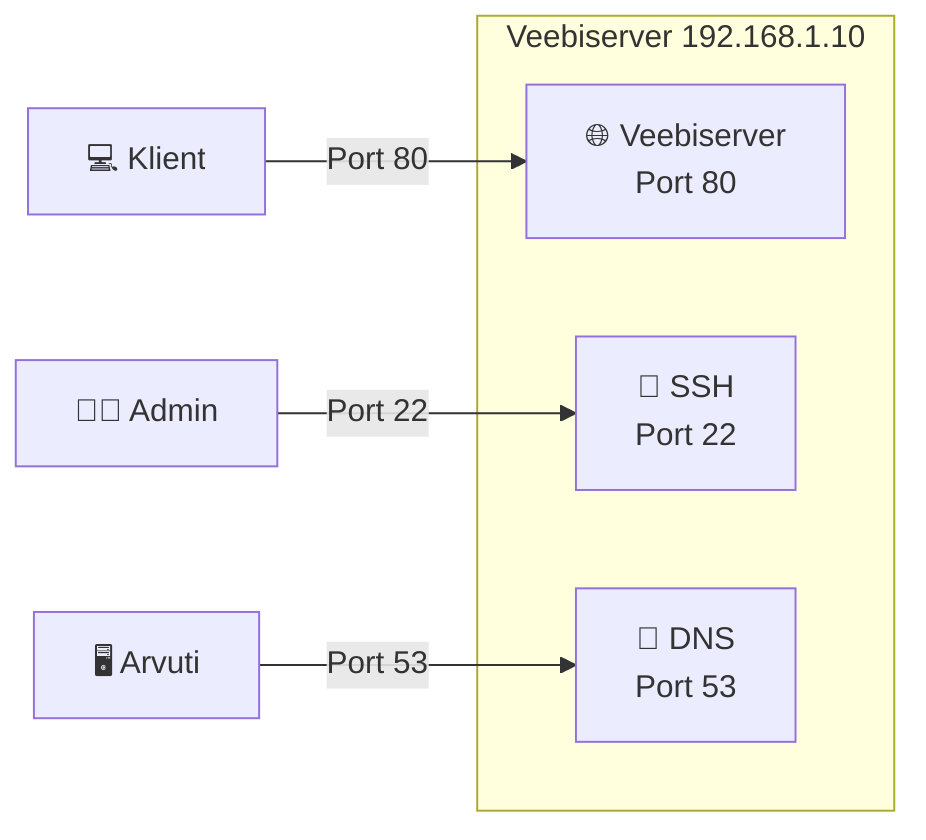

### Pordi vahemikud

65536 porti on jagatud kolme gruppi:

| Vahemik | Nimi | Kasutus |
|---------|------|---------|
| **0–1023** | Well-known ports | Standardsed teenused (HTTP, SSH, DNS). Vajavad admin õigusi. |
| **1024–49151** | Registered ports | Registreeritud rakendused (MySQL 3306, Minecraft 25565) |
| **49152–65535** | Dynamic/Private | Ajutised pordid, mida OS jagab rakendustele |

**Well-known pordid** on nagu "kuldne standard" — kõik teavad, et veebiserver on port 80-l. Sa EI PEA seda teadma, aga kõik lihtsalt teavad.

### Kõige tähtsamad pordid

Need pead meelde jätma! Küsitakse tööintervjuul.

| Port | Protokoll | Mida teeb | Meelespea |
|------|-----------|-----------|-----------|
| **20, 21** | FTP | Failide ülekanne | **F**ailid = **F**TP |
| **22** | SSH | Turvaline kaugjuurdepääs | **S**ecure **SH**ell |
| **23** | Telnet | Ebaturvaline kaugjuurdepääs | Vana ja ohtlik! |
| **25** | SMTP | E-kirjade saatmine | **S**end **M**ail |
| **53** | DNS | Nimede lahendamine | DNS = 53 (lihtsalt õpi pähe) |
| **67, 68** | DHCP | IP aadresside jagamine | DHCP server/klient |
| **80** | HTTP | Veebilehed (ebaturvaline) | **H**TTP = **8**0 |
| **110** | POP3 | E-kirjade vastuvõtt | |
| **143** | IMAP | E-kirjade vastuvõtt (parem) | |
| **443** | HTTPS | Veebilehed (turvaline) | HTTPS = 443 (4+4+3=11? Ei, lihtsalt õpi pähe) |
| **3389** | RDP | Windows Remote Desktop | |

**Nipp:** Kõige tähtsamad on **22, 23, 53, 80, 443**. Need tule uneski teadma!

### Kuidas pordid tegelikult töötavad

Kui sa avad brauseris `https://google.com`:

1. Brauser loob ühenduse `google.com:443` (HTTPS = port 443)
2. Su arvuti valib OMALE juhusliku pordi, näiteks `52847`
3. Nüüd on ühendus: `192.168.1.50:52847` ↔ `142.250.74.142:443`

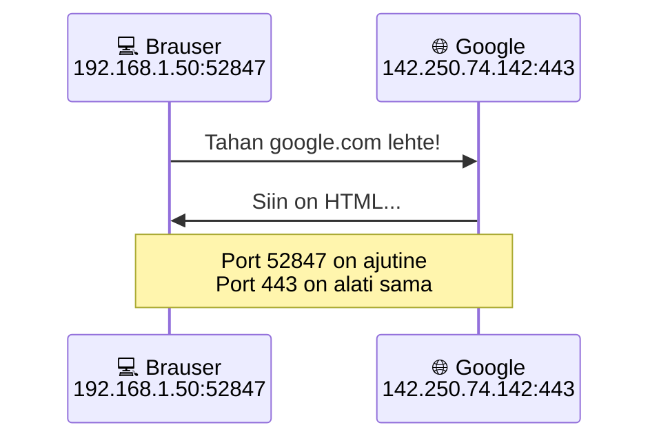

### Käsk `netstat` — kes kuulab mida?

Windowsis ja Linuxis saad näha aktiivseid ühendusi käsuga `netstat`:

```
netstat -an
```

Näed midagi sellist:
```
Proto  Local Address          Foreign Address        State
TCP    0.0.0.0:80            0.0.0.0:0              LISTENING
TCP    192.168.1.50:52847    142.250.74.142:443     ESTABLISHED
```

- **LISTENING** — port ootab ühendusi
- **ESTABLISHED** — aktiivne ühendus

---

### ✅ Kontrolli ennast

1. Mis on port ja miks seda vaja on?
2. Millised on HTTP ja HTTPS pordid?
3. Miks SSH (port 22) on parem kui Telnet (port 23)?
4. Kui sa ühendud google.com-i, siis mis port on SINU arvutil?

---

## 4. TCP — usaldusväärne transport

> **Miks see oluline on?**  
> TCP on põhjus, miks sa saad faile alla laadida ilma, et tükid puudu oleks. Miks e-mail jõuab kohale tervikuna. Miks pangaülekanne töötab. Kui vähegi on oluline, et KÕIK andmed pärale jõuaks — see on TCP.

### TCP — Transmission Control Protocol

TCP on nagu kullerteenus, mis:
- Kontrollib, et pakett kohale jõuab
- Kui ei jõua, saadab uuesti
- Tagab, et paketid tulevad ÕIGES JÄRJEKORRAS
- Annab kinnituse

### TCP põhiomadused

| Omadus | Mida tähendab |
|--------|---------------|
| **Connection-oriented** | Enne andmete saatmist luuakse ühendus (3-way handshake) |
| **Reliable** | Kui pakett kaob, saadetakse uuesti |
| **Ordered** | Paketid tulevad samas järjekorras, nagu saadeti |
| **Error-checked** | Kontrollsummad avastavad vigased andmed |
| **Flow control** | Ei saadeta rohkem, kui vastuvõtja suudab vastu võtta |

### Miks järjekord on oluline?

Kujuta ette, et laed alla 1GB filmi. See jagatakse miljoniteks väikesteks pakettideks.

**Ilma TCP-ta:**
- Pakett #1 jõuab kohale
- Pakett #3 jõuab kohale
- Pakett #2 läks kaduma
- Pakett #4 jõuab kohale
- **Tulemus: katki fail**

**TCP-ga:**
- Pakett #1 jõuab → "Sain #1, anna #2"
- Pakett #2 läks kaduma
- Ootab... ootab... "Kus #2 on?"
- Server saadab #2 uuesti
- Pakett #2 jõuab → "Sain #2, anna #3"
- **Tulemus: terve fail**

### TCP segment

TCP paketti nimetatakse **segmendiks**. Igal segmendil on päis (header), mis sisaldab:

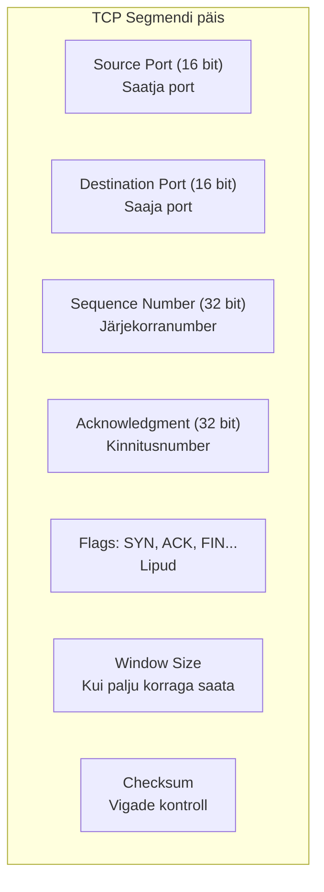

**Sequence Number** on võti! See number ütleb, mitu baiti on juba saadetud. Nii teab vastuvõtja, kas midagi on puudu.

---

### ✅ Kontrolli ennast

1. Mida tähendab "connection-oriented"?
2. Mis juhtub, kui TCP pakett kaob?
3. Miks on vaja Sequence Number'it?

---

## 5. TCP 3-way handshake

> **Miks see oluline on?**  
> 3-way handshake on see "rituaal", mis toimub ENNE kui üldse midagi saadetakse. Kui sa tead seda, mõistad miks mõnikord "ühendus ei tule" — käepigistus ei õnnestunud.

### Enne andmeid — käepigistus

TCP ei hakka lihtsalt andmeid saatma. Kõigepealt veendub ta, et teine pool ON OLEMAS ja KUULAB.

See on nagu telefonikõne:
1. Sa helistad
2. Teine vastab "Halloo?"
3. Sa ütled "Tere, olen Maria"
4. Nüüd saate rääkida

TCP-s on see formaliseeritud **3-way handshake**-ks.

### Kolm sammu

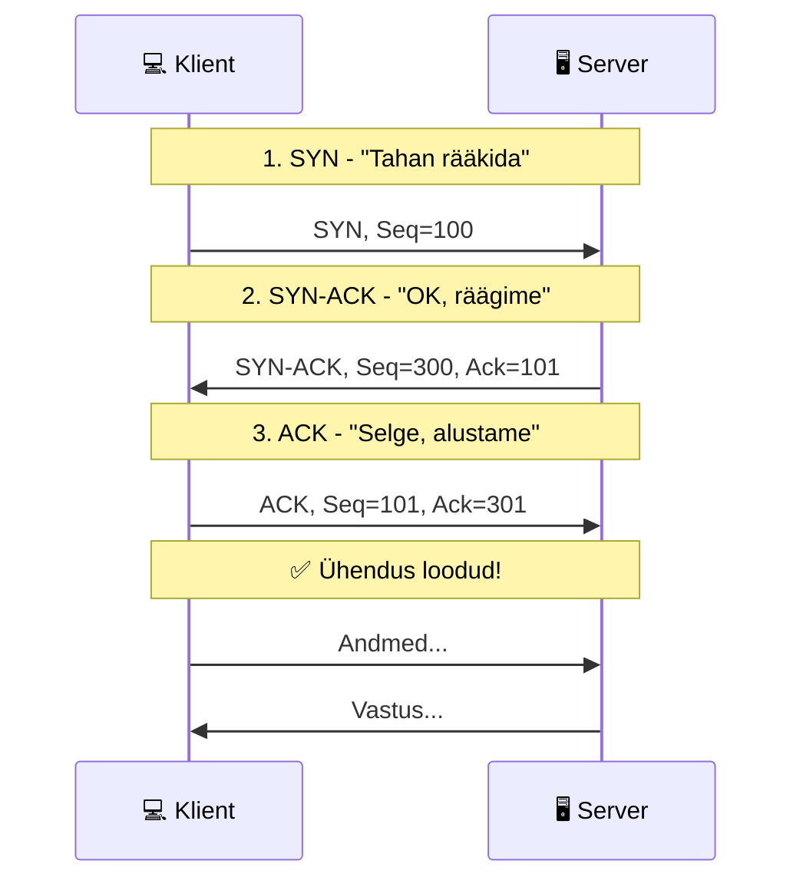

### Samm-sammu haaval

| Samm | Lipp | Suund | Mida ütleb |
|------|------|-------|------------|
| **1. SYN** | SYN | Klient → Server | "Tere, tahan ühendust. Mu Seq=100." |
| **2. SYN-ACK** | SYN+ACK | Server → Klient | "OK, kuulsin sind. Mu Seq=300. Ootan sinult 101." |
| **3. ACK** | ACK | Klient → Server | "Suurepärane, alustame. Ootan sinult 301." |

**Pärast seda** — ühendus on loodud, andmed saavad liikuda!

### Mida need numbrid tähendavad?

- **Seq (Sequence)** — "Mina alustan siit numbrist"
- **Ack (Acknowledgment)** — "Ootan sinult seda numbrit järgmiseks"

Ack = eelmise Seq + 1. See on nagu kinnitusallkiri — "jah, sain kätte".

### Mis juhtub, kui käepigistus ebaõnnestub?

| Probleem | Tulemus |
|----------|---------|
| Server ei vasta SYN-ile | Klient proovib uuesti (mitu korda), siis "Connection timed out" |
| Tulemüür blokeerib | "Connection refused" või "No route to host" |
| Vale port | "Connection refused" |

**Praktiline näide:** Kui näed "Connection timed out" — tõenäoliselt tulemüür blokeerib või server pole võrgus. Kui "Connection refused" — server on olemas, aga ei kuula sellel pordil.

### Ühenduse lõpetamine — 4-way close

Ühenduse lõpetamine on sarnane, aga 4 sammuga (FIN-ACK mõlemalt poolt):

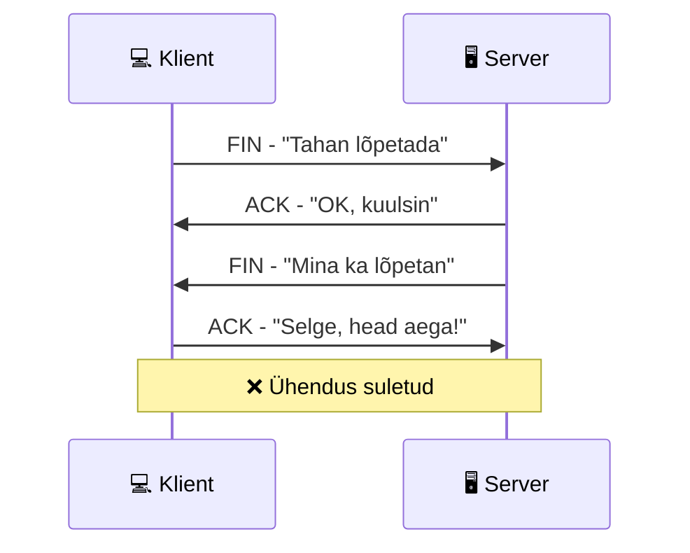

---

### ✅ Kontrolli ennast

1. Mida tähendab SYN, ACK ja FIN?
2. Mitu sammu on TCP ühenduse loomisel?
3. Kui saad "Connection timed out", siis mis võib olla probleem?
4. Miks TCP lõpetamine on 4 sammu, mitte 3?

---

## 6. UDP — kiire transport

> **Miks see oluline on?**  
> UDP on TCP vastand — kiire, aga ebausaldusväärne. Kui sa tead, millal UDP-d kasutada, saad aru, miks Zoom mõnikord "lagib" aga ei seisa täiesti kinni.

### UDP — User Datagram Protocol

UDP on nagu postkaart:
- Kirjutad, paned postkasti
- Loodad, et jõuab kohale
- Ei tea, kas jõudis
- Kui kadus — kadus

### UDP omadused

| Omadus | Mida tähendab |
|--------|---------------|
| **Connectionless** | Pole käepigistust, lihtsalt saadab |
| **Unreliable** | Kui pakett kaob, keegi ei saada uuesti |
| **Unordered** | Paketid võivad tulla suvalises järjekorras |
| **Fast** | Vähem ülekoormust, kiirem |
| **Simple** | Päis on väiksem |

### UDP päis — lihtne!

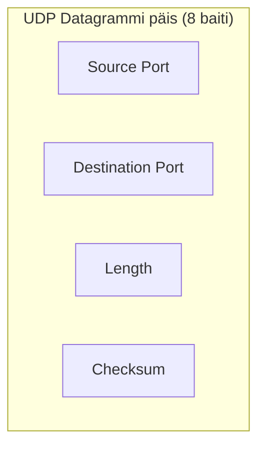

Võrdle TCP-ga — UDP päis on 8 baiti, TCP oma on 20+ baiti. Vähem overhead = kiirem.

### Miks keegi tahaks ebausaldusväärset transporti?

Hea küsimus! Vastus: **mõnikord kiirus on olulisem kui täpsus**.

**Video kõne (Zoom, Teams):**
- Kui üks kaader kaob — pole hullu, järgmine tuleb
- Kui ootaksime kadunud kaadrit — video hakkaks "jooksma"
- Parem näha 29 kaadrit sekundis kui 30 kaadrit 2 sekundit hiljem

**Online mängud:**
- Kui üks positsioonivärskendus kaob — järgmine tuleb 50ms pärast
- Ootamine = lag = mäng on mängimatu

**DNS päring:**
- Väike küsimus, väike vastus
- Kui kadus, küsi uuesti — kiirem kui TCP käepigistus

### UDP vs TCP — visuaalselt

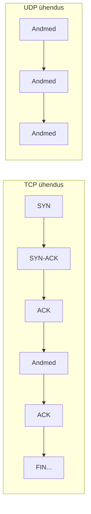

TCP = palju liiklust edasi-tagasi
UDP = ainult andmed ühes suunas

---

### ✅ Kontrolli ennast

1. Miks UDP on kiirem kui TCP?
2. Mis juhtub, kui UDP pakett kaob?
3. Miks videokõned kasutavad UDP-d, mitte TCP-d?

---

## 7. TCP vs UDP — millal mida kasutada

> **Miks see oluline on?**  
> See on praktiline teadmine — kui tead, milline rakendus mida kasutab, oskad paremini troubleshootida ja mõistad võrguliiklust.

### Suur võrdlustabel

| Omadus | TCP | UDP |
|--------|-----|-----|
| **Ühendus** | Jah (3-way handshake) | Ei |
| **Usaldusväärsus** | Jah (ACK, uuesti saatmine) | Ei |
| **Järjekord** | Jah (Sequence numbers) | Ei |
| **Kiirus** | Aeglasem | Kiirem |
| **Päise suurus** | 20+ baiti | 8 baiti |
| **Kasutus** | Fail, e-mail, veeb | Video, mäng, DNS |

### Kes kasutab mida?

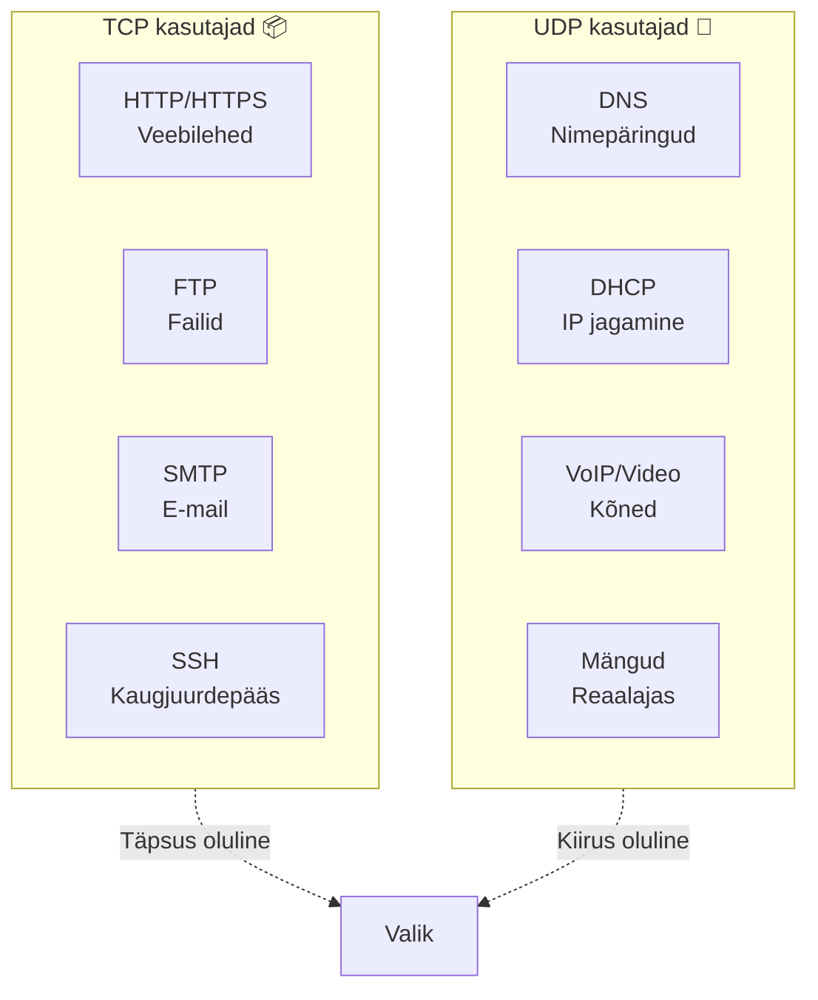

### Praktiline reegel

**Kasuta TCP, kui:**
- Andmed PEAVAD kohale jõudma (failid, pangaülekanded, e-mail)
- Järjekord on oluline
- Pole kiiret

**Kasuta UDP, kui:**
- Kiirus on kriitilisem kui täpsus
- Andmed vananevad kiiresti (video kaadrid, mängu positsioonid)
- Väikesed päringud (DNS)
- Rakendus ise tegeleb vigade parandamisega

### Port + protokoll = teenus

Pordid töötavad koos TCP VÕI UDP-ga:

| Port | TCP/UDP | Teenus |
|------|---------|--------|
| 22 | TCP | SSH |
| 23 | TCP | Telnet |
| 53 | **Mõlemad!** | DNS |
| 67/68 | UDP | DHCP |
| 80 | TCP | HTTP |
| 443 | TCP | HTTPS |

**Huvitav:** DNS kasutab tavaliselt UDP-d (kiirem), aga kui vastus on liiga suur, lülitub TCP-le!

---

### ✅ Kontrolli ennast

1. Miks HTTP kasutab TCP-d, mitte UDP-d?
2. Miks DNS kasutab UDP-d?
3. Kui sul on vaja saata 1GB faili, siis TCP või UDP?
4. Mis protokolli kasutab Spotify muusika striimimiseks?

---

## 8. Kokkuvõte

> **Miks see oluline on?**  
> See on kiire ülevaade kõigest — ideaalne kordamiseks enne testi või laborit.

### Transpordikiht — ühe pilguga

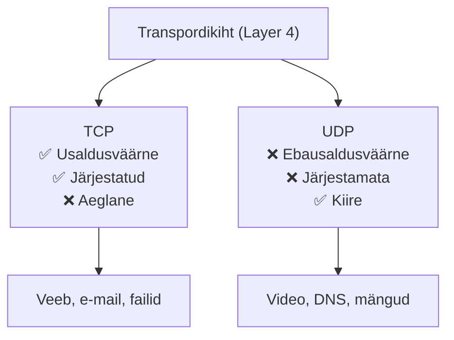

### Pordid — olulisemad

| Port | Protokoll | Teenus |
|------|-----------|--------|
| 22 | TCP | SSH |
| 23 | TCP | Telnet |
| 53 | UDP/TCP | DNS |
| 80 | TCP | HTTP |
| 443 | TCP | HTTPS |

### TCP 3-way handshake

1. **SYN** — "Tahan rääkida"
2. **SYN-ACK** — "OK, räägime"
3. **ACK** — "Alustame!"

### Millal mida?

| Olukord | Protokoll |
|---------|-----------|
| Alla laadida fail | TCP |
| Vaadata YouTube | UDP (video) + TCP (juhtimiseks) |
| Saata e-mail | TCP |
| Mängida online | UDP |
| Avada veebileht | TCP |
| DNS päring | UDP |

---

### 🎯 Lõplik kontroll

1. Selgita oma sõnadega, mis vahe on TCP-l ja UDP-l.
2. Miks veebibrauserid kasutavad TCP-d?
3. Nimeta 5 porti ja mis teenused neid kasutavad.
4. Kirjelda TCP 3-way handshake protsessi.
5. Miks video streaming kasutab UDP-d, mitte TCP-d?

---

*Nüüd oled valmis laboriks — testime porte ja ühendusi päriselt! 🚀*
