# Loeng 1: **Sissejuhatus arvutivõrkudesse**

---

## 1. Tere tulemast!

**Kursuse fookus:**

* Kestus: **16 nädalat**
* Õpime **praktilisi oskusi**
* Kasutame **päris Cisco seadmeid*

👉 Küsimus: *“Kellel on kodus ruuter?”*

---

## 2. Mis on võrk?

**Lihtne definitsioon:**
👉 Võrk = vähemalt kaks seadet, mis saavad omavahel suhelda.

**Igapäeva näited:**

* Kodus: WiFi ühendab telefoni, arvuti ja teleri
* Koolis: arvutiklassi arvutid
* Internetis: WhatsAppi sõnumid sõpradega

👉 Harjutus: *Nimetage kolm seadet, mis on teie kodus võrgus!*

---

## 3. Milleks on võrke vaja?

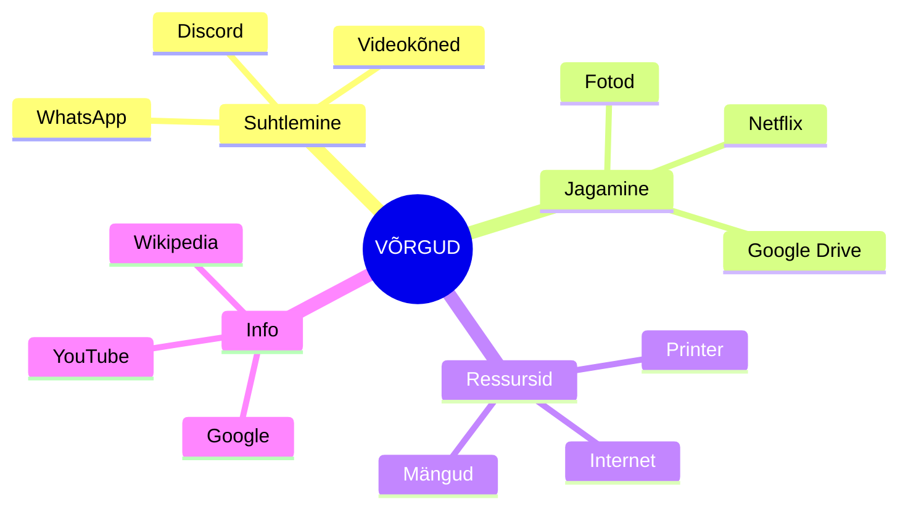

👉 Aruteluküsimus: *Mis juhtuks, kui internet kaoks nädalaks?*

---

## 4. Võrgu osad

Kolm peamist komponenti:

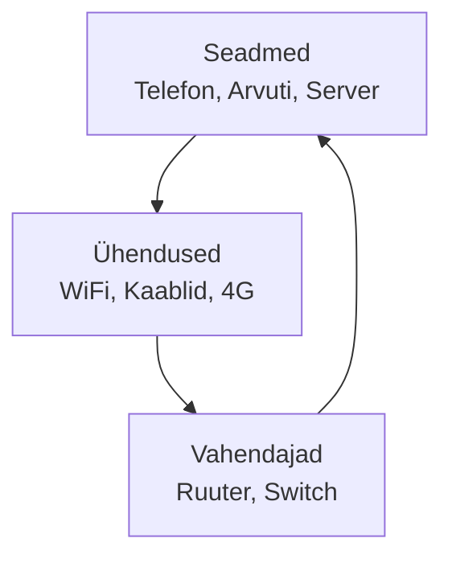

**Analoogia: Postisüsteem**

* Seadmed = inimesed
* Ühendused = teed
* Vahendajad = postkontor

---

## 5. Star-topoloogia

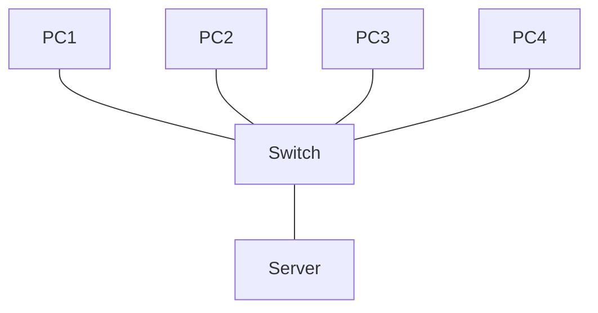

**Omadused:**

* **Plussid:** lihtne hallata, ühe arvuti rike ei sega teisi
* **Miinused:** kui switch läheb katki, seisab kogu võrk
* **Näited:** kodune WiFi, kooli võrk

👉 Küsimus: *Mis juhtub, kui kodune WiFi-ruuter läheb katki?*

---

## 6. Bus-topoloogia

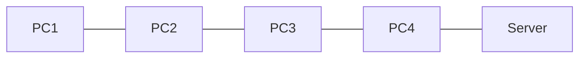

* **Plussid:** odav, vähe kaablit
* **Miinused:** üks kaablirike peatab kogu võrgu
* **Kasutati peamiselt vanasti**

**Analoogia:** Bussiliin – kõik peatused ühel teel.

---

## 7. Ring-topoloogia

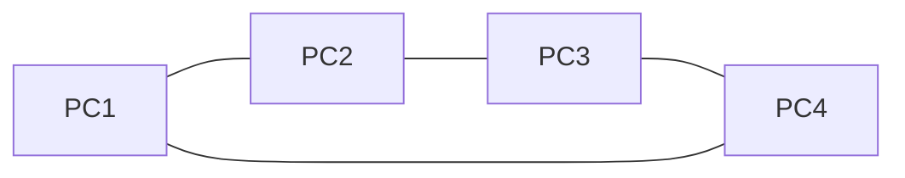

* **Plussid:** kõik seadmed on võrdses seisus
* **Miinused:** ühe seadme rike mõjutab kõiki
* **Andmed liiguvad ühes suunas**

---

## 8. Lõppseadmed

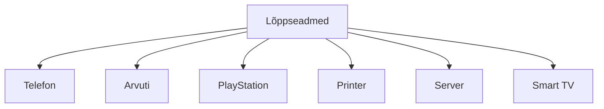

**Funktsioonid:**

* Andmete loomine ja kasutamine
* Võivad olla nii kliendid kui ka serverid

👉 Harjutus: *Võtke telefon välja – see on lõppseade!*

---

## 9. Vahendajad

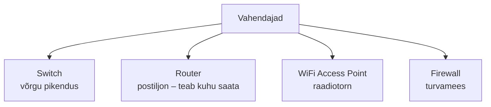

**Funktsioonid:**

* Suunavad andmeid õigesse kohta
* Tagavad turvalisuse

👉 Vaata meie klassi switchi!

---

## 10. Ühendused

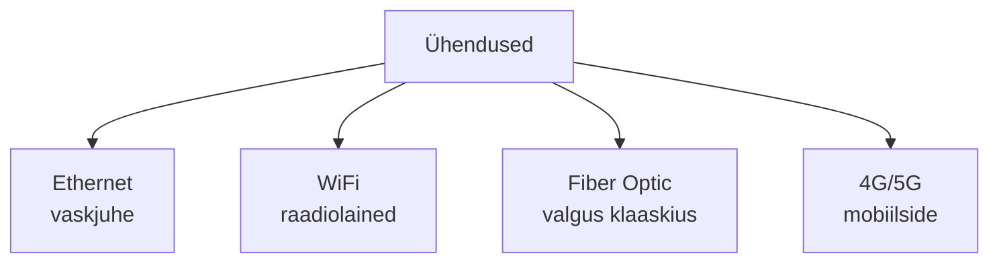

* **Ethernet:** stabiilne, kiire
* **WiFi:** mugav, mobiilne
* **Fiber:** ülikiire, aga kallis
* **Mobiilne:** töötab peaaegu kõikjal

---

## 11. Võrgu tüübid

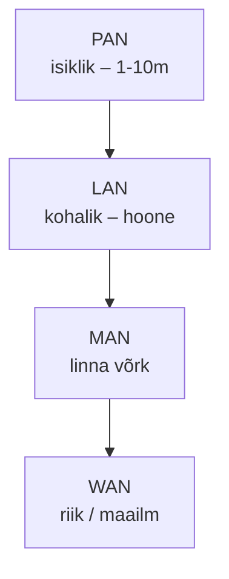

**Näited:**

* **PAN:** telefon + kõrvaklapid
* **LAN:** kodune WiFi
* **MAN:** linna avalik WiFi
* **WAN:** internet

👉 Küsimus: *Millist võrku kasutate kõige rohkem?*

---

## 12. Internet kui WAN

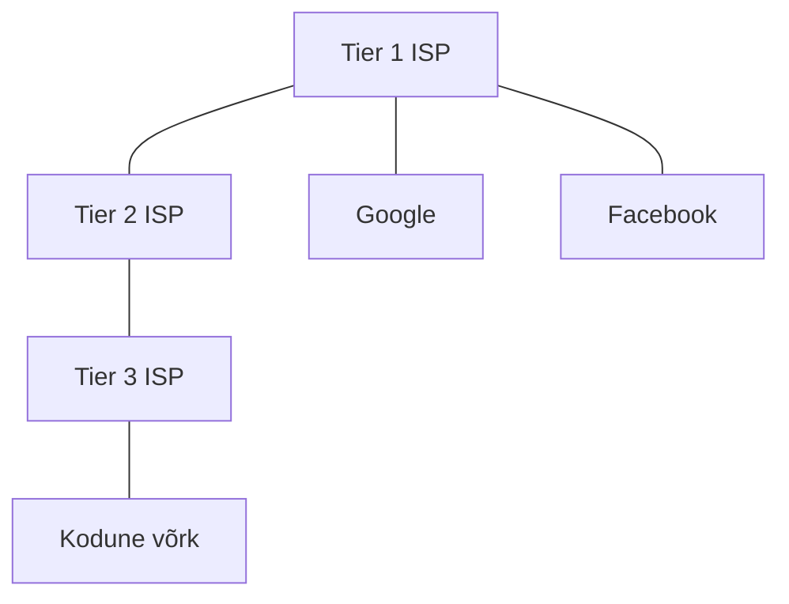

**Internet = võrkude võrk**

* Tuhanded võrgud, mis on omavahel seotud
* Kasutavad samu protokolle
* Tagavad globaalse ühenduvuse

---

## 13. Miks Cisco?

* Cisco ruuterid = \~**50% maailma turust**
* \~**70% Interneti liiklusest** liigub läbi Cisco seadmete
* **CCNA** sertifikaat on rahvusvaheliselt tunnustatud
* Kasutusel **200+ riigis**

**Meie koolis:**

* Õpime päris seadmete peal
* Sama käsud, mis ettevõtetes
* Hea ettevalmistus päris tööks

---

## 14. Packet Tracer

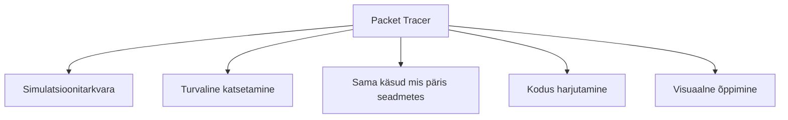

**Järgmises tunnis:**

* Installime / avame Packet Traceri
* Loome esimese võrgu
* Testime `ping` käsuga
* 2 arvutit + 1 switch

👉 NB: Vajate Google kontot!

---

## 15. Kontrollküsimused

1. Mis on võrgu kolm peamist osa?
2. Millist topoloogiat kohtate kõige sagedamini?
3. Mis vahe on lõppseadmel ja vahendajal?
4. Nimetage neli võrgu tüüpi!

---

## 16. Järgmiseks tunniks

**Ootused:**

* Teil peab olema Google konto (Packet Tracer jaoks)
* Tulge avatud meelega

**Edasine plaan:**

1. Täna: Packet Tracer esimene võrk
2. Järgmisel nädalal: päris Cisco seadmed
3. Paari nädala pärast: oma väike võrk serveriruumis

👉 Küsimused?

---

### Lihtne analoogia

**Võrk = inimeste grupp**

* **Lõppseadmed** = inimesed, kes räägivad
* **Vahendajad** = tõlgid
* **Ühendused** = keel, mida nad kasutavad