# Loeng 1: Võrgude alused

---

## 1: Tere tulemast!

### Arvutivõrkude alused
- **16 nädalat**
- **Praktilised oskused**
- **Cisco seadmed**
- **CCNA ettevalmistus**

"Kellel on kodus ruuter?"

---

## 2: Mis on võrk?

### Lihtne definitsioon
**Võrk = kaks või rohkem seadet, mis saavad omavahel suhelda**

### Igapäevaelus:
- Kodus: WiFi ühendab telefoni, arvuti, TV
- Koolis: arvutiklassi arvutid
- Internetis: WhatsApp sõpradega

"Nimetage 3 seadet, mis on teie kodus võrgus!"

---

## 3: Miks võrke vaja?

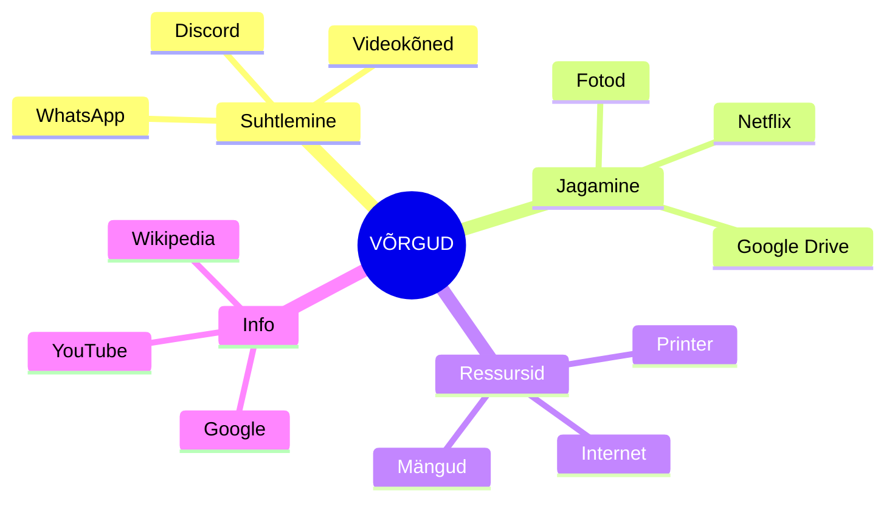

Mis juhtuks, kui internet kadugu 1 nädalaks?

---

## 4: Võrgu osad

### 3 peamist komponenti:

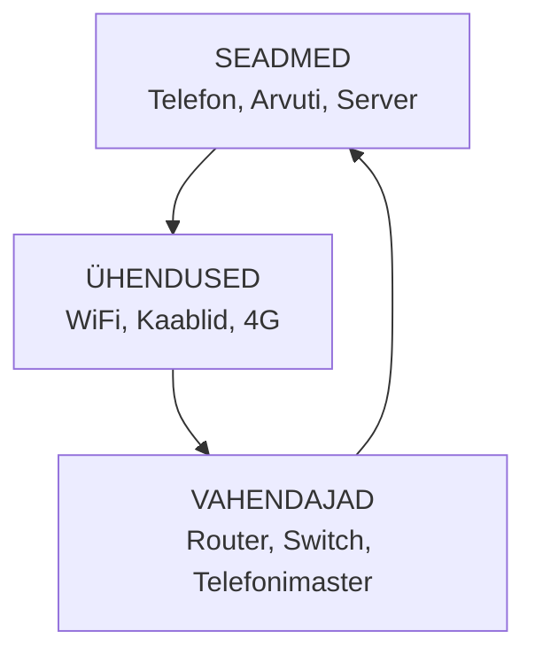

**Analoogia:** Postisüsteem
- Seadmed = inimesed
- Ühendused = teed
- Vahendajad = postkontor

---

## 5: Star Topoloogia

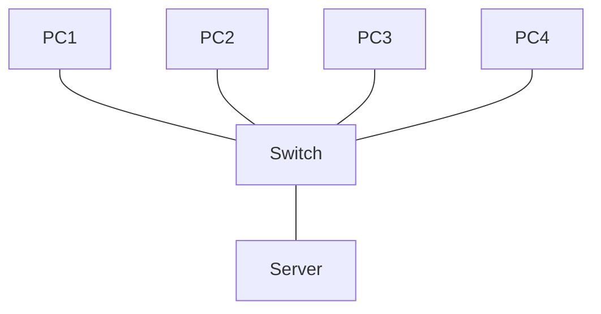

### Omadused:
- **Eelised:** Lihtne hallata, üks PC rike ei mõjuta teisi
- **Puudused:** Switch rike = kogu võrk seiskub
- **Näited:** Kodune WiFi, kooli võrk

"Mis juhtub kui WiFi ruuter kodus läheb katki?"

---

## 6: Bus Topoloogia

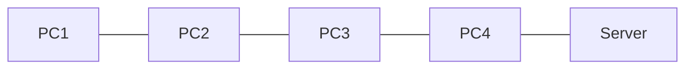

### Omadused:
- **Eelised:** Vähe kaablit, odav
- **Puudused:** Peakaabli rike = kõik seiskub
- **Kasutamine:** Vanemad võrgud

**Analoogia:** Bussiliin - kõik peatused ühel teel

---

## 7: Ring Topoloogia

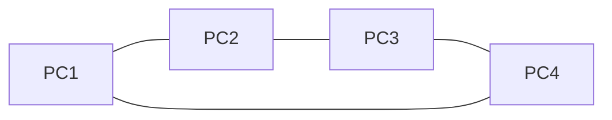

### Omadused:
- **Eelised:** Igal seadmel võrdne juurdepääs
- **Puudused:** Ühe seadme rike mõjutab kogu võrku
- **Andmed:** Liiguvad ühes suunas

---

## 8: Võrgu seadmed - Lõppseadmed

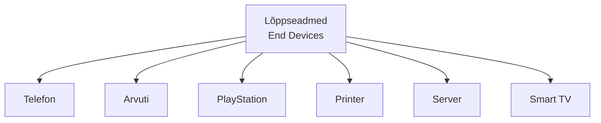

### Funktsioonid:
- Andmete genereerimine
- Andmete tarbimine
- Võivad olla klient VÕI server

 "Võtke telefon välja - see on lõppseade!"

---

## 9: Võrgu seadmed - Vahendajad

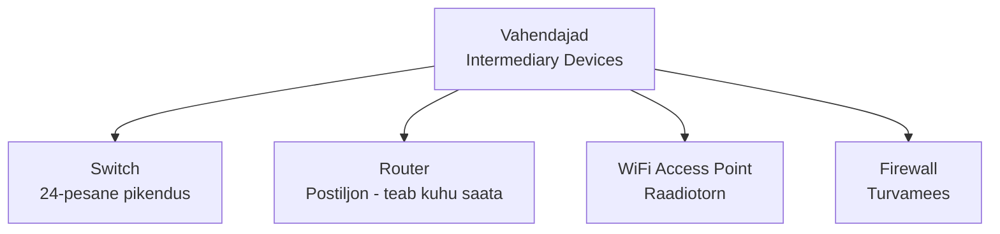

### Funktsioonid:
- Andmete edastamine
- Õige sihtkoha leidmine
- Turvalisuse tagamine

Vaata meie klassis switchi

---

## 10: Ühendused

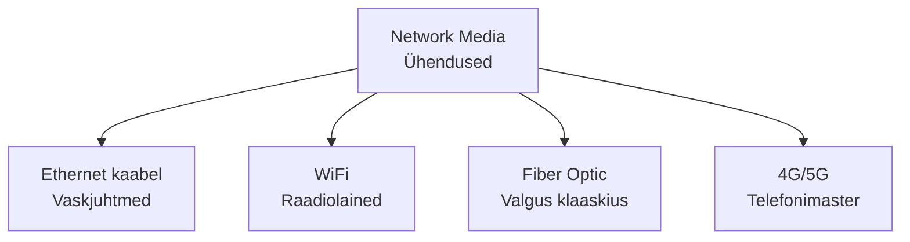

### Omadused:
- **Ethernet:** Stabiilne, kiire
- **WiFi:** Mugav, mobiilne  
- **Fiber:** Ülikiire, kallis
- **Mobiilne:** Kõikjal kättesaadav

---

## 11: Võrgu tüübid suuruse järgi

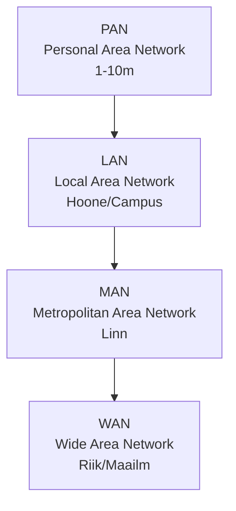

**Näited:**
- **PAN:** Telefon + kõrvaklapid
- **LAN:** Kodune WiFi
- **MAN:** Linna avalik WiFi
- **WAN:** Internet

"Millist võrku kasutate kõige rohkem?"

---

## 12: Internet kui WAN

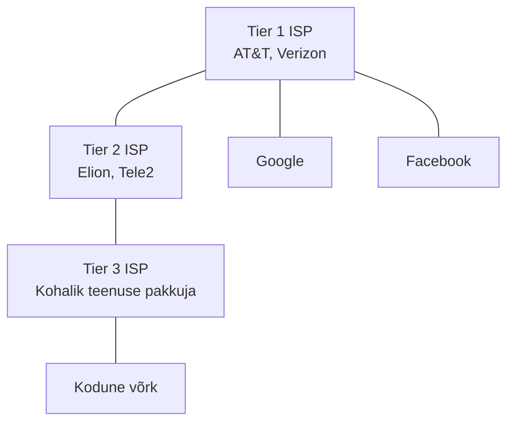

### Internet = võrkude võrk
- Tuhandeid erinevaid võrke
- Ühised protokollid
- Globaalne ühenduvus

---

## 13: Miks Cisco?

### Cisco faktid:
- **50%** maailma ruuteritest
- **70%** Internet'i liiklusest läbib Cisco seadmeid
- **CCNA** sertifikaat tunnustatud kogu maailmas
- **200+ riigis** kasutusel

### Meie koolis:
- Päris Cisco seadmed serveriruu
- Sama käsud mis ettevõtetes
- Reaalse töökogemuse simulatsioon

---

## 14: Packet Tracer

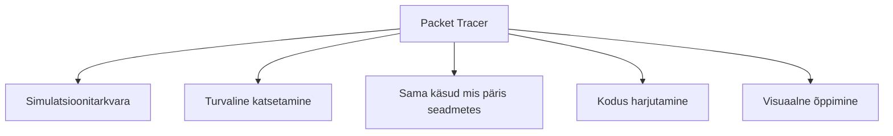

### Järgmise tunni eelvaade:
- Installeerime/avame PT
- Loome esimese võrgu
- Testimg ping käsuga
- 2 PC + 1 Switch

**NB:** Vajate Google kontot!

---

## 15: Kontrollküsimused

### 1. Mis on võrgu kolm peamist osa?

### 2. Millise topoloogia näete kõige rohkem?

### 3. Mis vahe on lõppseadmel ja vahendajal?

### 4. Nimetage 4 erinevat võrgu tüüpi!

---

## 16: Järgmiseks tunniks

### Ootused:
- **Google konto** Packet Tracer jaoks
- **Avatud meel** uute asjade õppimiseks

### Kuhu liigume:
1. **Täna:** Packet Tracer esimene võrk
2. **Järgmine nädal:** Päris Cisco seadmed
3. **Kuu pärast:** Oma võrk serveriruumis

### Küsimused?

**"IT-s töötamiseks tuleb alustada algusest - täna teeme selle esimese sammu!"**

---

### Analoogiad:

**Võrk = Inimeste grupp**
- Lõppseadmed = Inimesed kes räägivad
- Vahendajad = Tõlkijad
- Ühendused = Keel mida kasutavad