# Loeng 2: Võrgu Tarkvara ja Protokollid

## 📚 Sissejuhatus

Eelmises loengus vaatasime võrgu riistvara komponente - ruutereid, kommutaatoreid, kaableid. Täna vaatame **tarkvara poolt** - kuidas andmed tegelikult liiguvad ja millised reeglid seda juhivad.

Võrgu riistvara ilma tarkvarata on nagu tühi maja ilma inimesteta - struktuur on olemas, aga midagi ei toimu. Tarkvara paneb võrgu elama.

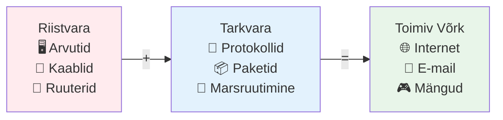

---

## 1️⃣ PROTOKOLLIDE HIERARHIA

### 1.1 Mis On Protokoll?

**Protokoll on formaalne reeglite kogum**, mis määrab täpselt, kuidas kaks või enam osapoolt omavahel suhtlevad. See pole lihtsalt tehniline detail - protokollid on kõikjal meie ümber. Diplomaatias on protokollid, mis määravad, kuidas riigipead kohtuvad. Ärimaailmas on protokollid koosolekute pidamiseks.

#### 📱 Näide: WhatsApp Kõne Protokoll

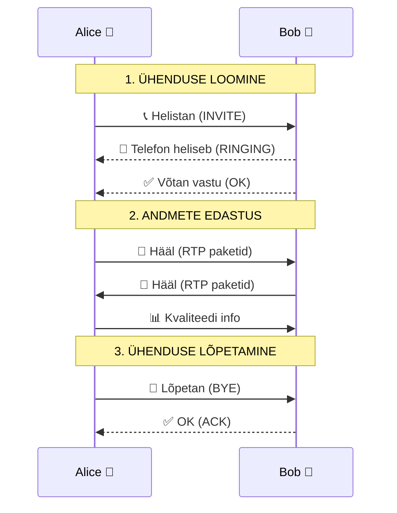

Võrguprotokollid määravad **kolm kriitilist aspekti**:

| Aspekt | Kirjeldus | Näide |
|--------|-----------|-------|
| **Süntaks** | Andmete formaat ja struktuur | HTTP päring algab "GET" või "POST" |
| **Semantika** | Mida iga väli tähendab | Port 80 = veebiserver |
| **Ajastus** | Millal ja kui kaua | TCP timeout = 3 sekundit |

### 1.2 Miks Protokollid On Kihtidena?

Võrgu tarkvara koosneb **hierarhilistest kihtidest**, kus iga kiht pakub teenuseid ülemisele kihile ja kasutab alumise kihi teenuseid. See pole juhuslik valik - kihtidel on mitu olulist eelist.

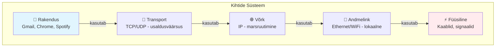

**Neli põhilist eelist:**

1. **🎯 Keerukuse juhtimine** - suur probleem jagatakse väiksemateks osadeks
2. **🔒 Abstraheerimine** - iga kiht peidab oma sisemised detailid  
3. **🔄 Sõltumatus** - kihte saab muuta teisi mõjutamata
4. **📏 Standardiseerimine** - igale kihile oma standardid

### 1.3 Filosoofi Näide

Vaatame konkreetset näidet, kuidas kihid töötavad. Kaks filosoofi tahavad arutada, üks räägib prantsuse, teine hollandi keeles.

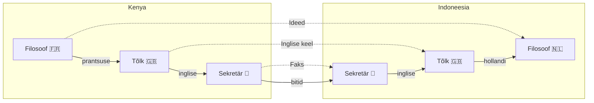

Filosoof arvab, et räägib otse teise filosoofiga, aga tegelikult info liigub läbi mitme kihi. Iga kiht suhtleb **horisontaalselt** oma vastaskihiga, kuigi füüsiliselt liigub info **vertikaalselt**.

---

## 2️⃣ KIHTIDE DISAINI PÕHIMÕTTED

### 2.1 Kuus Fundamentaalset Probleemi

Võrgu kihtide loomisel tuleb lahendada kuus põhiprobleemi. Need on universaalsed - esinevad igas võrgus, igal kihil.

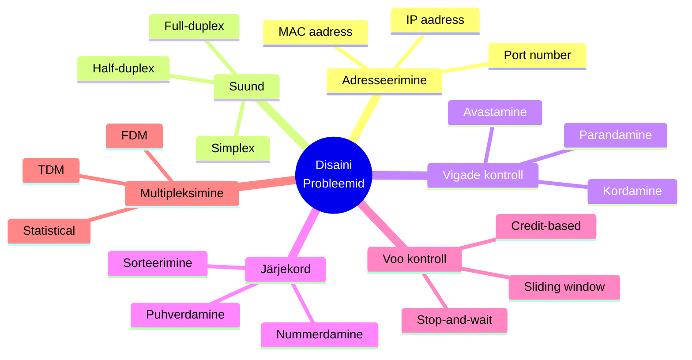

### 2.2 Adresseerimine Detailselt

Iga võrgukiht vajab oma **adresseerimissüsteemi**, sest igal kihil on erinev ulatus ja ülesanne.

| Kiht | Aadress | Näide | Ulatus | Muutuv? |
|------|---------|-------|--------|---------|
| **Transport** | Port | 443 (HTTPS) | Protsess | Jah |
| **Network** | IP | 192.168.1.100 | Globaalne | Jah |
| **Data Link** | MAC | AA:BB:CC:DD:EE:FF | Lokaalne | Ei |
| **Physical** | - | Broadcast kõigile | Kaabel | - |

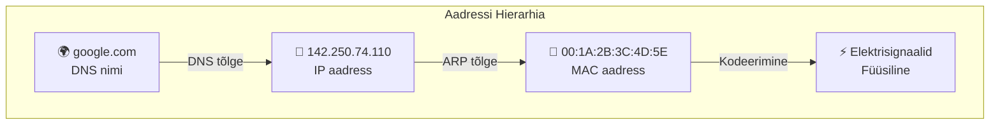

### 2.3 Vigade Kontroll

Füüsilised sidevahendid pole kunagi täiuslikud. Vaskkaablites tekitab müra vigu. WiFi-s segavad teised seadmed. Vigade kontroll on kriitiline.

#### Vigade Avastamise Meetodid

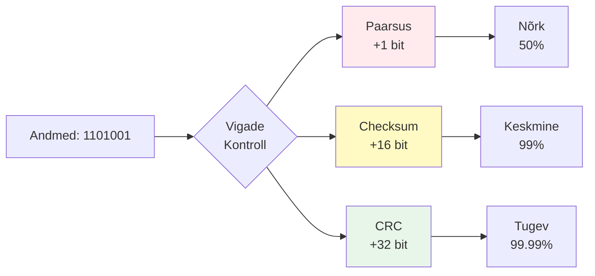

**Vigade parandamise strateegiad:**

| Meetod | Kirjeldus | Kasutus |
|--------|-----------|---------|
| **ARQ** | Automatic Repeat Request - küsi uuesti | TCP, WiFi |
| **FEC** | Forward Error Correction - paranda ise | Satelliit, CD |
| **Hybrid** | Kombineeri mõlemad | 5G, fiber |

---

## 3️⃣ ÜHENDUSEGA VS ÜHENDUSETA TEENUS

### 3.1 Connection-Oriented (TCP Mudel)

Connection-oriented teenus järgib **telefonikõne mudelit** - enne andmete saatmist luuakse ühendus, andmed saadetakse, siis ühendus suletakse.

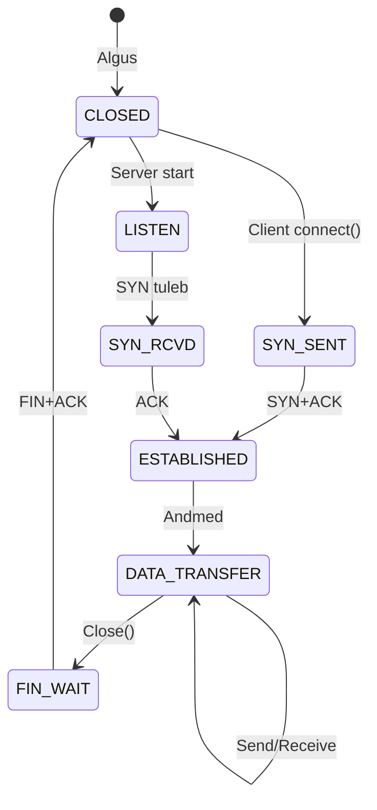

**TCP Three-Way Handshake:**

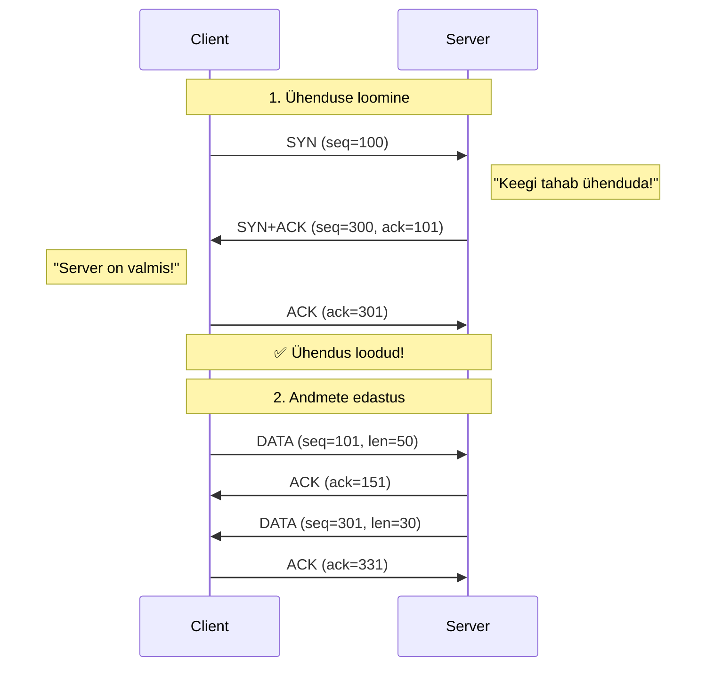

### 3.2 Connectionless (UDP Mudel)

Connectionless on nagu **postkaardi saatmine** - kirjutad, adresseerid, postitad. Pole eelnevat kokkulepet.

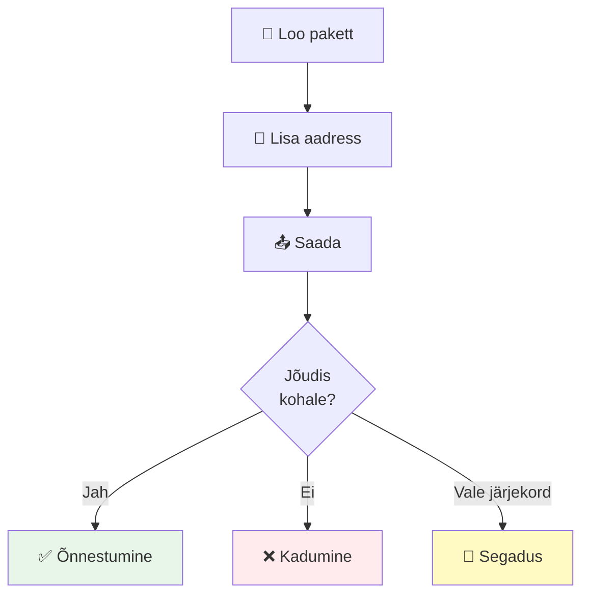

### 3.3 Võrdlus

| Omadus | Connection-Oriented (TCP) | Connectionless (UDP) |
|--------|--------------------------|---------------------|
| **Analoogia** | 📞 Telefonikõne | 📮 Postkaart |
| **Seadistus** | Vajalik (3-way handshake) | Pole vaja |
| **Järjekord** | ✅ Garanteeritud | ❌ Pole garanteeritud |
| **Usaldusväärsus** | ✅ Kõrge | ❌ Madal |
| **Kiirus** | 🐢 Aeglasem | 🚀 Kiirem |
| **Overhead** | Suur (20+ baiti) | Väike (8 baiti) |
| **Kasutus** | Failid, veeb, e-mail | Video, mängud, DNS |

---

## 4️⃣ TEENUSE PRIMITIIVID

### 4.1 Viis Põhilist Operatsiooni

Teenuse primitiivid on elementaarsed operatsioonid, mida kasutajad saavad teenusega teha. Need on nagu LEGO klotsid - lihtsad põhiosad.

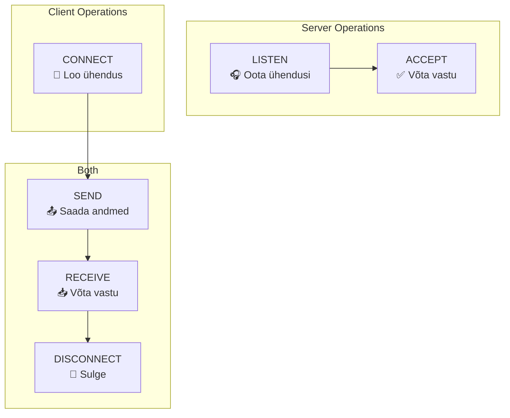

### 4.2 Berkeley Sockets

Berkeley sockets on de facto standard võrguprogrammeerimiseks. Loodud 1983 BSD Unix'is, nüüd kõikjal.

#### Server Voog

```python
# Pseudo-kood näide
server = socket()           # 1. Loo socket
server.bind(port=80)        # 2. Määra port
server.listen(queue=5)      # 3. Hakka kuulama
while True:
    client = server.accept()  # 4. Võta ühendus
    data = client.recv()      # 5. Loe andmed
    client.send(response)     # 6. Saada vastus
    client.close()           # 7. Sulge ühendus
```

---

## 5️⃣ OSI VÕRDLUSMUDEL

### 5.1 Seitse Kihti

OSI (Open Systems Interconnection) mudel loodi ISO poolt 1983. See on **teoreetiline mudel** võrkude mõistmiseks.

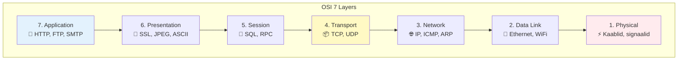

### 5.2 Iga Kihi Ülesanded

| Kiht | Nimi | Põhiülesanne | Näide |
|------|------|--------------|-------|
| **7** | Application | Kasutaja teenused | Veebileht (HTTP) |
| **6** | Presentation | Andmete vormindamine | Krüpteerimine (SSL) |
| **5** | Session | Dialoogide haldamine | SQL seanss |
| **4** | Transport | End-to-end ühendus | TCP segment |
| **3** | Network | Marsruutimine | IP pakett |
| **2** | Data Link | Vigadeta edastus | Ethernet kaader |
| **1** | Physical | Bitid juhtmetel | Elektrisignaalid |

### 5.3 Kuidas Andmed Liiguvad

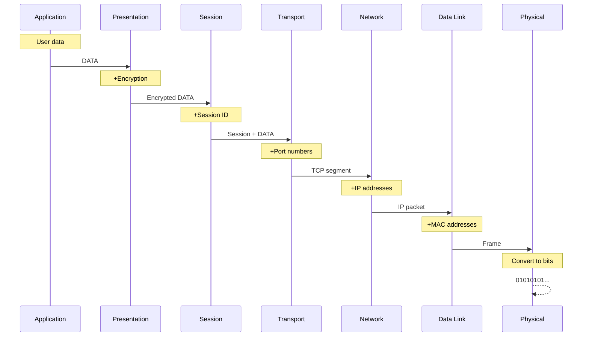

---

## 6️⃣ TCP/IP VÕRDLUSMUDEL

### 6.1 Praktiline 4-Kihiline Mudel

TCP/IP on **Internet'i tegelik mudel**. Loodud ARPANET'i jaoks, nüüd globaalne standard.

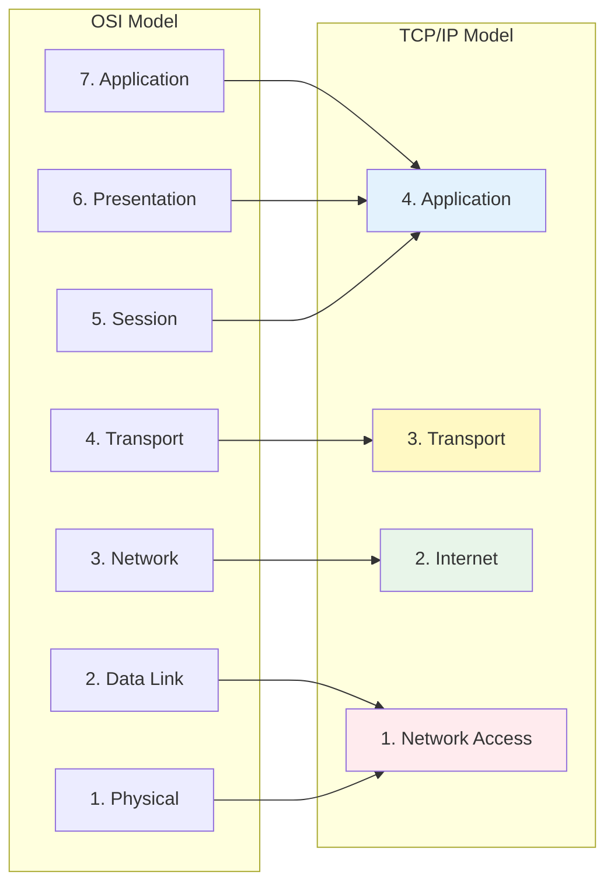

### 6.2 TCP/IP Protokollid

| Kiht | Protokollid | Funktsioon |
|------|------------|------------|
| **Application** | HTTP, FTP, SMTP, DNS | Kasutaja teenused |
| **Transport** | TCP, UDP | Usaldusväärsus |
| **Internet** | IP, ICMP, ARP | Marsruutimine |
| **Network Access** | Ethernet, WiFi, PPP | Füüsiline edastus |

### 6.3 OSI vs TCP/IP

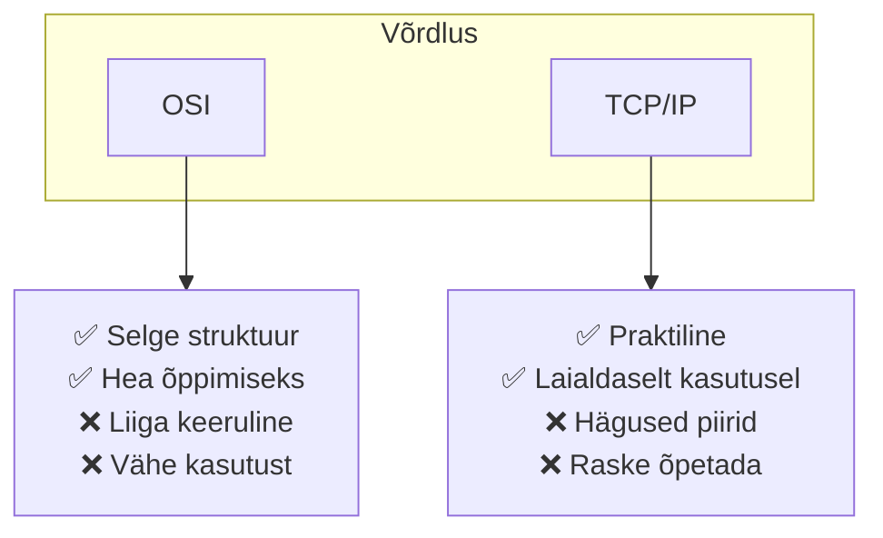

---

## 7️⃣ NÄIDISVÕRGUD

### 7.1 Internet Struktuur

Internet on **võrkude võrk** - hierarhiline struktuur ilma keskse kontrolli.

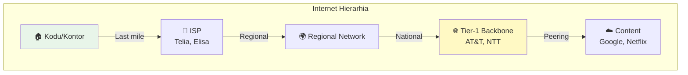

### 7.2 Mobiilvõrkude Evolutsioon

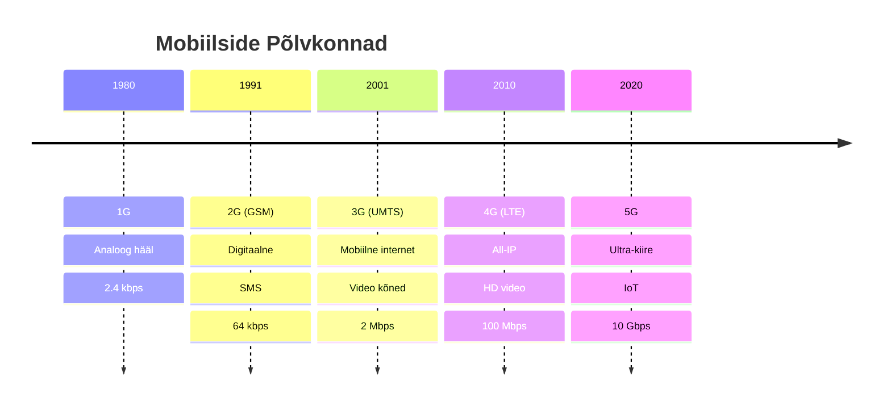

### 7.3 WiFi Standardid

| Standard | Aasta | Sagedus | Max kiirus | Uus nimi |
|----------|-------|---------|------------|----------|
| 802.11b | 1999 | 2.4 GHz | 11 Mbps | - |
| 802.11g | 2003 | 2.4 GHz | 54 Mbps | - |
| 802.11n | 2009 | 2.4/5 GHz | 600 Mbps | WiFi 4 |
| 802.11ac | 2013 | 5 GHz | 3.5 Gbps | WiFi 5 |
| 802.11ax | 2019 | 2.4/5/6 GHz | 9.6 Gbps | WiFi 6 |
| 802.11be | 2024 | 2.4/5/6 GHz | 46 Gbps | WiFi 7 |

---

## 8️⃣ STANDARDISEERIMINE

### 8.1 Miks Standardid On Kriitilised

Ilma standarditeta poleks globaalset internetti. Iga tootja teeks oma protokollid. Seadmed ei ühilduks.

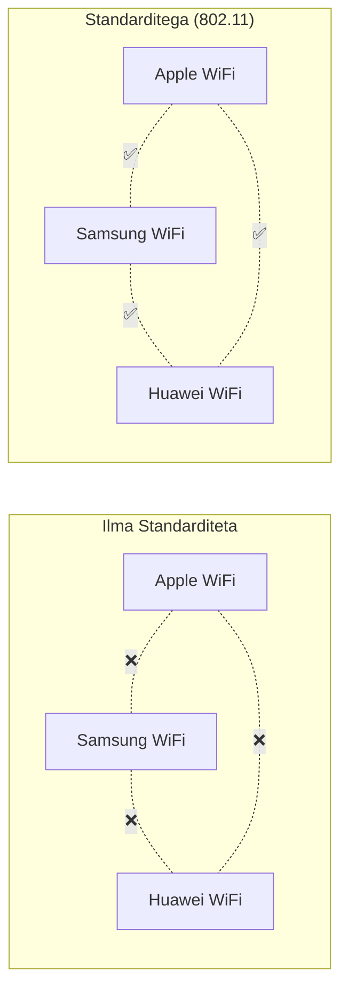

### 8.2 Peamised Organisatsioonid

| Org | Nimi | Vastutus | Standardid |
|-----|------|----------|------------|
| **ITU** | International Telecom Union | Telekom | G.xxx, H.264 |
| **ISO** | Int'l Standards Organization | Üldine | OSI mudel |
| **IEEE** | Inst of Electrical Engineers | LAN/MAN | 802.3, 802.11 |
| **IETF** | Internet Engineering TF | Internet | RFC (TCP/IP) |
| **W3C** | World Wide Web Consortium | Veeb | HTML, CSS |

---

## 9️⃣ MÕÕTÜHIKUD

### 9.1 Biti vs Baidi Segadus

> ⚠️ **1 bait (B) = 8 bitti (b)**

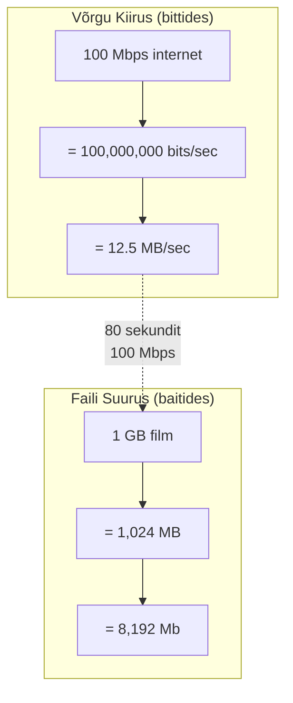

### 9.2 Praktiline Arvutus

**Näide: Kui kaua võtab 5 GB faili allalaadimine?**

```python
# Andmed
faili_suurus = 5 * 1024 * 1024 * 1024 * 8  # bits
kiirus = 100 * 1000 * 1000  # 100 Mbps

# Arvutus
aeg = faili_suurus / kiirus
# = 42,949,672,960 / 100,000,000
# = 429 sekundit
# = 7 minutit 9 sekundit

# Praktikas: lisa 10-15% overhead
tegelik_aeg = 429 * 1.15 = 493 sekundit
```

---

## 📊 Kokkuvõte

### Peamised Õpitud Kontseptsioonid

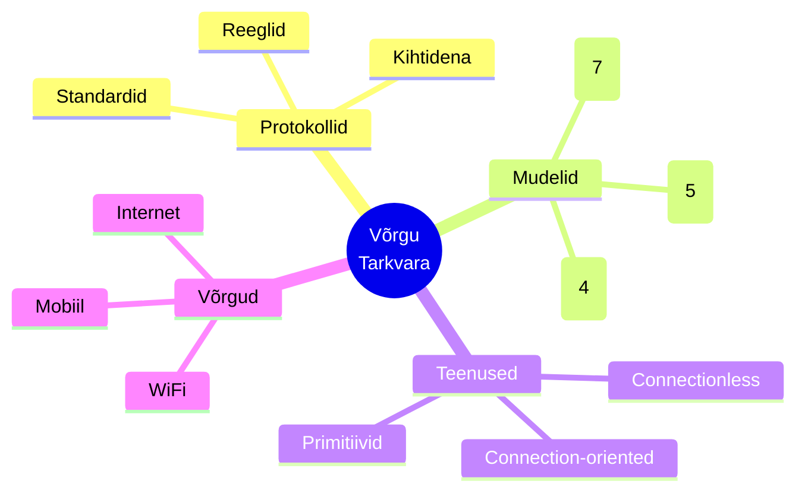

### 🎯 Mida Edasi?

- **Järgmine loeng:** Füüsiline kiht detailselt
- **Praktikum:** Packet Tracer labor
- **Kodutöö:** OSI vs TCP/IP võrdlus

### 📚 Lisalugemist

- RFC 793 - TCP Protocol
- IEEE 802.11 - WiFi Standard
- Tanenbaum Ch 2 - Physical Layer

---

## ✅ Kontrolli Oma Teadmisi

1. **Miks on protokollid kihtidena?**
2. **Mis vahe on TCP ja UDP vahel?**
3. **Mitu kihti on OSI mudelis? TCP/IP mudelis?**
4. **Millal kasutada connection-oriented teenust?**
5. **Kui suur on 1 Gbps MB/s-des?**

### 📺 Vaata Videot

[](https://www.youtube.com/watch?v=vv4y_uOneC0)
*Kliki pildil, et vaadata OSI mudeli selgitust*
