# Võrguprotokollid ja Arhitektuur

## Protokollide Olemus

Võrguprotokoll on kokkulepete süsteem, mis määrab andmevahetuse reeglid arvutivõrkudes. Protokollid toimivad nagu diplomaatilised kokkulepped riikide vahel - nad loovad ühise keele ja reeglid, mida kõik osapooled järgivad. Kui riistvara moodustab võrgu füüsilise skeleti, siis protokollid annavad sellele funktsionaalsuse ja võimaldavad erinevatel seadmetel omavahel suhelda. Ilma protokollideta oleks võrguseadmed nagu inimesed, kes räägivad eri keeltes ilma tõlgita.

### Protokolli Komponendid

Iga protokoll defineerib kolm fundamentaalset aspekti, mis tagavad edukat kommunikatsiooni. **Süntaks** määrab andmevormingu ja struktuuri spetsifikatsiooni - näiteks kuidas numbrid ja tekstid pakettidesse paigutatakse. **Semantika** defineerib väljade tähenduse ja tõlgendamise, andes igale bitile ja baidile konkreetse tähenduse. **Ajastus** kehtestab sündmuste järjekorra ja ajalised piirangud, tagades et osapooled teavad millal rääkida ja millal kuulata.

Praktiline näide HTTP protokollist illustreerib neid komponente hästi. Päring algab võtmesõnaga GET või POST (süntaks), mis näitab kas soovitakse andmeid lugeda või saata. Port 80 tähistab standardset veebiserverit (semantika), andes teada millisele teenusele päring on suunatud. Vastuse ooteaeg on piiratud tavaliselt 30 sekundiga (ajastus), et vältida lõputut ootamist.

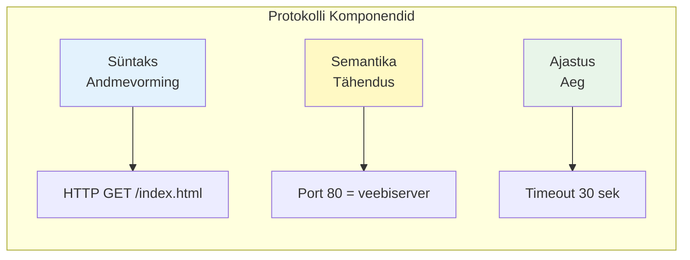

## Kihiline Arhitektuur

### Abstraktsioonikihtide Põhjendus

Võrguarhitektuur organiseeritakse kihtidena mitmel fundamentaalsel põhjusel, mis on tõestanud oma väärtust aastakümnete jooksul. Esiteks võimaldab see hallata keerukust läbi probleemide jagamise - iga kiht lahendab konkreetset probleemide klassi, muutes kogu süsteemi arusaadavamaks ja hallatavamaks. Teiseks tagab kihtide eraldatus paindlikkuse - WiFi tehnoloogiat saab asendada 5G-ga ilma ülemisi kihte muutmata, mis tähendab et uuendused ühes kihis ei nõua kogu süsteemi ümbertegemist. Kolmandaks lihtsustab kihiline lähenemine standardiseerimist, kuna iga kihi jaoks saab luua sõltumatud standardid.

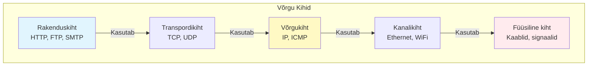

### Kihtidevahelised Suhted

Iga kiht pakub teenuseid ülemisele kihile läbi selgelt defineeritud liidese, luues hierarhilise teenuste struktuuri. TCP transpordikihis tagab näiteks usaldusväärsuse ja järjekorra säilimise, mida HTTP rakenduskihis eeldab oma toimimiseks. Samal ajal kasutab TCP ise IP võrgukihi marsruutimisvõimekust, delegeerides pakettide teekonna leidmise alumisele kihile. See teenuste hierarhia võimaldab igal kihil keskenduda oma spetsiifilisele ülesandele ilma muretsemata alumiste kihtide detailide pärast.

## Disaini Väljakutsed

### Adresseerimine

Igal võrgukihil on oma adressiruum, mis on kohandatud selle kihi spetsiifiliste vajaduste järgi. See mitmekihiline adresseerimine võimaldab paindlikku ja skaaleeruvat võrguarhitektuuri, kus iga kiht saab sõltumatult hallata oma identifikaatoreid. Adresside tõlkimine kihtide vahel toimub spetsiaalsete protokollide abil nagu ARP (Address Resolution Protocol) ja DNS (Domain Name System).

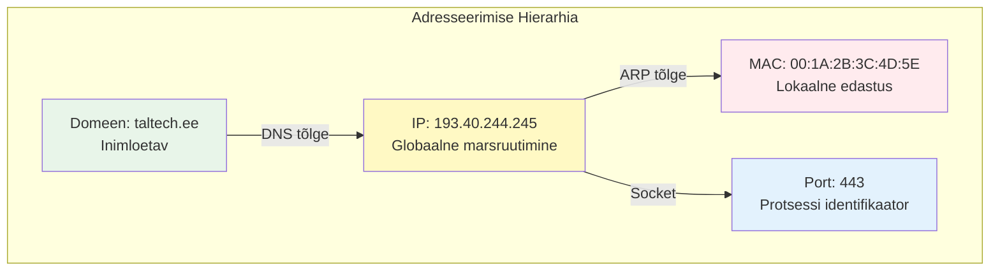

**Transpordikihis** kasutatakse 16-bitiseid pordinumbreid (0-65535), mis identifitseerivad konkreetseid protsesse või teenuseid arvutis. Standardsed pordid nagu 80 (HTTP) ja 443 (HTTPS) on registreeritud IANA poolt. Dünaamilised pordid (49152-65535) eraldatakse ajutisteks ühendusteks.

**Võrgukihis** toimivad IP-aadressid kui globaalsed identifikaatorid - IPv4 kasutab 32 bitti (4.3 miljardit aadressi) ja IPv6 128 bitti. Eestile on RIPE NCC eraldanud IPv4 vahemikud nagu 90.190.0.0/15 ja 217.146.64.0/20. IPv6 puhul on Eesti organisatsioonidel tavaliselt /32 või /48 prefiksid.

**Kanalikihis** kasutatakse 48-bitiseid MAC-aadresse, mis on tehases seadmetesse põletatud unikaalsed identifikaatorid. Esimesed 24 bitti (OUI - Organizationally Unique Identifier) identifitseerivad tootja, viimased 24 bitti on tootja määratud järjenumber. MAC-aadressid on olulised ainult lokaalses segmendis ja ruuterid neid ei edasta.

### Vigade Käsitlemine

Andmeedastuse vigade tuvastamine ja parandamine on kriitiline võrgu usaldusväärsuse tagamiseks. Erinevad meetodid pakuvad erineva tasakaalu keerukuse ja efektiivsuse vahel. Vigade põhjusteks võivad olla elektromagnetiline häiring, signaali nõrgenemine, riistvara probleemid või võrgu ülekoormus.

Lihtne **paarsuskontroll** lisab andmetele ühe biti, mis muudab ühtede arvu paaris- või paarituks. See meetod avastab 50% vigadest, kuid ei suuda tuvastada paarisarvu vigade samaaegset esinemist. Paarsuskontrolli kasutatakse sageli järjestikustes ühendustes ja RAID massiivides.

**CRC (Cyclic Redundancy Check)** kasutab polünoomjagamist ja suudab avastada üle 99.99% vigadest. CRC-32 on standard Etherneti kaadrites, lisades igale kaadrile 4-baidise kontrollsumma. CRC suudab tuvastada kõik ühe- ja kahebitilised vead, paaritu arvu vigu ja purskevigu kuni 32 biti pikkuses.

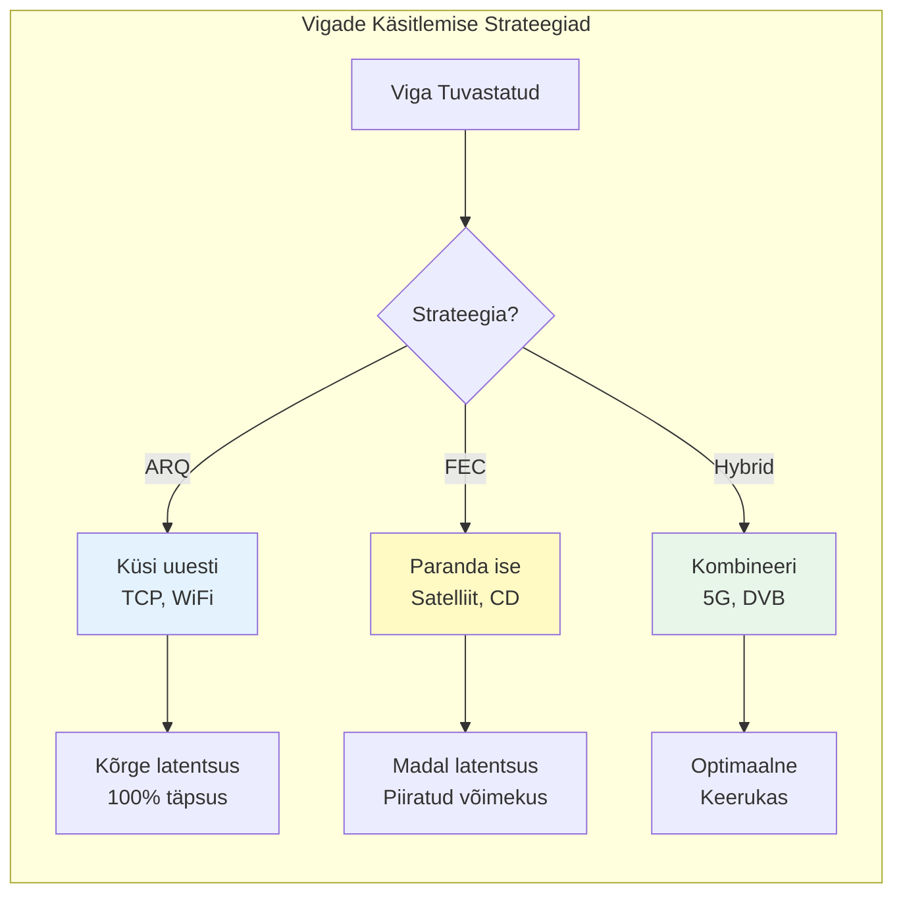

Vigade parandamiseks on kaks põhistrateegiat, mis erinevad lähenemiselt ja kasutusjuhtudelt. **ARQ (Automatic Repeat Request)** tuvastab vea ja nõuab paketi kordussaatmist - seda kasutavad TCP ja WiFi protokollid. **FEC (Forward Error Correction)** lisab piisavalt redundantsi, et vastuvõtja saaks vigu ise parandada - kasutatakse satelliitsides ja mobiilsides, kus kordusnõue oleks aeglane.

Eesti mobiilvõrkudes kasutatakse kombineeritud lähenemist. Raadiolülis rakendatakse Turbo või LDPC koode (FEC) kiirete vigade parandamiseks. Kõrgemates kihtides töötab ARQ täiendava kaitsena. See tagab optimaalse tasakaalu kiiruse ja usaldusväärsuse vahel.

## Ühendusteenused

### Ühendusega Teenus (TCP)

TCP (Transmission Control Protocol) loob enne andmeedastust virtuaalse ühenduse, tagades usaldusväärsuse ja järjekorra säilimise. See protokoll on Internet'i selgroog, kanddes üle 90% kogu andmeliiklusest. TCP sobib ideaalselt olukordadesse, kus andmete terviklikkus on kriitilise tähtsusega - failiedastus, e-post, veebilehed.

Ühenduse loomine toimub kolmekäigulise kätluse (three-way handshake) abil, mis sünkroniseerib mõlema osapoole olekud. Klient saadab SYN (synchronize) lipuga paketi koos juhusliku algse järjekorranumbriga. Server vastab SYN+ACK kombinatsiooniga, kinnitades kliendi numbri ja pakkudes oma algset numbrit. Klient kinnitab ACK-ga serveri numbri, viimistledes ühenduse loomise.

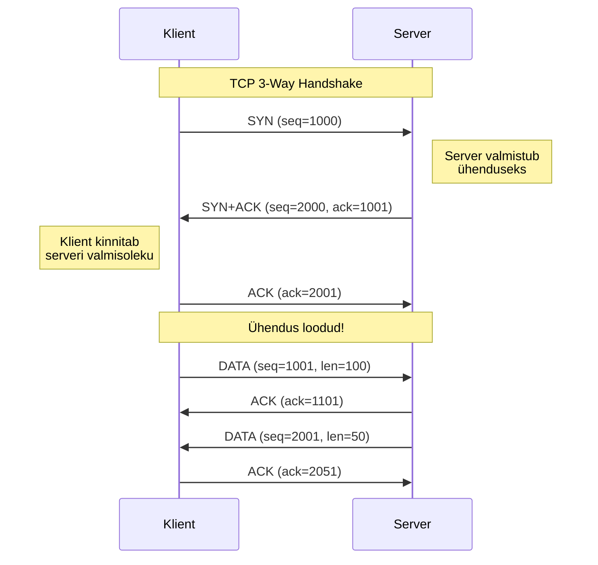

Telia ja Elisa võrkudes on TCP ühenduse loomise mediaan-aeg Eesti-siseselt 5-8ms. Tallinn-Tartu vahel on see tavaliselt 8-10ms, sõltuvalt võrgu koormusest ja marsruudist. Rahvusvahelised ühendused Soome nõuavad 8-12ms, Rootsi 15-25ms ja USA idarannikule 90-110ms.

### Ühenduseta Teenus (UDP)

UDP (User Datagram Protocol) saadab pakette ilma eelneva kokkuleppeta, toimides nagu postkaart - kirjutad, adresseerid ja saadad. See lähenemine vähendab latentsust ja overhead'i, kuid ei garanteeri kohaletoimetamist ega järjekorda. UDP on ideaalne reaalajarakendustes, kus kiirus on tähtsam kui absoluutne usaldusväärsus.

UDP kasutusjuhud hõlmavad häälekõnesid (VoIP), videovoogu, online-mänge ja DNS päringuid. Näiteks Skype ja Teams kasutavad UDP-d häälekõnedeks, kus üksikute pakettide kadumine pole kriitiline - inimkõrv ei märka 20-30ms audiolünki. Mängudes nagu Counter-Strike on oluline madal latentsus, mitte vana positsiooniinfo kordussaatmine.

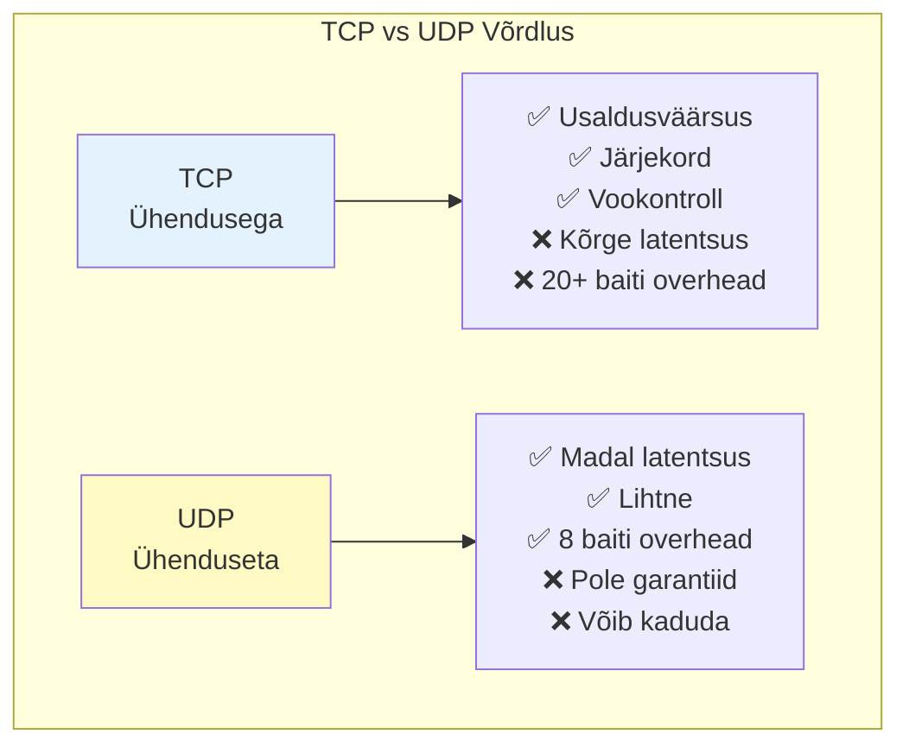

UDP päis on vaid 8 baiti, võrreldes TCP 20+ baidiga. See tähendab, et väikeste pakettide puhul võib UDP olla kuni 30% efektiivsem. Eesti IPTV teenused (Telia TV, Elisa Elamus) kasutavad multicast UDP-d video edastamiseks, optimeerides võrgu läbilaskevõimet.

## Võrdlusmudelid

### OSI Mudel

ISO (International Organization for Standardization) loodud 7-kihiline OSI (Open Systems Interconnection) mudel on teoreetiline raamistik võrguarhitektuuri mõistmiseks. Kuigi praktikas domineerib TCP/IP, on OSI mudel endiselt väärtuslik õppevahend ja terminoloogia allikas. Paljud võrguseadmed ja -tehnoloogiad viitavad endiselt OSI kihtidele (Layer 2 switch, Layer 3 routing).

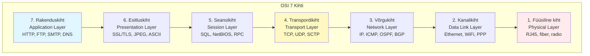

**Füüsiline kiht** tegeleb bittide edastamisega füüsiliste kanalite kaudu - elektrisignaalid vaskkaablites, valgus fiiberoptilises kaablis, raadiosagedused õhus. See kiht määrab pingetasemed, ajastuse, kaablite füüsilised omadused. Näiteks Ethernet 1000BASE-T kasutab kõiki nelja paari Cat5e kaablis.

**Kanalikiht** moodustab kaadreid, lisab MAC-aadressid ja teostab vigakontrolli lokaalses segmendis. Ethernet lisab 14-baidise päise ja 4-baidise CRC kontrollsumma. WiFi (802.11) lisab krüpteerimise ja kinnitussõnumid. Switches töötavad sellel kihil, tehes edastamisotsuseid MAC-aadressi tabeli põhjal.

**Võrgukiht** vastutab pakettide marsruutimise eest läbi mitme võrgu. IP protokoll lisab lähte- ja sihtaadressi, TTL (Time To Live) välja ja fragmenteerib suured paketid. Ruuterid töötavad sellel kihil, kasutades marsruutimistabeleid ja protokolle nagu OSPF või BGP. Eesti AS-ide vahelist liiklust marsruudib LINX (London Internet Exchange) või AMSIX (Amsterdam Internet Exchange).

### TCP/IP Mudel  

TCP/IP on Internet'i praktiline 4-kihiline mudel, mis arendati ARPANET projekti raames 1970ndatel. See mudel on pragmaatiline ja keskendub toimivale implementatsioonile, mitte teoreetilisele puhtusele. Kõik Internet'i seadmed ja teenused põhinevad TCP/IP protokollistikul.

TCP/IP lihtsustab OSI mudelit, ühendades ülemised kihid rakenduskihiks ja alumised kihid võrgujuurdepääsu kihiks. See lähenemine vähendab keerukust ja lihtsustab implementatsiooni. Protokollide vaheline suhtlus on paindlikum kui range OSI mudel ette näeb.

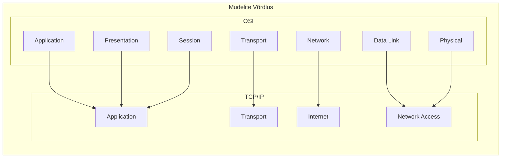

Eesti riiklik andmeside baasvõrk EEBone kasutab täielikult TCP/IP protokollistikku. X-tee, mis ühendab üle 900 Eesti avaliku ja erasektori infosüsteemi, töötab SOAP/REST protokollidega üle HTTPS/TLS, mis kõik põhinevad TCP/IP mudelil. See tagab ühilduvuse rahvusvaheliste standarditega ja võimaldab turvalist andmevahetust.

## Eesti Võrguinfrastruktuur

### Rahvusvaheline Ühenduvus

Eesti on ühendatud globaalse internetiga mitme sõltumatu kanali kaudu, tagades redundantsuse ja töökindluse. Peamine ühendus kulgeb läbi Soome merekaablitega - EstLink merekaablid (mitte segamini ajada elektrikaabliga) ja Baltica Submarine Cable. Need kaablid võimaldavad latentsust alla 10ms Soome ja sealt edasi Põhjamaadesse ja Kesk-Euroopasse.

Lääne-Euroopa ühendus kulgeb läbi Stockholmi, kasutades TeliaSonera ja Tele2 infrastruktuuri. See marsruut on kriitiline Saksamaa (Frankfurt) ja Hollandi (Amsterdam) internet exchange point'idega ühendumiseks, kus asuvad paljud rahvusvahelised content delivery network'id. Kolmas marsruut läbi Läti toimib backup'ina ja pakub alternatiivset teed Ida-Euroopasse ja Venemaale.

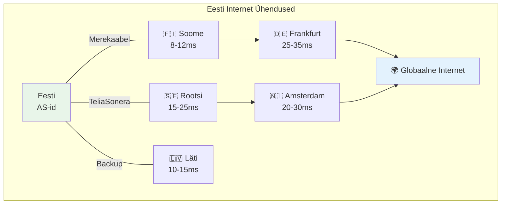

TTJA (Tarbijakaitse ja Tehnilise Järelevalve Amet) reguleerib elektroonilise side teenuseid Eestis. TTJA väljastab sageduslube, määrab numbrivahemikke ja tagab konkurentsi telekommunikatsiooni turul. Amet jälgib ka võrguneutraalsuse reeglite täitmist ja lahendab tarbijate kaebusi sideoperaatorite vastu.

### WiFi Sagedused

Eestis on WiFi jaoks eraldatud kolm peamist sagedusala, millest igaüks sobib erinevateks kasutusteks. 2.4 GHz sagedusala (2400-2483.5 MHz) pakub 13 kanalit 20 MHz laiusega, kuid kattuvuste tõttu on mittekattuvaid kanaleid vaid kolm (1, 6, 11). See sagedus levib hästi läbi seinte, kuid on sageli ülekoormatud ja häiritud mikrolaineahjude ja Bluetooth seadmete poolt.

5 GHz sagedusala (5150-5875 MHz) pakub oluliselt rohkem kanaleid ja vähem häireid, kuid lühemat levikaugust. Kanalid 36-64 on mõeldud siseruumideks (200mW), kanalid 100-140 nõuavad DFS (Dynamic Frequency Selection) toe olemasolu radarite vältimiseks. Välitingimustes on lubatud võimsus kuni 1W kanalitel 100-140.

6 GHz sagedusala (5945-6425 MHz) avati WiFi 6E jaoks 2021. aastal. See pakub 480 MHz spektrit, võimaldades kuni seitse 160 MHz laiust kanalit. Siseruumides on lubatud võimsus 200mW (LPI - Low Power Indoor), väljas 25mW (VLP - Very Low Power). AFC (Automated Frequency Coordination) süsteem võimaldab tulevikus kõrgemaid võimsusi.

### Mobiilside

Eesti mobiilioperaatorite spekter on jaotatud kolme põhioperaatori vahel, kes pakuvad üleriigilist katvust. Telia omab kõige laiemaid sagedusvahemikke - 800 MHz (digital dividend), 900 MHz (GSM rebanded), 1800 MHz, 2100 MHz (3G) ja 2600 MHz (4G/5G). Elisa spekter on sarnane, kuid väiksema 900 MHz osaga. Tele2 opereerib peamiselt 800, 1800 ja 2600 MHz sagedustel.

5G võrgu arendus Eestis kasutab esialgu 3.5 GHz (3400-3800 MHz) sagedusala, mida TTJA jagas 2022. aastal. Telia sai 3410-3540 MHz, Elisa 3540-3670 MHz ja Tele2 3670-3800 MHz vahemikud. Millimeeterlaine sagedustel (26 GHz) on planeeritud tulevikus tihedama katvusega aladel nagu Tallinna kesklinn ja Ülemiste City.

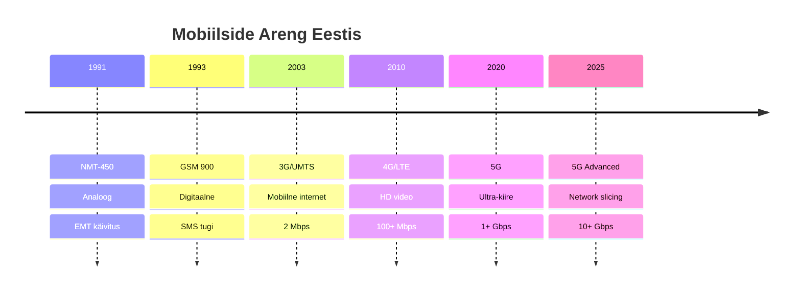

2024. aasta seisuga katavad 5G levialad Tallinna (90% katvus), Tartu (85%), Pärnu (70%) ja Narva (60%). Kiirus ulatub ideaaltingimustes 1-2 Gbps, keskmiselt 200-500 Mbps. 4G võrk katab 99.8% elanikkonnast ja 98% territooriumist. Keskmine 4G kiirus on 50-100 Mbps, maksimum 300 Mbps carrier aggregation'iga.

## Standardiseerimine

### Rahvusvahelised Organisatsioonid

Standardiseerimine on võrgutehnoloogiate globaalse ühilduvuse alus, ilma milleta poleks tänapäevane internet võimalik. **ITU (International Telecommunication Union)** on ÜRO telekommunikatsiooniagentuur, millega Eesti liitus juba 1922. aastal. ITU-T sektor vastutab telekommunikatsioonistandardite eest nagu G.711 (digitaalne hääl), H.264 (videokomissioon) ja Y.1564 (Ethernet teenuste testimine). ITU-R haldab raadiosagedusspektrit ja satelliitorbiite globaalsel tasandil.

**ETSI (European Telecommunications Standards Institute)** loob Euroopa telekommunikatsioonistandardeid ja Eesti osaleb selles läbi EVS (Eesti Standardimis- ja Akrediteerimiskeskus). ETSI standardid hõlmavad GSM/3G/4G/5G mobiilsidet, DECT juhtmeta telefone ja intelligentseid transpordisüsteeme. ETSI EN standardid on sageli kohustuslikud kogu Euroopa Liidus, tagades ühtse tehnilise ruumi.

**IEEE (Institute of Electrical and Electronics Engineers)** vastutab LAN ja WLAN standardite eest. IEEE 802.3 defineerib Etherneti (10 Mbps kuni 400 Gbps), 802.11 WiFi tehnoloogiad ja 802.1Q VLAN'id. IEEE standardikomiteed koosnevad tööstuse esindajatest - Cisco, Intel, Broadcom - kes tagavad praktilise rakendatavuse.

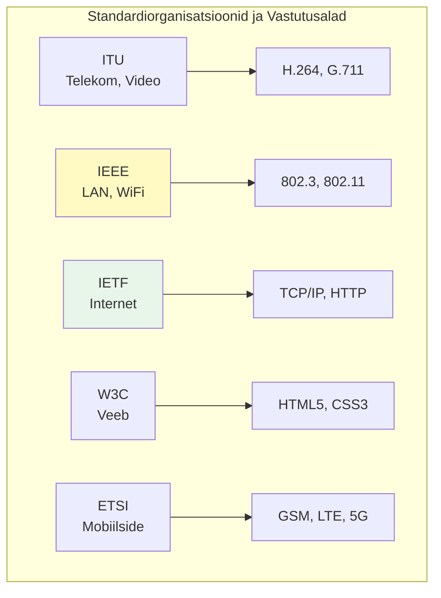

**IETF (Internet Engineering Task Force)** haldab interneti põhiprotokolle läbi RFC (Request for Comments) dokumentide. RFC 791 defineerib IP protokolli, RFC 793 TCP protokolli ja RFC 2616 HTTP/1.1. IETF töötab avatud konsensuse põhimõttel - "rough consensus and running code" - kus töötav kood on olulisem kui formaalne hääletamine.

### Eesti Standardiorganisatsioonid

**EVS (Eesti Standardimis- ja Akrediteerimiskeskus)** on Eesti rahvuslik standardiasutus, mis vahendab rahvusvahelisi standardeid ja loob vajadusel Eesti olusid arvestavaid lisasid. EVS haldab üle 30,000 standardi, millest IT valdkonnas on olulisemad EVS-EN seeria (Euroopa standardid) ja EVS-ISO/IEC (rahvusvahelised IT standardid). Näiteks EVS-ISO/IEC 27001 defineerib infoturbe haldussüsteemi nõuded, mida kasutavad paljud Eesti organisatsioonid.

**TTJA (Tarbijakaitse ja Tehnilise Järelevalve Amet)** kehtestab tehnilised normid elektroonilise side valdkonnas ja haldab riiklikku sagedusplaani. TTJA määrused reguleerivad näiteks numeratsiooni (numbriportaalsus, lühinumbrid), võrgu kvaliteedinõudeid (packet loss <0.1%, jitter <50ms VoIP jaoks) ja raadioseadmete tehnilisi parameetreid. Amet teostab ka turujärelevalvet, kontrollides seadmete CE märgistuse õigsust ja elektromagnetilise ühilduvuse nõuete täitmist.

**RIA (Riigi Infosüsteemi Amet)** määrab riigi IT-standardid ja ISKE (Infosüsteemide Kolmeastmelise Etalonturbe Süsteem) nõuded. ISKE põhineb ISO 27001 standardil, kuid on kohandatud Eesti avaliku sektori vajadustele. RIA haldab ka krüptograafilisi standardeid riigi krüptovõtmete jaoks ja X-tee tehnilisi spetsifikatsioone, mis määravad kuidas riigi infosüsteemid omavahel turvaliselt suhtlevad.

## Jõudluse Arvutused

### Läbilaskevõime

Reaalses võrgus on efektiivne läbilaskevõime alati väiksem kui nominaalne, kuna osa mahust kulub protokollide metaandmetele ja juhtimisele. TCP/IP protokollistik lisab igale paketile vähemalt 40 baiti päiseid (20 baiti TCP + 20 baiti IP), mis 1500-baidise Ethernet MTU korral tähendab ~2.7% overhead'i. Väiksemate pakettide puhul võib overhead ulatuda 40%-ni või rohkemgi.

Ethernet kaadristamine lisab omakorda 38 baiti (14 päis + 4 CRC + 20 inter-frame gap), mis on täiendav 2.5% overhead 1500-baidise paketi kohta. ACK paketid, TCP slow start ja võimalikud taasedastused vähendavad läbilaskevõimet veelgi. Praktikas saavutatakse parimal juhul 94-95% teoreetilisest maksimumist ideaalsetes tingimustes.

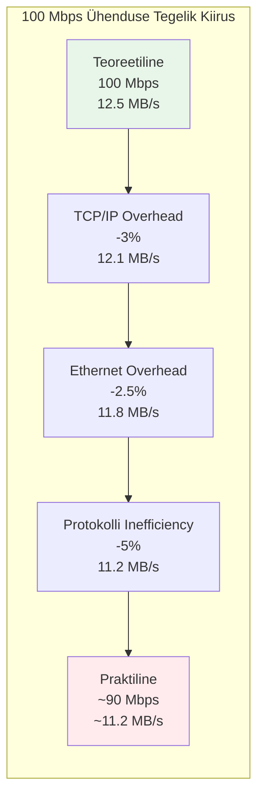

Näiteks 100 Mbps ühendus annab teoreetiliselt 12.5 MB/s (100 ÷ 8), kuid praktiline kiirus on ~10.6-11.2 MB/s. 1 Gbps ühendus peaks andma 125 MB/s, kuid realistlik on 110-117 MB/s. Faktorid nagu CPU võimekus, kõvaketta kiirus ja võrgukaardi draiverid võivad samuti piirata tegelikku kiirust.

### Latentsus

Võrgu latentsus koosneb mitmest komponendist - propagatsiooniviivitus (valguse kiirus meediumis), serialiseerimisviivitus (paketi edastamise aeg), töötlusviivitus (ruuterites ja switchides) ja järjekorra viivitus (puhvrites ootamine). Valguse kiirus fiiberoptilises kaablis on ~200,000 km/s, mis tähendab 5 mikrosekundit kilomeetri kohta. Vaskkaablis on kiirus ~230,000 km/s ehk 4.3 mikrosekundit kilomeetri kohta.

Eesti-sisesed viivitused on madalad tänu riigi kompaktsele suurusele ja hästi arenenud fiiberoptilisele infrastruktuurile. Tallinn-Tartu vahemaa 180km tähendab teoreetilist minimaalselt 0.9ms propagatsiooniviivitust, kuid praktikas lisanduvad ruuterite töötlusajad. Tallinn-Pärnu (130km) on tavaliselt 4-8ms, Tallinn-Narva (210km) 6-10ms. Saaremaale lisandub 5-7ms täiendavat viivitust Saaremaa väina kaabli tõttu.

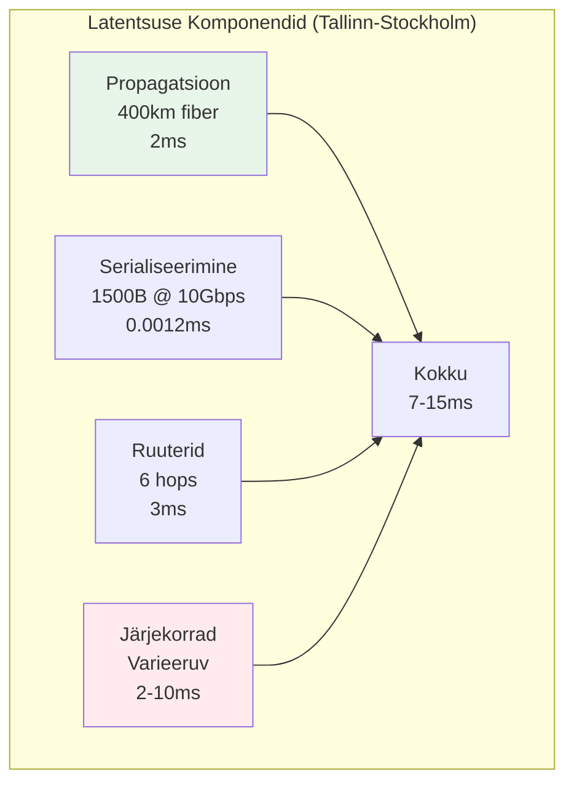

Rahvusvahelised latentsused sõltuvad geograafiast ja võrgu topoloogiast. Helsinki on 8-12ms (85km merekaabel + võrguseadmed), Stockholm 15-25ms (400km), Frankfurt 25-35ms (1600km läbi mitme riigi). New York on 90-110ms (6500km Atlandi kaablid), Tokyo 250-280ms (läbi Siberi või India ookeani), Sydney 320-350ms (peaaegu vastaspool maakera).

## Praktiline Rakendus

### E-riigi Infrastruktuur

Võrguprotokolle mõista on fundamentaalne riigi digitaalse infrastruktuuri arendamisel ja haldamisel. Eesti e-riigi teenused - X-tee, e-identiteet, digiretsept, e-maksuamet - kõik põhinevad nendel protokollistackkidel. X-tee kasutab SOAP või REST protokolle üle HTTPS/TLS, mis omakorda töötab TCP/IP peal, tagades turvalise ja usaldusväärse andmevahetuse riigi infosüsteemide vahel.

ISKE (Infosüsteemide kolmeastmeline etalonturbe süsteem) nõuab protokollide turvalisuse põhjalikku hindamist riigi infosüsteemides. See hõlmab TLS versioonide kontrolli (minimaalselt TLS 1.2), tugevate šifrite kasutamist (AES-256, RSA-2048) ja protokollide nõrkuste (nagu SSL/TLS POODLE, Heartbleed) testimist. Kriitiline infrastruktuur peab rakendama täiendavaid kaitsemeetmeid nagu DDoS kaitse ja anomaaliate tuvastamine.

Riigi teenuste kättesaadavus sõltub otseselt võrguprotokollidest - kui DNS ei tööta, ei saa kasutajad teenusteni jõuda isegi kui need on töökorras. Seetõttu on Eesti riiklikel teenustel redundantsed DNS serverid mitmes geograafilises asukohas. Protokollide standardiseerimine tagab, et e-teenused töötavad sõltumata kasutaja seadmest või internetiteenuse pakkujast.

### Tulevikutehnoloogiad

Järgmise põlvkonna protokollid nagu QUIC (Quick UDP Internet Connections) ja HTTP/3 lubavad märkimisväärset jõudluse paranemist. QUIC ühendab TCP usaldusväärsuse UDP kiiruse ja TLS turvalisusega, vähendades ühenduse loomise aega 0-RTT (round-trip time) handshake'iga. Google'i andmetel vähendab QUIC YouTube'i puhverdamisaega 18% ja otsingutulemuste latentsust 8%.

IPv6 juurutamine Eestis on aeglane, kuid vältimatu - 2024 seisuga on IPv6 kasutusmäär ~35% (allikas: Google IPv6 Statistics). Telia ja Elisa pakuvad IPv6 tuge nii era- kui äriklientidele, kuid paljud teenused töötavad endiselt dual-stack režiimis. Riigi IT-strateegiad näevad ette täielikku IPv6 üleminekut 2030. aastaks.

5G võrgu funktsioonid nagu network slicing ja edge computing nõuavad uusi protokolle ja arhitektuure. Network slicing võimaldab luua virtuaalseid võrke spetsiifiliste QoS nõuetega - näiteks garanteeritud latentsusega slice autonoomsete sõidukite jaoks või kõrge läbilaskevõimega slice 8K video striimimiseks. Edge computing toob arvutusvõimsuse lähemale kasutajale, vähendades latentsust kriitilistele rakendustele.

---

### Allikad

1. Tanenbaum, A. S., & Wetherall, D. (2021). *Computer Networks* (6th ed.). Pearson.
2. Kurose, J. F., & Ross, K. W. (2021). *Computer Networking: A Top-Down Approach* (8th ed.). Pearson.
3. TTJA. (2024). *Eesti elektroonilise side turg 2023. aasta ülevaade*. Tarbijakaitse ja Tehnilise Järelevalve Amet.
4. RIA. (2023). *ISKE rakendamise juhend v3.1*. Riigi Infosüsteemi Amet.
5. RIPE NCC. (2024). *IPv6 RIPEness measurements for Estonia*. https://www.ripe.net/
6. IEEE Standards Association. (2022). *802.11ax-2021 - IEEE Standard for Wireless LAN*. IEEE.
7. IETF. (2021). *RFC 9000: QUIC: A UDP-Based Multiplexed and Secure Transport*. Internet Engineering Task Force.
8. EVS. (2023). *EVS-EN 50173-1:2018 Infosidetehnika. Üldkaabeldusvõrgu süsteemid*. Eesti Standardikeskus.
9. European Commission. (2023). *DESI 2023 Estonia Report*. Digital Economy and Society Index.
10. Elisa Eesti AS. (2024). *5G võrgu tehniline spetsifikatsioon*. Sisedokument.

*Kliki pildil, et vaadata OSI mudeli selgitust*
