# Loeng 2: Võrgukomponendid, tüübid ja ühendused

## Õpiväljundid

Selle peatüki läbimise järel oskate:

* Eristada kliendi ja serveri rolle võrgus
* Selgitada peer-to-peer võrkude toimimist
* Klassifitseerida võrguseadmeid nende funktsiooni järgi
* Võrrelda erinevaid ISP ühenduse tüüpe
* Valida sobivat internetiühendust vastavalt vajadustele

---

## 2.1 Kliendid ja serverid

### Klient-serveri mudel

Tänapäevased võrgud põhinevad suures osas **klient-serveri mudelil**. See on lihtne aga võimas kontseptsioon:

* **Klient** on seade või rakendus, mis **küsib** teenust
* **Server** on seade või rakendus, mis **pakub** teenust

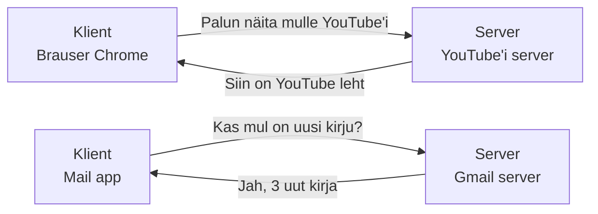

**Igapäeva näited 2024-2025:**

* Kui avate TikTok või YouTube'i, on teie telefon **klient** ja platvormi serverid on **server**
* Discord'is mängides on teie arvuti **klient** ja Discord serverid on **server**
* ChatGPT või Copilot kasutades on teie brauser **klient** ja AI serverid on **server**
* Online pangas on teie telefon/arvuti **klient** ja panga turvaserverid on **server**

### Miks klient-serveri mudel on populaarne?

1. **Lihtne hallata** - kogu informatsioon on ühes kohas (serveris)
2. **Turvaline** - server saab kontrollida, kes millele ligi pääseb
3. **Uuendused on lihtsad** - piisab serveri uuendamisest
4. **Skaleeruv** - üks server teenindab tuhandeid kliente

### Peer-to-Peer (P2P) võrgud

P2P võrgus **ei ole kedagi peamist** - kõik seadmed on võrdsed ja saavad nii küsida kui ka pakkuda teenuseid.

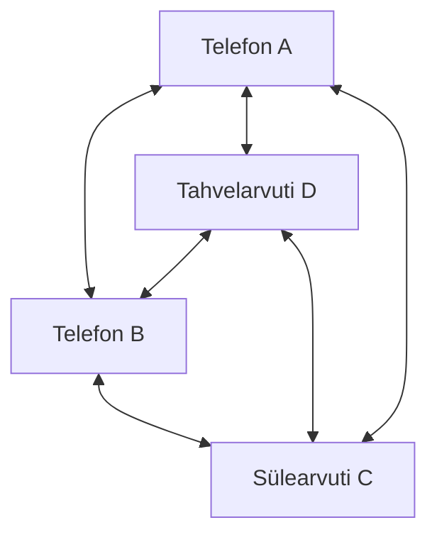

**P2P eelised:**

* Ei vaja kallist serverit
* Kui üks seade läheb rikki, teised töötavad edasi
* Mida rohkem kasutajaid, seda kiirem

**P2P puudused:**

* Raskem turvalisust tagada
* Pole garantiid, et teenus alati toimib
* Keeruline hallata

### P2P rakendused praktikas

**BitTorrent failijagamine:**

* Suur fail jagatakse väikesteks tükkideks
* Iga kasutaja laadib mõned tükid ja jagab neid edasi
* Mida rohkem jagajaid, seda kiirem

**Bitcoin ja krüptovaluutad:**

* Kõik tehingud salvestatakse kõigile arvutitele
* Ei ole keskpanka ega valitsust
* Võrk ise kontrollib tehingute õigsust

**Skype (vanemad versioonid):**

* Kõned läksid otse kasutajalt kasutajale
* Ei vajanud Skype'i servereid kõnede edastamiseks

### Mitmed rollid võrgus

Sama seade saab olla **nii klient kui server**, sõltuvalt situatsioonist:

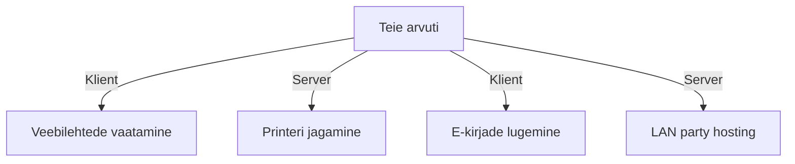

**Näited:**

* **Klient:** kui vaatate Netflix'i
* **Server:** kui sõbrad trükivad teie printeriga
* **Klient:** kui kuulate Spotify't
* **Server:** kui jagate WiFi parooli

---

## 2.2 Võrgukomponendid

### Võrgu ehitusklotsid

Võrk on nagu lego ehitis - koosneb erinevatest osadest, millel on oma kindel ülesanne. Kõik komponendid jagame kahte gruppi:

### Lõppseadmed (End Devices)

Need on seadmed, mis **kasutavad** võrku - kas saadavad või saavad andmeid.

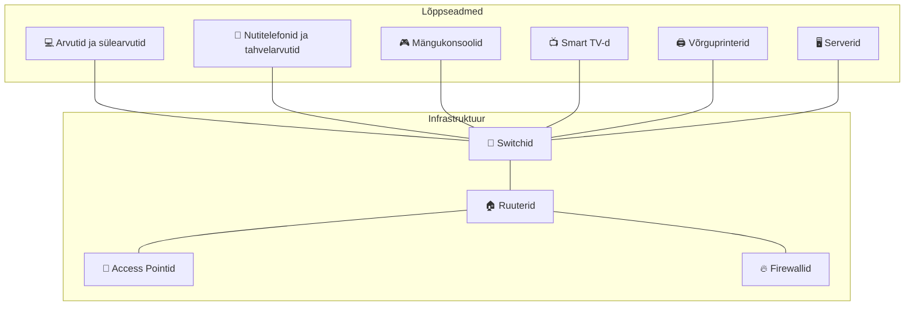

**Kasutajaseadmed:**

* Arvutid ja sülearvutid
* Nutitelefonid ja tahvelarvutid
* Mängukonsoolid (PlayStation, Xbox)
* Smart TV-d ja Apple TV

**Serverid:**

* Veebiserverid (hostsivad veebilehti)
* Mailiserverid (saadavad e-kirju)
* Failiserverid (hoiustavad dokumente)
* Andmebaasiserverid

### Infrastruktuuriseadmed

Need seadmed **aitavad andmetel liikuda** õigesse kohta võrgus.

**Switch (lüliti):**

* Ühendab seadmeid sama võrgu sees
* Nagu roundabout liikluses - suunab liikluse õigesse suunda
* Töötab MAC aadresside alusel

**Router (marsruuter):**

* Ühendab erinevaid võrke omavahel
* Nagu GPS - leiab parima tee sihtkohta
* Töötab IP aadresside alusel

**Access Point:**

* Loob WiFi ühenduse
* Nagu raadiotorn - edastab signaali õhus

**Firewall:**

* Kontrollib, mis liiklus tohib võrku siseneda
* Nagu turvamees - kontrollib igat sisenejat

### Võrgu infrastruktuuri näide

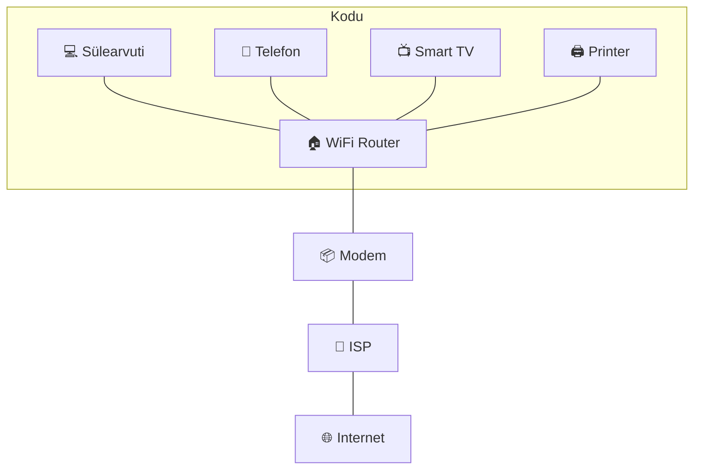

---

## 2.3 ISP ühenduse valikud

### Mis on ISP?

**Internet Service Provider (ISP)** on ettevõte, mis müüb teile internetiühendust. Nagu elektriettevõte müüb elektrit, müüb ISP internetti.

**Eesti peamised ISP-d:**

* **Telia** (suurim, endine Eesti Telekom)
* **Elisa**
* **Tele2**
* **Starman** (kaabel-TV ettevõte)

### ISP teenused

ISP-d pakuvad erinevaid teenuseid:

* **Internetiühendus** kodudesse ja ettevõtetesse
* **E-posti kastid** (@telia.ee, @elisa.ee)
* **Veebihosteerimise teenused**
* **IP telefonid**
* **TV teenused**

### Peamised ühenduse tüübid

#### DSL (Digital Subscriber Line)

DSL kasutab **olemasolevat telefoniliini** andmete edastamiseks.

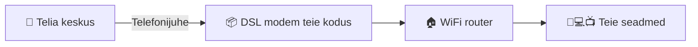

**Kuidas töötab:**

* Telefon kasutab madalaid sagedusi (0-4 kHz)
* Internet kasutab kõrgemaid sagedusi (25 kHz - 1 MHz)
* Mõlemad saavad korraga töötada

**Plussid:**

* Kasutab olemasolevat infrastruktuuri
* Saadaval peaaegu kõikjal
* Suhteliselt odav

**Miinused:**

* Kiirus väheneb kaugusega telefonikeskusest
* Maksimaalne kaugus ~5 km
* Aeglasem kui teised tehnoloogiad

**Tüüpiline kiirus:** 1-100 Mbps

#### Kaabliühendus

Kasutab **sama kaablit mis televisioon** - koaksiaalkaablit.

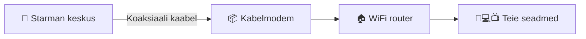

**Kuidas töötab:**

* Kaabel toob nii TV signaalid kui interneti
* Erinevad sagedused erinevateks teenusteks
* HFC (Hybrid Fiber-Coaxial) - fiber pealiinides, koaks kodudesse

**Plussid:**

* Kiire ühendus
* Üks kaabel nii TV kui internetile
* Lai levik linnades

**Miinused:**

* **Jagatud ribalaiusega** - naabrite kasutus mõjutab kiirust
* Aeglasem õhtupoole kui kõik Netflix'i vaatavad
* Pole maal saadaval

**Tüüpiline kiirus:** 100-500 Mbps

#### Fiber Optic (kiudoptika)

Kasutab **valgust** andmete edastamiseks läbi klaaskiudude.

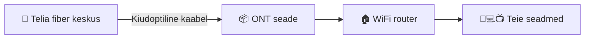

**Kuidas töötab:**

* Valgusimpulsid kannavad andmeid
* Erinevad valguse lainepikkused erinevate suundade jaoks
* Peaaegu valguse kiirusel

**Plussid:**

* **Kõige kiirem** saadaval olev tehnoloogia
* Väga madal latentsus (viivitus)
* Ei häiri elektromagnetilised segadused
* Sümmetriline (sama kiirus üles ja alla)

**Miinused:**

* Kallis paigaldada
* Pole veel kõikjal saadaval
* Nõuab spetsiaalset tehnikat

**Tüüpiline kiirus:** 100 Mbps - 1+ Gbps

### Täiendavad ühenduse valikud

#### Mobiilne andmeside

4G/LTE ja 5G võrgud pakuvad internetiühendust.

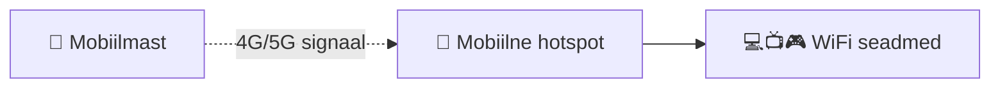

**4G/LTE:**

* Kiirus: 5-50 Mbps
* Hea levik
* Andmelimiidid

**5G:**

* Kiirus: kuni 1+ Gbps
* Väga madal latentsus
* Piiratud levik (praegu põhiliselt linnades)

**Eesti 5G:**

* Tallinnas ja Tartus
* Tele2, Elisa, Telia
* Kiirus võib olla kiirem kui kodune fiber

#### Satelliitühendus

Internet tuleb kosmosest - satelliitidelt.

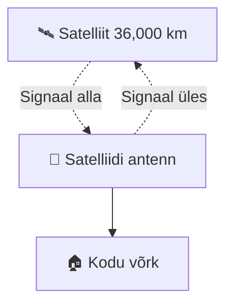

**Traditsiooniline satelliit (GEO):**

* Satelliidid 36,000 km kõrgusel
* Kõrge latentsus (~600ms)
* Sobib kaugematesse piirkondadesse

**Uus põlvkond (LEO - Low Earth Orbit):**

* Starlink, OneWeb
* Satelliidid 500-2000 km kõrgusel
* Madalam latentsus (~50ms)
* Kiiremad kiirused

### ISP valik - millega arvestada?

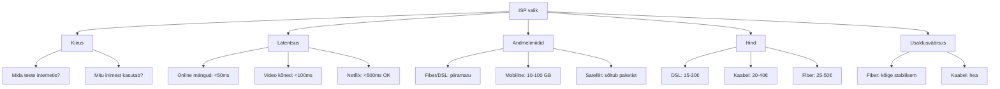

---

## 2.4 Kokkuvõte

Selles moodulis käsitlesime võrkude põhikomponente ja internetiühenduse valikuid:

### Peamised õpitud kontseptsioonid

**Klient-serveri vs P2P:**

* **Klient-server:** keskse kontrolliga, turvaline, skaleeruv (YouTube, Discord, ChatGPT)
* **P2P:** detsentraliseeritud, odavam, kuid keerulisem hallata (BitTorrent, Blockchain)

**Võrgukomponendid:**

* **Lõppseadmed:** kasutavad võrku (PC, telefon, printer, server)
* **Infrastruktuur:** aitavad andmetel liikuda (switch, router, kaablid)

**ISP ühendused 2025:**

* **DSL:** telefonijuhe, odav, kaugusest sõltuv (15-40€)
* **Kaabel:** TV-kaabel, kiire, jagatud ribalaiusega (25-50€)
* **Fiber:** kõige kiirem ja stabiilsem, kuni 10 Gbps (30-80€)
* **5G:** mobiilne, kuni 2+ Gbps, andmelimiitidega (20-60€)
* **Starlink:** satelliit, kaugematesse kohtadesse (50-100€)

### Praktiline rakendamine

**IT-spetsialisti vaates:**

* Mõistke klientide vajadusi võrgu planeerimisel
* Oskate soovitada sobivat ISP tehnoloogiat
* Tunnete võrgukomponentide rolle probleemide lahendamisel

**Igapäevaelus:**

* Teate, miks teie seadmed mõnikord on kliendid, mõnikord serverid
* Oskate valida sobivat internetipaketti
* Mõistate, miks erinevad ühendused erinevalt töötavad

---

## Kontrollküsimused

1. **Kontseptuaalsed küsimused:**

   * Selgitage erinevust kliendi ja serveri vahel. Tooge kolm tänapäevast näidet.
   * Millistes olukordades on P2P võrk parem kui klient-serveri mudel?
   * Kas ChatGPT kasutab klient-serveri või P2P mudelit? Põhjendage.

2. **Tehnilised küsimused:**

   * Klassifitseerige järgmised seadmed kas lõppseadmeteks või infrastruktuuriks: laptop, switch, smart TV, router, nutitelefon, access point.
   * Miks on fiber optic ühendus kiirem kui DSL? Selgitage tehniliselt.
   * Võrrelge 5G ja fiber interneti eeliseid ning puuduseid.

3. **Praktilised stsenaariumid:**

   * Millist ISP ühendust soovitaksite järgmistele kasutajatele ja miks?

     * Online mängur, kes vajab madalat latentsust
     * Perekond, kes vaatab palju 4K/8K videoid
     * Kodukontori töötaja, kes teeb videokõnesid
     * Maapiirkonna elanik, kus kaabel pole võimalik

4. **Tuleviku tehnoloogiad:**

   * Kuidas muudab 6G ühiskonda (2030+)?
   * Miks on Starlink oluline Eesti maapiirkondade jaoks?