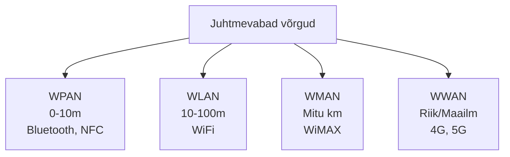
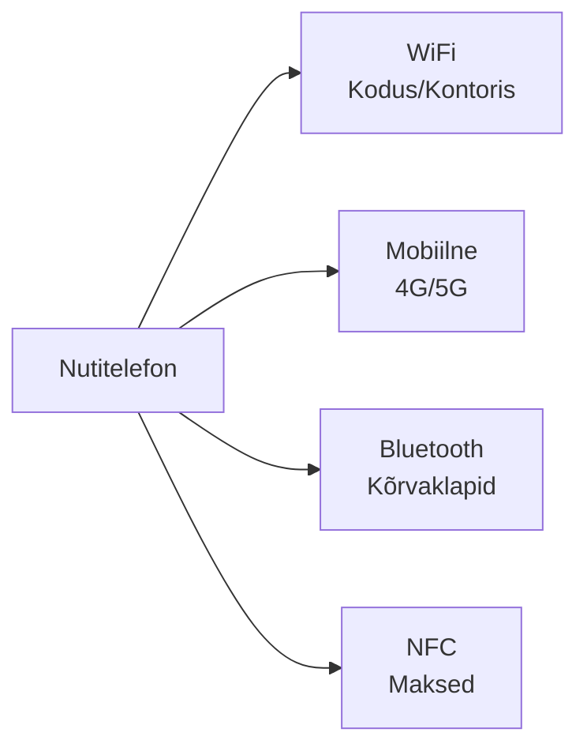
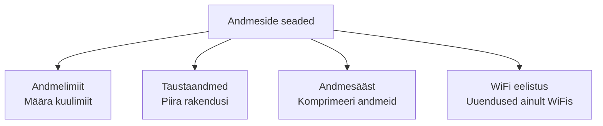
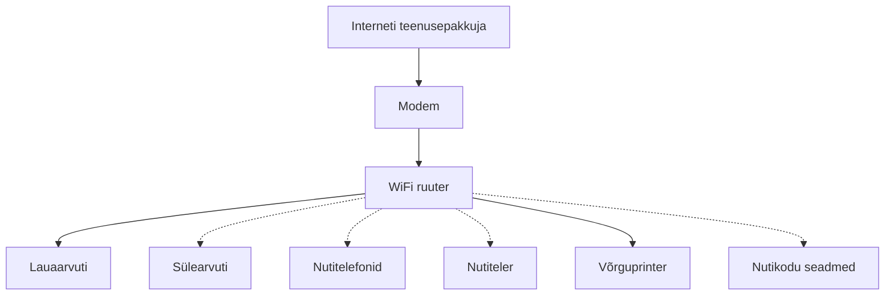
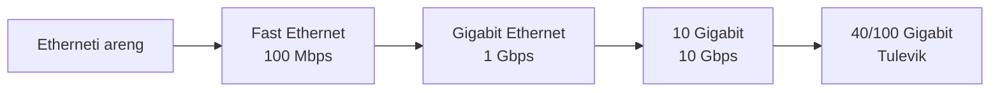
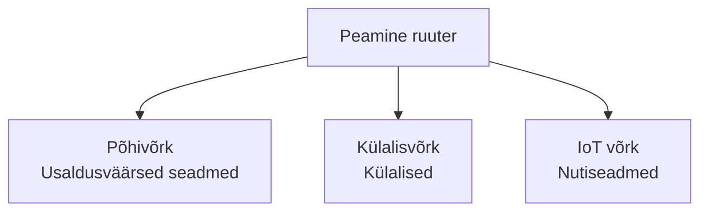

# Loeng 3: Juhtmevabad ja mobiilsed võrgud

## 3.0 Sissejuhatus

### 3.0.1 Miks peaksin seda moodulit õppima?

Tänapäeval on juhtmevabad tehnoloogiad igal pool


### 3.0.2 Mida ma selles moodulis õpin?

- Erinevad juhtmevabad võrgutüübid
- Mobiilseadmete võrguseaded
- WiFi standardid ja konfiguratsioon
- Bluetooth paaristamine
- Andmeside tehnoloogiad (4G, 5G)

---

## 3.1 Juhtmevabad võrgud

### 3.1.1 Juhtmevabade võrkude tüübid



#### WPAN (Wireless Personal Area Network)
**Isiklik võrk - teie ümber**

- **Ulatus:** 0-10 meetrit
- **Kiirus:** 1-3 Mbps (Bluetooth), 424 kbps (NFC)
- **Kasutus:** Kõrvaklapid, nutikell, arvutihiir
- **Eelised:** Väike energiatarve, lihtne ühendada
- **Puudused:** Lühike ulatus, aeglane kiirus

**Näited igapäevaelust:**
- AirPods ühendus telefoniga
- Smartwatch sünkroonimine
- Kontaktivaba maksmine poes
- Auto hands-free süsteem

#### WLAN (Wireless Local Area Network)
**Kohalik võrk - kodu või kontor**

- **Ulatus:** 10-100 meetrit (siseruumides)
- **Kiirus:** 54 Mbps kuni 9.6 Gbps (WiFi 6)
- **Kasutus:** Kodune internet, kontori võrk
- **Eelised:** Kiire, mugav, palju seadmeid
- **Puudused:** Seinte läbimine, häired

**WiFi sagedused:**
- **2.4 GHz:** Parem levi, aeglasem
- **5 GHz:** Kiirem, lühem ulatus
- **6 GHz:** Ülikiire, väga lühike ulatus (WiFi 6E)

#### WMAN (Wireless Metropolitan Area Network)
**Linnavõrk - terve linn**

- **Ulatus:** Kuni 50 km
- **Tehnoloogia:** WiMAX (praegu vähe kasutusel)
- **Asendatud:** 4G/5G võrkudega
- **Kasutus:** Avalik WiFi, linna teenused

#### WWAN (Wireless Wide Area Network)
**Lai võrk - riik või maailm**

- **Ulatus:** Riigi- või maailmatasand
- **Tehnoloogiad:** 3G, 4G LTE, 5G
- **Kiirus:** 5 Mbps (3G) kuni 10 Gbps (5G)
- **Kasutus:** Mobiilne internet

**Põlvkonnad:**
- **3G (2001):** 384 kbps - 2 Mbps
- **4G LTE (2010):** 100 Mbps - 1 Gbps
- **5G (2019):** 1 Gbps - 10 Gbps

### 3.1.2 Telefoni interaktsioonid erinevate võrkudega

Nutitelefon oskab automaatselt valida parima võrgu:



**Võrgu prioriteedid:**
1. **WiFi** - kui saadaval (säästab mobiilset andmemahtu)
2. **Mobiilne** - kui WiFi pole või on nõrk
3. **Bluetooth** - alati taustal aksessuaaride jaoks
4. **NFC** - aktiveerub vajadusel

**Näide:** YouTube video vaatamine
- Kodus: WiFi (tasuta, kiire)
- Bussis: 4G/5G (kasutab andmemahtu)
- Üleminekul: automaatne vahetus

### 3.1.3 Muud juhtmevabad võrgud

#### Satelliitinternet

**Traditsiooniline (GEO):**
- Satelliit 36,000 km kõrgusel
- Latentsus: 500-600ms
- Kiirus: 25-100 Mbps
- Sobib kaugetesse kohtadesse

**Uus põlvkond (LEO - Starlink):**
- Satelliidid 500-2000 km kõrgusel
- Latentsus: 20-40ms
- Kiirus: 50-200 Mbps
- Eestis saadaval 2023+

#### RFID (Radio Frequency Identification)

**Kasutusalad:**
- Uksekaarid kontoris
- Bussikaart (Ühiskaart)
- Kauba jälgimine laos
- Lemmiklooma kiip

#### IoT võrgud

**LoRaWAN:**
- Ulatus: kuni 15 km
- Väga väike energiatarve
- Temperatuuriandurid, niiskuseandurid

**NB-IoT:**
- Kasutab mobiilsidevõrku
- Nutikad elektri/gaasi/veearvestid

### 3.1.4 Enesekontroll - Juhtmevabad võrgud

**Põhimõisted:**
- Juhtmevabad võrgud kasutavad raadiolaineid
- Erinevad sagedused erinevateks otstarbeteks
- Kompromiss ulatuse, kiiruse ja energiatarbe vahel
- Kõrgem sagedus = kiirem, aga lühem ulatus

---

## 3.2 Mobiilseadmete ühenduvus

### 3.2.1 Mobiilseadmed ja WiFi

**Levinumad WiFi probleemid ja lahendused:**

| Probleem | Võimalik põhjus | Lahendus |
|----------|-----------------|----------|
| Ei näe võrku | Peidetud SSID | Sisesta võrgu nimi käsitsi |
| Ei ühendu | Vale parool | Kontrolli parooli |
| Aeglane kiirus | Häired | Vaheta kanalit |
| Pidev katkemine | Energiasääst | Muuda energiaseadeid |
| Nõrk signaal | Kaugus ruuterist | Liigu lähemale |

### 3.2.2 WiFi seaded

**Olulised WiFi konfiguratsioonid:**

**Turvalisuse protokollid (nõrgimast tugevaimani):**
1. **Avatud** - Krüpteerimata (ÄRA KASUTA!)
2. **WEP** - Vananenud, kergesti murutav (1999)
3. **WPA** - Parem, aga ikka nõrk (2003)
4. **WPA2** - Praegune miinimum standard (2004)
5. **WPA3** - Uusim ja turvaline (2018)

**Sageduse valik:**
- **2.4 GHz:** Parem levi maja ulatuses
- **5 GHz:** Kiirem, vähem häireid
- **Automaatne:** Lase ruuteril valida

### 3.2.3 Mobiilse WiFi ühenduse konfigureerimine

**Android seadistus:**
1. Seaded → Võrk ja internet → WiFi
2. Lülita WiFi sisse
3. Vali võrk nimekirjast
4. Sisesta parool
5. Täpsemad seaded → Staatiline IP (vajadusel)

**iOS seadistus:**
1. Seaded → WiFi
2. Lülita WiFi sisse
3. Vali võrk
4. Sisesta parool
5. Võrgu info → Konfigureeri IP (vajadusel)

**Nõuanded:**
- Salvesta usaldusväärste võrkude paroolid
- Väldi avalikke krüptimata võrke
- Kasuta VPN-i avalikes kohtades

### 3.2.4 Mobiilse andmeside seaded

**Andmemahu haldamine:**



**Eesti operaatorite APN seaded:**

**Telia:**
- APN: internet.telia.ee
- Kasutajanimi: (tühi)
- Parool: (tühi)

**Elisa:**
- APN: internet
- Kasutajanimi: (tühi)
- Parool: (tühi)

**Tele2:**
- APN: internet.tele2.ee
- Kasutajanimi: (tühi)
- Parool: (tühi)

### 3.2.5 Bluetoothi konfigureerimine Windows sülearvutis

**Windows 11 seadistus:**
1. Start → Seaded → Bluetooth ja seadmed
2. Lülita Bluetooth sisse
3. Lisa Bluetooth või muu seade
4. Vali seadme tüüp:
   - Bluetooth (hiired, klaviatuurid, kõlarid)
   - Ekraan või dokk
   - Kõik muu

### 3.2.6 Lihtne ühenduvus Bluetoothiga

**Bluetoothi profiilid ja kasutus:**

| Profiil | Kasutus | Näited |
|---------|---------|--------|
| A2DP | Kvaliteetne heli | Muusika kuulamine |
| HFP | Hands-free kõned | Auto Bluetooth |
| HID | Sisendseadmed | Hiir, klaviatuur |
| PAN | Interneti jagamine | Telefoni hotspot |
| BLE | Madal energiatarve | Fitness tracker |

### 3.2.7 Bluetoothi paaristamine

**Paaristamise protsess:**


**Turvalisuse nõuanded:**
- Paarista ainult tuntud seadmetega
- Lülita Bluetooth välja kui ei kasuta
- Eemalda vanad paaristused
- Ära nõustu tundmatute paaristustega

### 3.2.8 Tutvu oma mobiilseadme võrguseadetega

**Mida kontrollida:**
- Praegune IP aadress
- Ühendatud võrgu info
- Andmemahu kasutus
- Salvestatud võrgud
- VPN seaded

**Harjutus:** Leidke oma telefonis:
1. WiFi MAC aadress
2. Praegune IP aadress
3. Tänane andmemahu kasutus
4. Salvestatud WiFi võrkude arv

---

## 3.3 Juhtmevabade ja mobiilsete võrkude kokkuvõte

### 3.3.1 Mida ma selles moodulis õppisin?

**Peamised teemad:**
- ✅ Erinevad juhtmevabad võrgud (WPAN, WLAN, WMAN, WWAN)
- ✅ WiFi konfiguratsioon ja turvalisus
- ✅ Mobiilseadmete võrguseaded
- ✅ Bluetooth ühendused
- ✅ Andmeside haldamine

### 3.3.2 Arutelu küsimused

1. Miks valida 5GHz WiFi 2.4GHz asemel?
2. Millist turvalisuse protokolli kasutada WiFi jaoks?
3. Millal on satelliitinternet parim valik?
4. Kuidas vähendada mobiilse andmemahu kasutust?

---

# Moodul 4: Koduvõrgu ehitamine

## 4.0 Sissejuhatus

### Miks ehitada koduvõrk?

**Tänapäeva kodus on palju seadmeid:**
- Arvutid ja sülearvutid
- Nutitelefonid ja tahvelarvutid
- Nutikad telerid
- Mängukonsoolid
- Nutikodu seadmed
- Turvakaameraid

**Hästi planeeritud koduvõrk tagab:**
- Kiire interneti kõigile
- Turvalise ühenduse
- Stabiilse töö
- Lihtsa haldamise

---

## 4.1 Koduvõrgu põhitõed

### 4.1.1 Tüüpiline koduvõrgu ülesehitus



**Ühenduse tüübid:**
- Pidevjoon = Kaabliga (Ethernet)
- Katkendjoon = WiFi

### 4.1.2 Koduvõrgu komponendid

#### Põhikomponendid

**1. Modem**
- Ühendab ISP-ga
- Muundab signaali (kaabel/DSL/fiber → Ethernet)
- Tavaliselt ISP poolt antud
- Võib olla ühendatud ruuteriga

**2. Ruuter (Router)**
- Loob koduse võrgu
- Jagab IP aadresse (DHCP)
- Pakub WiFi ühendust
- Võrgu turvalisus (firewall)

**3. Ethernet kaablid**
- **Cat5e:** Kuni 1 Gbps (piisav koduseks)
- **Cat6:** Kuni 10 Gbps (tulevikukindel)
- **Cat6a/Cat7:** Professionaalne kasutus

**4. Võrgulüliti (Switch) - valikuline**
- Lisab Ethernet porte
- Ei vaja seadistamist
- Laiendab kaablivõrku

### 4.1.3 Tüüpilised koduvõrgu ruuterid

**Ruuteri omadused vastavalt eelarvele:**

| Omadus | Soodne (30-60€) | Keskmine (60-150€) | Kallis (150€+) |
|--------|-----------------|---------------------|----------------|
| WiFi standard | WiFi 5 (AC) | WiFi 6 (AX) | WiFi 6E/7 |
| Kiirus | AC1200 | AX3000 | AX6000+ |
| Sagedused | Dual-band | Dual-band | Tri-band |
| Ethernet pordid | 4 | 4-8 | 8+ |
| USB pordid | 0-1 | 2 | 2-3 |
| Sobib | 1-2 tuba | 3-4 tuba | Suur maja |

**Populaarsed ruuteri tootjad:**
- **ASUS:** Mängijatele, palju funktsioone
- **TP-Link:** Soodne, hea kvaliteet
- **Netgear:** Usaldusväärne, stabiilne
- **Linksys:** Lihtne seadistada
- **Ubiquiti:** Professionaalne

### 4.1.4 Enesekontroll - Koduvõrgu põhitõed

**Põhipunktid:**
- Modem ühendab internetti
- Ruuter loob koduse võrgu
- Kaabliühendus on kiirem ja stabiilsem
- WiFi on mugav aga võib olla häireid

---

## 4.2 Võrgutehnoloogiad kodus

### 4.2.1 LAN juhtmevabad sagedused

#### 2.4 GHz sagedusala

**Omadused:**
- **Ulatus:** Pikem (läbib seinu paremini)
- **Kiirus:** Aeglasem (kuni 600 Mbps)
- **Kanalid:** 11 USA-s, 13 EL-is
- **Häired:** Rohkem (mikrolaineahi, Bluetooth)

**Sobib:**
- IoT seadmetele
- Tavaliseks veebilehitsemiseks
- Kaugemal ruuterist olevatele seadmetele

#### 5 GHz sagedusala

**Omadused:**
- **Ulatus:** Lühem (seinte läbimine kehv)
- **Kiirus:** Kiirem (kuni 4.8 Gbps)
- **Kanalid:** 24+ mittekattuvat
- **Häired:** Vähem ummistusi

**Sobib:**
- 4K video voogedastusele
- Online mängimisele
- Suurte failide edastamisele
- Ruuteri lähedal olevatele seadmetele

#### 6 GHz sagedusala (WiFi 6E/7)

**Omadused:**
- **Ulatus:** Kõige lühem
- **Kiirus:** Kõige kiirem (kuni 9.6 Gbps)
- **Kanalid:** 59 saadaval
- **Häired:** Minimaalsed (uus sagedus)

**Sobib:**
- VR/AR rakendustele
- 8K voogedastusele
- Ülimadala latentsusega mängimisele

### 4.2.2 Kaabliga võrgutehnoloogiad

#### Etherneti standardid



#### Powerline võrk

**Kasutab elektrijuhtmeid:**
- Kiirus: 200-2000 Mbps
- Sobib raskesti kaabeltatavates kohtades
- Võib olla elektrilisi häireid
- Lihtne paigaldada

#### MoCA (Multimedia over Coax)

**Kasutab TV koakskaableid:**
- Kiirus: kuni 2.5 Gbps
- Väga stabiilne
- Sobib kodudele olemasoleva TV-kaabliga
- Kallis

### 4.2.3 Enesekontroll - Võrgutehnoloogiad

**Võrdlustabel:**

| Tehnoloogia | Kiirus | Usaldusväärsus | Hind | Paigaldus |
|-------------|--------|----------------|------|-----------|
| Ethernet | Suurepärane | Suurepärane | Odav | Keskmine |
| WiFi 2.4GHz | Hea | Hea | Odav | Lihtne |
| WiFi 5GHz | Väga hea | Hea | Odav | Lihtne |
| Powerline | Varieeruv | Rahuldav | Keskmine | Lihtne |
| MoCA | Suurepärane | Suurepärane | Kallis | Keskmine |

---

## 4.3 Juhtmevabad standardid

### 4.3.1 WiFi võrgud

#### WiFi standardite areng

| Standard | Nimi | Max kiirus | Sagedus | Aasta |
|----------|------|------------|---------|-------|
| 802.11b | WiFi 1 | 11 Mbps | 2.4 GHz | 1999 |
| 802.11a | WiFi 2 | 54 Mbps | 5 GHz | 1999 |
| 802.11g | WiFi 3 | 54 Mbps | 2.4 GHz | 2003 |
| 802.11n | WiFi 4 | 600 Mbps | 2.4/5 GHz | 2009 |
| 802.11ac | WiFi 5 | 3.5 Gbps | 5 GHz | 2014 |
| 802.11ax | WiFi 6 | 9.6 Gbps | 2.4/5 GHz | 2019 |
| 802.11ax | WiFi 6E | 9.6 Gbps | 2.4/5/6 GHz | 2020 |
| 802.11be | WiFi 7 | 40+ Gbps | 2.4/5/6 GHz | 2024 |

### 4.3.2 Juhtmevabad seaded

**Olulised WiFi konfiguratsioonid:**

1. **SSID (võrgu nimi)**
   - Tehke unikaalne aga mitte isiklik
   - Vältige vaikenimesid
   - Saab peita (pole soovitatav)

2. **Turvaseaded**
   - Kasutage minimaalselt WPA2
   - WPA3 kui kõik seadmed toetavad
   - Tugev parool (12+ tähemärki)

3. **Kanali valik**
   - 2.4 GHz: Kasutage 1, 6 või 11
   - 5 GHz: Auto töötab hästi
   - Kasutage WiFi analüsaatori rakendusi

4. **Kanali laius**
   - 2.4 GHz: 20 MHz (vältige 40 MHz)
   - 5 GHz: 40 või 80 MHz
   - Laiem = kiirem aga rohkem häireid

### 4.3.3 Enesekontroll - Juhtmevabad standardid

**Parimad praktikad:**
- Kasutage uusimat standardit mida seadmed toetavad
- Eraldage IoT seadmed külalisvõrku
- Regulaarsed püsivara uuendused
- Muutke vaikeparoolid

---

## 4.4 Koduvõrgu ruuteri seadistamine

### 4.4.1 Esmakordne seadistamine

#### Samm-sammult ruuteri seadistus

**1. Füüsiline ühendus**
```
ISP kaabel → Modem → (Ethernet) → Ruuteri WAN port
Ruuteri LAN port → (Ethernet) → Arvuti (seadistamiseks)
```

**2. Ruuteri liidesesse sisenemine**
- Tavaline aadress: 192.168.1.1 või 192.168.0.1
- Vaikeparoolid ruuteri sildil
- Kasutage veebilehitsejat

**3. Seadistusviisardi käivitamine**
- Valige ühenduse tüüp (tavaliselt DHCP)
- Määrake admin parool (muutke vaikeparool!)
- Seadistage WiFi nimi ja parool
- Uuendage püsivara kui pakutakse

**4. Olulised turvaseaded**
- Muutke vaikimisi admin kasutajanimi/parool
- Keelake WPS (WiFi Protected Setup)
- Lubage WPA2/WPA3
- Keelake kaughaldus
- Uuendage püsivara

### 4.4.2 Disaini kaalutlused

#### Võrgu planeerimine

**Seadmete inventuur:**
- Loendage kõik ühendatavad seadmed
- Märkige ribalaiuse vajadused
- Tuvastage kaabel vs WiFi vajadused

**Ruuteri asukoht:**
- Keskne asukoht
- Kõrgel positsioonil
- Eemal häirete allikatest
- Mitte suletud kappides

**Võrgu segmenteerimine:**


### 4.4.3 Juhtmevaba ruuteri ja kliendi konfigureerimine

#### Täpsemad ruuteri seaded

**QoS (Quality of Service):**
- Prioritiseeri seadmeid/rakendusi
- Ribalaiuse jaotamine
- Mängude/voogedastuse optimeerimine

**Pordi suunamine:**
- Serverite/mängude jaoks
- Turvarisk - kasutage ettevaatlikult
- Kaaluge UPnP alternatiive

**DHCP seaded:**
- IP vahemiku konfigureerimine
- Staatilised IP määrangud
- DNS serveri seaded

### 4.4.4 Packet Traceri harjutus

**Stsenaarium:**
1. Lisa juhtmevaba ruuter
2. Lisa 2 arvutit ja 2 sülearvutit
3. Konfigureeri ruuter:
   - SSID: KoduVork
   - Parool: Turvaline123
   - Turvalisus: WPA2-PSK
   - Kanal: 6

**Kontrollimine:**
- Testi `ping` käsuga
- Kontrolli DHCP seadeid
- Vaata ühendatud seadmeid

---

### 4.5. Arutelu küsimused

1. **Turvalisus vs mugavus**
   - Kuidas tasakaalustada lihtsat ligipääsu turvalisusega?
   - Millised riskid on kodukeskkonnas aktsepteeritavad?

2. **Kaabel vs WiFi**
   - Millal on kaabelühendus vajalik?
   - Kui palju seadmeid vajab tegelikult maksimaalset kiirust?

3. **Investeerimisotsused**
   - Kas osta praeguste või tulevaste vajaduste jaoks?
   - Millal on mesh võrk mõistlik?

---

## Lisaressursid

### Soovitatavad tööriistad

**Võrgu testimine:**
- Speedtest.net - Interneti kiirus
- WiFi Analyzer (Android) - Kanalite analüüs
- inSSIDer - WiFi skannimine
- PingPlotter - Ühenduse kvaliteet