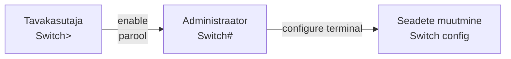

# Loeng 4: Seadmete konfigureerimine
##  Kuidas "rääkida" võrguseadmetega

## Miks me seda õpime?

Kujutage ette, et võrguseade (switch või ruuter) on nagu nutitelefon ilma ekraanita. Kuidas te seda seadistaksite? **Me õpime täna "rääkima" võrguseadmetega** läbi käsurea.

See on nagu:
- WhatsAppi asemel kirjutate SMSe
- Graafilise menüü asemel kirjutate käske
- Arvuti kuulab ja teeb, mida ütlete

---

## Osa 1: Kuidas võrguseadmega ühenduda?

### Analoogia: Telefoni lukust avamine


**Cisco seade töötab samamoodi:**



---

## Osa 2: Kolm põhilist "ruumi" Cisco seadmes

### 1. ESIK - Tavakasutaja režiim 🏠
**Tunnus:** `Switch>`

Nagu maja esik - saate vaadata, aga mitte muuta:
- Vaadata kas internet töötab
- Kontrollida ühendusi
- Testida teiste seadmetega ühendust

```
Switch> show version        ← Mis mudel see on?
Switch> ping 8.8.8.8        ← Kas internet töötab?
```

### 2. ELUTUBA - Administraatori režiim 🔑
**Tunnus:** `Switch#`

Nagu elutuba - rohkem õigusi, saate vaadata kõike:
- Näha kõiki seadeid
- Vaadata paroole
- Salvestada muudatusi

```
Switch> enable              ← "Tahan adminiks"
Switch# show running-config ← Näita kõik seaded
```

### 3. KONTOR - Seadistuste režiim ⚙️
**Tunnus:** `Switch(config)#`

Nagu kontor - siin teete päris muudatusi:
- Muudate nime
- Lisate paroole
- Seadistate võrku

```
Switch# configure terminal      ← "Tahan midagi muuta"
Switch(config)# hostname Kool-SW1  ← Annan uue nime
```

---

## Osa 3: Kõige olulisemad käsud algajale

### TOP 5 käsku mida ALATI vaja

| Käsk | Mida teeb | Millal kasutada |
|------|-----------|-----------------|
| `?` | Näitab abi | Kui ei tea, mida teha |
| `enable` | Saad adminiks | Alguses alati |
| `show ip interface brief` | Näitab kõiki porte | Kontrolli ühendusi |
| `copy run start` | Salvesta töö | Enne väljalülitamist |
| `exit` | Mine tagasi | Kui eksid ära |

### Näide: Esimene kord switchiga

```cisco
Vajuta Enter
Switch>                        ← Oled esikus
Switch> enable                 ← Tahan admin olla
Switch#                        ← Nüüd oled admin
Switch# show ip interface brief  ← Vaata porte

Interface    IP-Address    Status    Protocol
Fa0/1        unassigned    up        up        ← Port töötab!
Fa0/2        unassigned    down      down      ← Port ei tööta
```

---

## Osa 4: Praktiline näide - Anname switchile nime

### Samm-sammult juhend

**1. ÜHENDU** (nagu telefoni avamine)
```
Vajuta Enter
Switch>
```

**2. SAA ADMINIKS** (nagu administraatori õigused)
```
Switch> enable
Switch#
```

**3. MINE SEADISTUSTESSE** (nagu Settings menüü)
```
Switch# configure terminal
Switch(config)#
```

**4. ANNA UUES NIMI** (nagu telefoni nime muutmine)
```
Switch(config)# hostname Minu-Switch
Minu-Switch(config)#           ← Näed, nimi muutus!
```

**5. VÄLJU SEADISTUSTEST**
```
Minu-Switch(config)# exit
Minu-Switch#
```

**6. SALVESTA** (VÄGA OLULINE!)
```
Minu-Switch# copy running-config startup-config
[Enter]
```

---

## Osa 5: Kuidas mitte eksida?

### Kui eksid ära - ÄRA PAANITESE!

**Kust aru saada, kus sa oled:**

| Mis näed | Kus oled | Kuidas välja |
|----------|----------|--------------|
| `>` | Tavakasutaja | `enable` et saada adminiks |
| `#` | Admin | `conf t` et muuta seadeid |
| `(config)#` | Seadistused | `exit` et minna tagasi |
| `(config-if)#` | Pordi seaded | `exit` et minna tagasi |

### Hädaabi käsud

```cisco
Ctrl+C    ← Katkesta käsk
Ctrl+Z    ← Mine kohe admin režiimi
exit      ← Üks samm tagasi
end       ← Mine kohe admin režiimi
?         ← Näita abi
```

---

## Labori harjutus: Teeme koos!

### Harjutus 1: Switch ärkab ellu

**Eesmärk:** Anda switchile nimi ja parool

```cisco
SAMM 1: Ühendu switchiga
Switch>

SAMM 2: Saa adminiks
Switch> enable
Switch#

SAMM 3: Mine seadistustesse
Switch# configure terminal
Switch(config)#

SAMM 4: Anna nimi (nt oma eesnimi)
Switch(config)# hostname Mari-Switch
Mari-Switch(config)#

SAMM 5: Lisa parool admin režiimile
Mari-Switch(config)# enable secret salajane123
Mari-Switch(config)#

SAMM 6: Välju ja salvesta
Mari-Switch(config)# exit
Mari-Switch# copy run start
```

### Harjutus 2: Vaatame, mis toimub

```cisco
Mari-Switch# show running-config
    ↑ Näitab kõik seaded

Mari-Switch# show ip interface brief
    ↑ Näitab kõik pordid

Mari-Switch# show version
    ↑ Näitab mudeli ja tarkvara
```

---

## Mis juhtub kui midagi valesti läheb?

### Tüüpilised vead ja lahendused

| Probleem | Põhjus | Lahendus |
|----------|--------|----------|
| "Invalid input" | Kirjutasid valesti | Kontrolli õigekirja |
| "Incomplete command" | Käsk poolik | Vajuta ? abi saamiseks |
| "% Access denied" | Pole õigusi | Mine enable režiimi |
| Ei saa ühendust | Vale COM port | Kontrolli Device Manager |
| Tühi ekraan | Seade magab | Vajuta Enter |

## Meelespea enne labori tundi

### Mida kaasa võtta:
- ✅ Sülearvuti
- ✅ See juhend (prinditud või telefonis)
- ✅ Märkmik ja pastakas
- ✅ Julge meel - kõik teevad vigu!

### Mida meeles pidada:
1. **Kirjuta käsud üles** - hiljem on vaja
2. **Küsi abi** - õpetaja on selleks
3. **Ära karda eksida** - seadet ei saa ära rikkuda
4. **Salvesta alati** - `copy run start`

### Kolm kuldreeglit:
1. **?** = sinu parim sõber
2. **exit** = kui eksid ära
3. **copy run start** = enne lõpetamist

---
