# Võrguprotokollid ja mudelid

## Peatükk 1: Miks üldse protokollid?

### Paabeli torni probleem digitaalses maailmas

Alustame ühe looga. Kujutage ette, et olete rahvusvahelisel konverentsil. Ruumis on jaapanlane, kes räägib ainult jaapani keelt, venelane, kes räägib ainult vene keelt, hispaanlane, kes räägib ainult hispaania keelt, ja teie. Kuidas te omavahel suhtlete? Täpselt - te ei suhtle. Või kui suhtlete, siis žestidega, mis on äärmiselt ebaefektiivne.

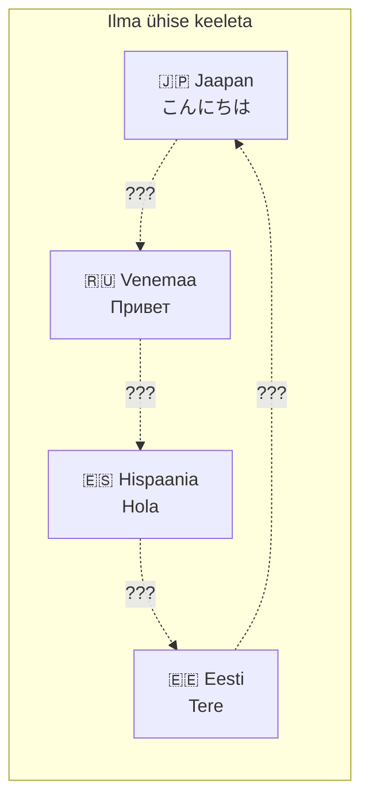
```mermaid
graph LR
    subgraph "Ilma ühise keeleta"
        JP[🇯🇵 Jaapan<br/>こんにちは] -.->|???| RU[🇷🇺 Venemaa<br/>Привет]
        RU -.->|???| ES[🇪🇸 Hispaania<br/>Hola]
        ES -.->|???| EE[🇪🇪 Eesti<br/>Tere]
        EE -.->|???| JP
    end
```

Nüüd kujutage ette, et samas ruumis on tuhat erinevat arvutit - mõned jooksutavad Windowsi, teised Linuxi, kolmandad macOS-i. Mõned on 20 aastat vanad, teised alles eile ostetud. Mõned on Hiinas toodetud, teised USAs, kolmandad Eestis. Kuidas nad omavahel suhtlevad?

### Protokollide teke - Kaosest korra poole

| Aeg | Probleem | Lahendus |
|-----|----------|----------|
| **1960ndad** | Iga tootja oma süsteem | Kaos - keegi ei saa kellegagi suhelda |
| **1970ndad** | IBM räägib IBM-ga, DEC räägib DEC-ga | Väikesed "saarekesed" - ikka probleem |
| **1980ndad** | Vajadus universaalse standardi järele | OSI mudeli loomine (1984) |
| **1990ndad** | Internet plahvatab | TCP/IP võidab de facto standardina |
| **2000ndad** | Mobiilne internet | Samad protokollid, uued väljakutsed |
| **Täna** | IoT, 5G, kvantarvutid | Protokollid arenevad edasi |

Teate, mis juhtuks, kui protokolle poleks? Ma räägin teile tõestisündinud loo. 1970ndatel oli üks suur pank USAs, kes ostis arvuteid kolmelt erinevalt tootjalt - IBM, DEC ja Burroughs. Nad panid need kõik ühte ruumi ja... ei midagi. Arvutid ei saanud omavahel suhelda. Pank pidi palkama inimesi, kes kandsid andmeid ühest arvutist teise KÄSITSI, magnetlintidel. Kujutage ette - 21. sajandi pank, kus andmeid kantakse nagu keskaegset kirja hobuse seljas!

---

## Peatükk 2: OSI mudel - 7 kihti põhjalikult

### Üldine ülevaade - Maja metafoor

OSI mudelit on kõige lihtsam mõista, kui kujutame seda 7-korruselise majana. Teie, kasutaja, elate 7. korrusel - penthouse'is. Teie sõnum peab jõudma teise maja 7. korrusele. Aga sõnum ei saa lihtsalt lennata läbi õhu (kuigi WiFi puhul... aga sellest hiljem). Sõnum peab minema alla esimesele korrusele, siis mööda tänavat teise majja ja seal jälle üles 7. korrusele.

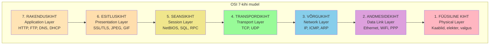
```mermaid
graph TB
    subgraph "OSI 7-kihi mudel"
        A7[7. RAKENDUSKIHT<br/>Application Layer<br/>HTTP, FTP, DNS, DHCP]
        A6[6. ESITLUSKIHT<br/>Presentation Layer<br/>SSL/TLS, JPEG, GIF]
        A5[5. SEANSIKIHT<br/>Session Layer<br/>NetBIOS, SQL, RPC]
        A4[4. TRANSPORDIKIHT<br/>Transport Layer<br/>TCP, UDP]
        A3[3. VÕRGUKIHT<br/>Network Layer<br/>IP, ICMP, ARP]
        A2[2. ANDMESIDEKIHT<br/>Data Link Layer<br/>Ethernet, WiFi, PPP]
        A1[1. FÜÜSILINE KIHT<br/>Physical Layer<br/>Kaablid, elekter, valgus]
    end
    
    A7 --> A6
    A6 --> A5
    A5 --> A4
    A4 --> A3
    A3 --> A2
    A2 --> A1
    
    style A7 fill:#FFE4B5
    style A6 fill:#FFDEAD
    style A5 fill:#F0E68C
    style A4 fill:#98FB98
    style A3 fill:#87CEEB
    style A2 fill:#DDA0DD
    style A1 fill:#FFB6C1
```

### Meeldejätmise nipid

Tudengid küsivad alati, kuidas seda kõike meelde jätta. Siin on paar nippi:

**Inglise keeles (ülalt alla):**  
"**A**ll **P**eople **S**eem **T**o **N**eed **D**ata **P**rocessing"

**Inglise keeles (alt üles):**  
"**P**lease **D**o **N**ot **T**hrow **S**ausage **P**izza **A**way"

**Eesti keeles võite mõelda nii:**  
"**A**rvuti **P**akub **S**ulle **T**ööd **N**utikalt **D**igitaalselt **P**idevalt"

### Kiht 7: Rakenduskiht - Teie aken maailma

Alustame tipust, 7. kihist - rakenduskiht ehk Application Layer. See on kiht, millega teie, kasutaja, otse suhtlete. Kui avate Chrome'i ja sisestate "facebook.com", siis te suhtlete rakenduskihiga.

Mõelge sellest kui restorani menüüst. Te ei pea teadma, kuidas kokk toitu valmistab, milliseid nõusid ta kasutab, kust tulevad toorained. Te lihtsalt tellite "Caesari salat" ja see ilmub teie lauale. Rakenduskiht on see menüü - lihtne, arusaadav liides keerulise süsteemi peale.

| Protokoll | Port | Kasutus | Näide elust |
|-----------|------|---------|-------------|
| **HTTP** | 80 | Veebilehed (turvamata) | http://example.com |
| **HTTPS** | 443 | Turvalised veebilehed | https://internetipank.ee |
| **FTP** | 21 | Failide ülekanne | Firmade failiserverid |
| **SSH** | 22 | Turvaline kaughaldus | Serveri haldamine |
| **Telnet** | 23 | Ebaturvaline kaughaldus | Vana, ära kasuta! |
| **SMTP** | 25 | E-maili saatmine | Gmail saadab kirja |
| **DNS** | 53 | Nimeserver | google.com → IP |
| **DHCP** | 67/68 | IP automaatne | WiFi'ga ühendumine |
| **POP3** | 110 | E-maili allalaadimine | Outlook tõmbab kirjad |
| **IMAP** | 143 | E-maili sünkroonimine | Gmail mitmes seadmes |

Lõbus fakt: Teate, miks veebiaadressid algavad www-ga? World Wide Web - see oli revolutsiooniline idee 1990ndatel. Tim Berners-Lee, kes selle leiutas CERN-is, pidi kolleegidele seletama, et see pole mingi uus arvuti, vaid süsteem, mis ühendab kõik arvutid maailmas. Nad ei uskunud teda alguses! Üks ülemus ütles isegi: "See on huvitav mäng, Tim, aga mine tee nüüd päris tööd ka."

### Kiht 6: Esitluskiht - Tõlk, pakkija ja turvamees

Esitluskiht ehk Presentation Layer on nagu tõlk ÜROs. Kui Jaapani delegaat räägib jaapani keelt, tõlgib tõlk selle inglise keelde, et kõik aru saaksid. Esitluskiht teeb sama - ta tõlgib andmed formaati, mida kõik mõistavad.

Aga see pole kõik! Esitluskiht on ka nagu turvamees ööklubis ja pakkija korraga. 

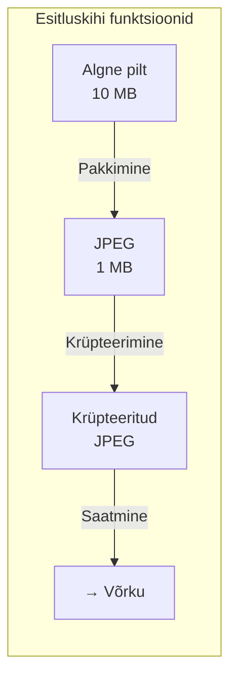
```mermaid
graph LR
    subgraph "Esitluskihi funktsioonid"
        A[Algne pilt<br/>10 MB] -->|Pakkimine| B[JPEG<br/>1 MB]
        B -->|Krüpteerimine| C[Krüpteeritud<br/>JPEG]
        C -->|Saatmine| D[→ Võrku]
    end
```

**Kolm peamist ülesannet:**

1. **Tõlkimine/Kodeerimine**
   - ASCII ↔ EBCDIC
   - UTF-8 ↔ UTF-16
   - Windows-1252 ↔ ISO-8859-1

2. **Pakkimine**
   - JPEG piltide jaoks (vähendab 90%)
   - ZIP failide jaoks
   - MP3 muusika jaoks
   - H.264 video jaoks

3. **Krüpteerimine**
   - SSL/TLS (HTTPS jaoks)
   - Paroolide räsimine
   - VPN tunnelid

Näide elust: Kui saadate WhatsAppi kaudu pildi, siis esitluskiht:
1. Võtab teie 10MB pildi telefonist
2. Pakib selle 1MB JPEG-iks
3. Krüpteerib end-to-end krüpteeringuga
4. Saadab võrku

Vastuvõtja pool toimub vastupidine protsess. Geniaalne, kas pole?

### Kiht 5: Seansikiht - Vestluse korraldaja

Seansikiht ehk Session Layer on nagu konverentsi moderaator. Ta otsustab, kes millal räägib, hoiab vestlust käimas ja lõpetab selle korrektselt.

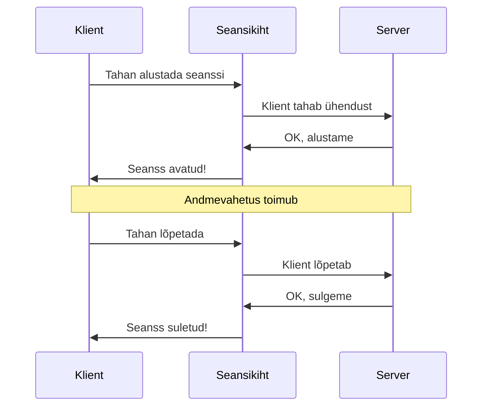
```mermaid
sequenceDiagram
    participant A as Klient
    participant S as Seansikiht
    participant B as Server
    
    A->>S: Tahan alustada seanssi
    S->>B: Klient tahab ühendust
    B->>S: OK, alustame
    S->>A: Seanss avatud!
    Note over A,B: Andmevahetus toimub
    A->>S: Tahan lõpetada
    S->>B: Klient lõpetab
    B->>S: OK, sulgeme
    S->>A: Seanss suletud!
```

**Seansikihi ülesanded:**

| Ülesanne | Kirjeldus | Näide |
|----------|-----------|-------|
| **Loomine** | Alustab uut seanssi | Sisselogimine Gmaili |
| **Haldamine** | Hoiab seanssi aktiivsena | Video streaming |
| **Sünkroonimine** | Checkpoint'id pikaks ülekanneteks | 10GB faili allalaadimine |
| **Lõpetamine** | Sulgeb korrektselt | Väljalogimine |

Praktiline näide: Netflix. Kui vaatate 2-tunnist filmi, siis seansikiht:
- Alustab seanssi, kui vajutate "Play"
- Märgib ära, kus kohast vaatasite (checkpoint)
- Kui internet katkeb ja tuleb tagasi, jätkab samast kohast
- Lõpetab seanssi, kui film läbi või vajutate "Stop"

### Kiht 4: Transpordikiht - Kullerfirma

Transpordikiht on võrgu kullerfirma. Tal on kaks peamist töötajat: TCP ja UDP.

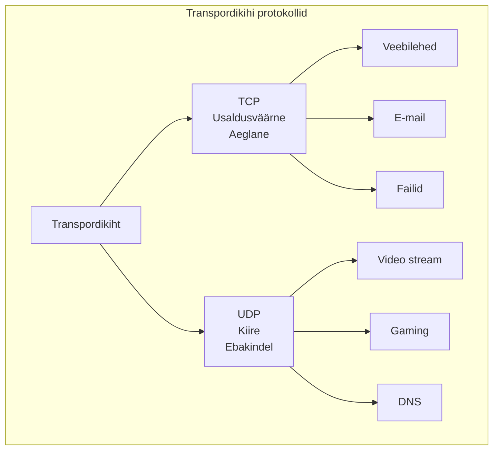
```mermaid
graph TB
    subgraph "Transpordikihi protokollid"
        T[Transpordikiht]
        T --> TCP[TCP<br/>Usaldusväärne<br/>Aeglane]
        T --> UDP[UDP<br/>Kiire<br/>Ebakindel]
        
        TCP --> W[Veebilehed]
        TCP --> E[E-mail]
        TCP --> F[Failid]
        
        UDP --> V[Video stream]
        UDP --> G[Gaming]
        UDP --> D[DNS]
    end
```

**TCP - Tähitud kiri:**

TCP (Transmission Control Protocol) on nagu tähitud kiri. Saatja saab kinnituse, et kiri jõudis kohale. Kui ei jõudnud, saadab uuesti.

| TCP omadused | Kirjeldus |
|--------------|-----------|
| **3-way handshake** | SYN → SYN-ACK → ACK |
| **Järjekorra number** | Iga pakett nummerdatud |
| **Kinnitused** | Iga paketi kohta ACK |
| **Uuesti saatmine** | Kui ACK ei tule, saadab uuesti |
| **Voo kontroll** | Ei ummista võrku |
| **Päise suurus** | 20 baiti |

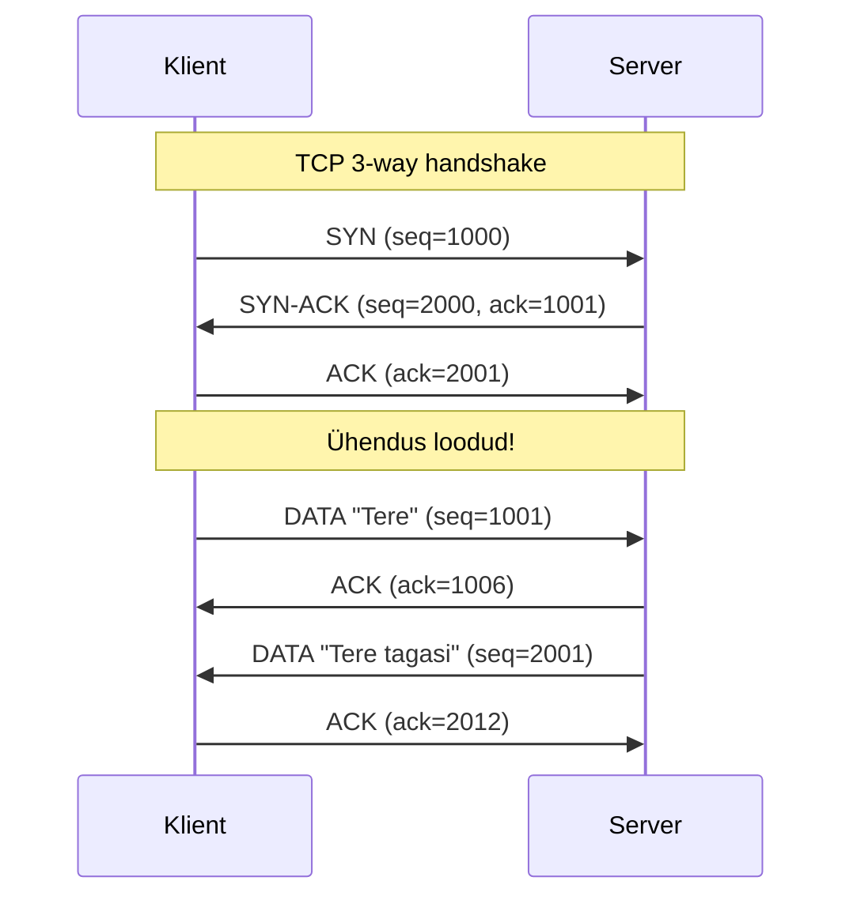
```mermaid
sequenceDiagram
    participant C as Klient
    participant S as Server
    
    Note over C,S: TCP 3-way handshake
    C->>S: SYN (seq=1000)
    S->>C: SYN-ACK (seq=2000, ack=1001)
    C->>S: ACK (ack=2001)
    Note over C,S: Ühendus loodud!
    
    C->>S: DATA "Tere" (seq=1001)
    S->>C: ACK (ack=1006)
    S->>C: DATA "Tere tagasi" (seq=2001)
    C->>S: ACK (ack=2012)
```

**UDP - Postkaart:**

UDP (User Datagram Protocol) on nagu postkaart. Viskan postkasti ja loodan, et jõuab kohale. Kiirem, aga pole garantiid.

| UDP omadused | TCP võrdlus |
|--------------|-------------|
| **Ühenduseta** | TCP vajab ühendust |
| **Kiire** | 3x kiirem kui TCP |
| **Päis 8 baiti** | TCP päis 20 baiti |
| **Ei kontrolli** | TCP kontrollib kõike |
| **"Fire and forget"** | TCP ootab kinnitust |

**Millal TCP, millal UDP?**

Lihtne reegel: Kui andmed PEAVAD kohale jõudma õigesti, kasuta TCP. Kui kiirus on tähtsam kui täpsus, kasuta UDP.

| Kasuta TCP | Kasuta UDP |
|------------|------------|
| Veebilehed (HTTP/HTTPS) | Live video (YouTube Live) |
| E-mail (SMTP, POP3) | Online mängud |
| Failide allalaadimine | VoIP (Skype, Zoom) |
| SSH ühendused | DNS päringud |
| Andmebaasid | DHCP |

### Kiht 3: Võrgukiht - GPS ja teehaldur

Võrgukiht on nagu GPS-süsteem ja teehaldur üheskoos. Ta teab, kus asub iga arvuti maailmas (IP aadress) ja leiab parima tee sinna jõudmiseks (ruutimine).

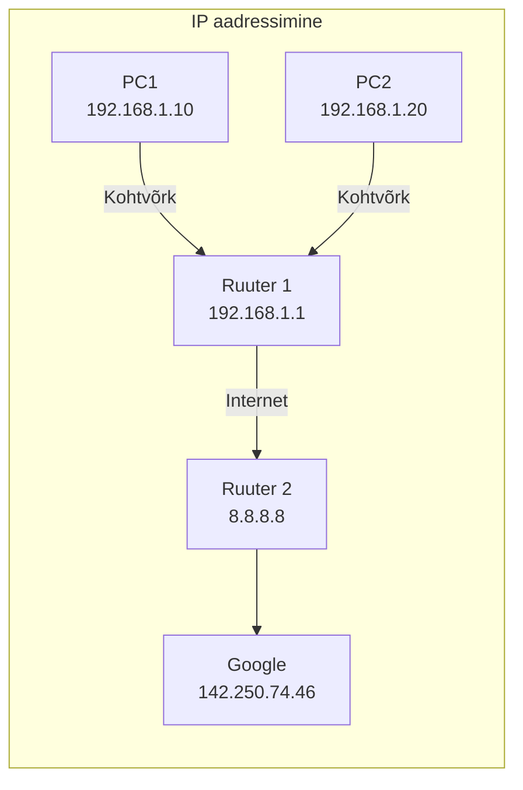
```mermaid
graph LR
    subgraph "IP aadressimine"
        PC1[PC1<br/>192.168.1.10] -->|Kohtvõrk| R1[Ruuter 1<br/>192.168.1.1]
        PC2[PC2<br/>192.168.1.20] -->|Kohtvõrk| R1
        
        R1 -->|Internet| R2[Ruuter 2<br/>8.8.8.8]
        R2 --> G[Google<br/>142.250.74.46]
    end
```

**IP versioonid:**

| | IPv4 | IPv6 |
|--|------|------|
| **Formaat** | 192.168.1.1 | 2001:db8::1 |
| **Bitid** | 32 bitti | 128 bitti |
| **Aadresse** | 4.3 miljardit | 340 sextiljonit |
| **Näide** | 8.8.8.8 | 2001:4860:4860::8888 |
| **Probleem** | Otsas! | Liiga keeruline |

**Ruutimise tabel näide:**

```
Destination     Gateway         Interface
0.0.0.0         192.168.1.1     eth0        (Default)
192.168.1.0/24  0.0.0.0         eth0        (Kohtvõrk)
10.0.0.0/8      192.168.1.254   eth0        (Firmasisene)
8.8.8.8/32      192.168.1.1     eth0        (Google DNS)
```

Huvitav fakt: IPv4 aadresse on maailmas vähem kui inimesi! Sellepärast kasutame NAT-i (Network Address Translation), kus ühe avaliku IP taga võib olla tuhandeid arvuteid.

### Kiht 2: Andmesidekiht - Kohalik postiljon

Andmesidekiht on nagu postiljon teie tänaval. Ta teab kõiki maju numbrite järgi (MAC aadressid) ja toimetab kirju majast majja.

**MAC aadress:**
- 48 bitti pikk (6 baiti)
- Formaat: AA:BB:CC:DD:EE:FF
- Esimesed 3 baiti = tootja
- Viimased 3 baiti = seeria number
- Näide: 00:1B:44 = Cisco seade

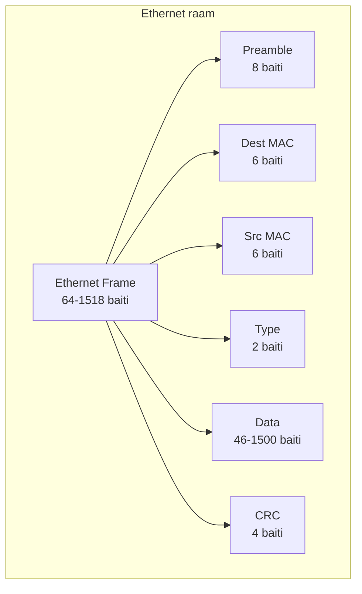
```mermaid
graph TB
    subgraph "Ethernet raam"
        F[Ethernet Frame<br/>64-1518 baiti]
        F --> P[Preamble<br/>8 baiti]
        F --> D[Dest MAC<br/>6 baiti]
        F --> S[Src MAC<br/>6 baiti]
        F --> T[Type<br/>2 baiti]
        F --> DATA[Data<br/>46-1500 baiti]
        F --> CRC[CRC<br/>4 baiti]
    end
```

**Switch'i MAC tabel:**

| Port | MAC aadress | Aeg |
|------|-------------|-----|
| 1 | AA:BB:CC:11:22:33 | 2 min tagasi |
| 2 | DD:EE:FF:44:55:66 | 30 sek tagasi |
| 3 | 11:22:33:44:55:66 | 5 min tagasi |
| 4 | Broadcast: FF:FF:FF:FF:FF:FF | Alati |

### Kiht 1: Füüsiline kiht - Kaablid ja signaalid

Füüsiline kiht on kõige põhilisem - tegelikud kaablid, elekter, valgus, raadiolained. See on nagu teed ja raudteed, mida mööda kõik liigub.

**Meediumi tüübid:**

| Meedium | Kiirus | Kaugus | Kasutus |
|---------|--------|---------|---------|
| **Cat5e** | 1 Gbps | 100m | Kontor |
| **Cat6** | 10 Gbps | 55m | Andmekeskus |
| **Multimode fiber** | 10 Gbps | 550m | Hoone sisene |
| **Singlemode fiber** | 100 Gbps | 40km | Linnade vahel |
| **WiFi 6** | 9.6 Gbps | 50m | Juhtmevaba |
| **5G** | 10 Gbps | 1km | Mobiil |

---

## Peatükk 3: TCP/IP mudel - Päris internet

### OSI vs TCP/IP

Kui OSI on teooria, siis TCP/IP on praktika. Internet töötab TCP/IP mudeli järgi, mis on lihtsam - ainult 4 kihti.

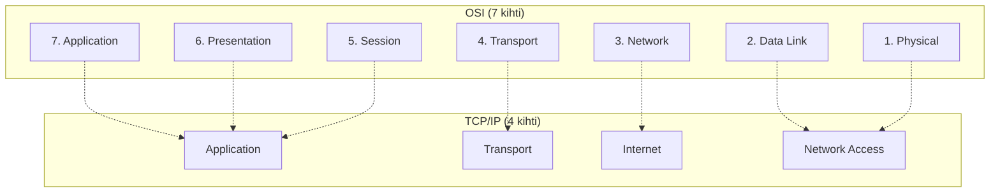
```mermaid
graph TB
    subgraph "OSI (7 kihti)"
        O7[7. Application]
        O6[6. Presentation]  
        O5[5. Session]
        O4[4. Transport]
        O3[3. Network]
        O2[2. Data Link]
        O1[1. Physical]
    end
    
    subgraph "TCP/IP (4 kihti)"
        T4[Application]
        T3[Transport]
        T2[Internet]
        T1[Network Access]
    end
    
    O7 -.-> T4
    O6 -.-> T4
    O5 -.-> T4
    O4 -.-> T3
    O3 -.-> T2
    O2 -.-> T1
    O1 -.-> T1
```

TCP/IP loomise lugu on põnev. 1960ndatel kartis USA kaitseministeerium, et tuumasõja korral hävineb kogu sidesüsteem. Nad tahtsid võrku, mis töötab ka siis, kui pool sellest on hävinud. Nii sündiski ARPANET, Interneti esiisa.

---

## Peatükk 4: Kapseldamine - Vene nukk efekt

### Kuidas andmed "pakkitakse"

Kapseldamine on nagu vene nukk (matrjoška) - iga kiht lisab oma "ümbrise" ümber andmete.

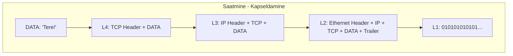
```mermaid
graph TD
    subgraph "Saatmine - Kapseldamine"
        A[DATA: 'Tere!']
        A --> B[L4: TCP Header + DATA]
        B --> C[L3: IP Header + TCP + DATA]
        C --> D[L2: Ethernet Header + IP + TCP + DATA + Trailer]
        D --> E[L1: 010101010101...]
    end
```

**Praktiline näide - E-maili saatmine:**

1. **Rakenduskiht**: "Tere, kuidas läheb?" (300 baiti)
2. **Transpordikiht**: [TCP päis 20B] + [DATA 300B] = 320 baiti
3. **Võrgukiht**: [IP päis 20B] + [TCP 20B] + [DATA 300B] = 340 baiti
4. **Andmesidekiht**: [Eth 14B] + [IP 20B] + [TCP 20B] + [DATA 300B] + [CRC 4B] = 358 baiti
5. **Füüsiline**: 358 × 8 = 2864 bitti elektrit/valgust

Vastuvõtja pool toimub täpselt vastupidine protsess - igal kihil võetakse vastav "ümbris" maha.

---

## Peatükk 5: DNS - Interneti telefoniraamat

### Kuidas DNS töötab

DNS on geniaalne leiutis. Kujutage ette, et peaksite meelde jätma kõigi sõprade telefoninumbrid. Õnneks on meil telefoniraamat - salvestame nime ja telefon helistab numbri järgi. DNS teeb internetis sama.

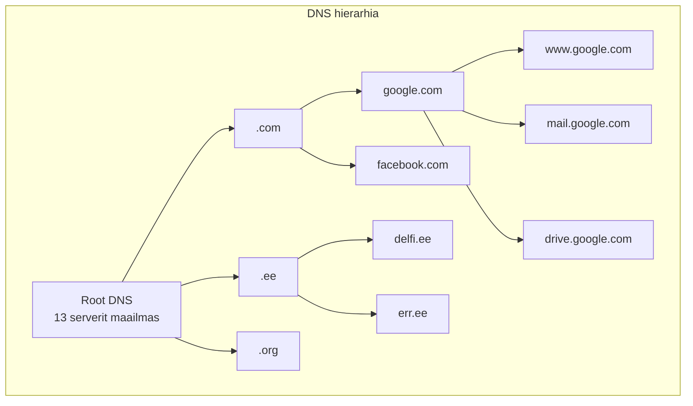
```mermaid
graph TB
    subgraph "DNS hierarhia"
        ROOT[Root DNS<br/>13 serverit maailmas]
        ROOT --> TLD1[.com]
        ROOT --> TLD2[.ee]
        ROOT --> TLD3[.org]
        
        TLD1 --> G[google.com]
        TLD1 --> F[facebook.com]
        
        TLD2 --> D[delfi.ee]
        TLD2 --> E[err.ee]
        
        G --> SUB1[www.google.com]
        G --> SUB2[mail.google.com]
        G --> SUB3[drive.google.com]
    end
```

**DNS päring samm-sammult:**

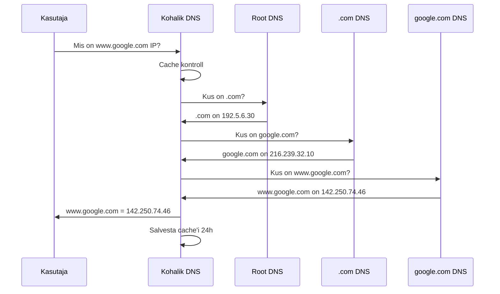
```mermaid
sequenceDiagram
    participant U as Kasutaja
    participant L as Kohalik DNS
    participant R as Root DNS
    participant T as .com DNS
    participant G as google.com DNS
    
    U->>L: Mis on www.google.com IP?
    L->>L: Cache kontroll
    L->>R: Kus on .com?
    R->>L: .com on 192.5.6.30
    L->>T: Kus on google.com?
    T->>L: google.com on 216.239.32.10
    L->>G: Kus on www.google.com?
    G->>L: www.google.com on 142.250.74.46
    L->>U: www.google.com = 142.250.74.46
    L->>L: Salvesta cache'i 24h
```

**DNS kirjete tüübid:**

| Tüüp | Eesmärk | Näide |
|------|---------|-------|
| **A** | IPv4 aadress | google.com → 142.250.74.46 |
| **AAAA** | IPv6 aadress | google.com → 2607:f8b0:4004:c07::71 |
| **CNAME** | Alias/viide | www.example.com → example.com |
| **MX** | E-posti server | gmail.com → gmail-smtp-in.l.google.com |
| **TXT** | Tekst info | SPF, DKIM emaili turvalisuseks |
| **NS** | Nimeserver | example.com → ns1.example.com |

Lõbus fakt: Kogu interneti DNS süsteem algab 13 root serverist. Need on märgitud tähtedega A-M. Eesti kõige lähemal on I-root Stockholmis ja K-root Helsingis. Kui kõik 13 kukuksid korraga, lakkaks internet töötamast umbes 24-48 tunni pärast (kui cache aegub).

---

## Peatükk 6: DHCP - Automaatne võlur

### DHCP DORA protsess

DHCP on nagu kinnisvaramaakler - ta annab teile ajutise "aadressi" võrgus ja uuendab seda vajadusel.

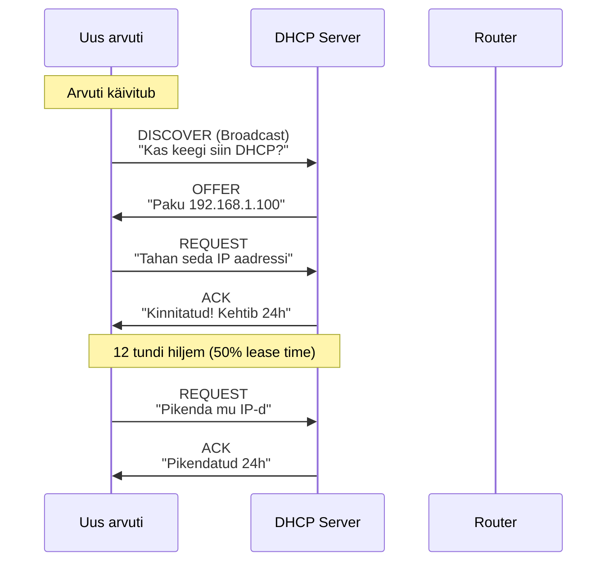
```mermaid
sequenceDiagram
    participant C as Uus arvuti
    participant D as DHCP Server
    participant R as Router
    
    Note over C: Arvuti käivitub
    C->>D: DISCOVER (Broadcast)<br/>"Kas keegi siin DHCP?"
    D->>C: OFFER<br/>"Paku 192.168.1.100"
    C->>D: REQUEST<br/>"Tahan seda IP aadressi"
    D->>C: ACK<br/>"Kinnitatud! Kehtib 24h"
    
    Note over C,D: 12 tundi hiljem (50% lease time)
    C->>D: REQUEST<br/>"Pikenda mu IP-d"
    D->>C: ACK<br/>"Pikendatud 24h"
```

**DHCP pakub järgmist infot:**

| Parameeter | Näide | Miks vaja? |
|------------|-------|------------|
| **IP Address** | 192.168.1.100 | Teie aadress võrgus |
| **Subnet Mask** | 255.255.255.0 | Võrgu suurus |
| **Default Gateway** | 192.168.1.1 | Värav internetti |
| **DNS Servers** | 8.8.8.8, 8.8.4.4 | Nimede tõlkimine |
| **Lease Time** | 86400 (24h) | Kui kaua IP kehtib |
| **Domain Name** | company.local | Võrgu nimi |

**DHCP Relay:**

Suurtes võrkudes on DHCP server ühes kohas, aga kliendid üle terve maja. DHCP Relay on nagu postkast - kogub kokku päringud ja edastab serverile.

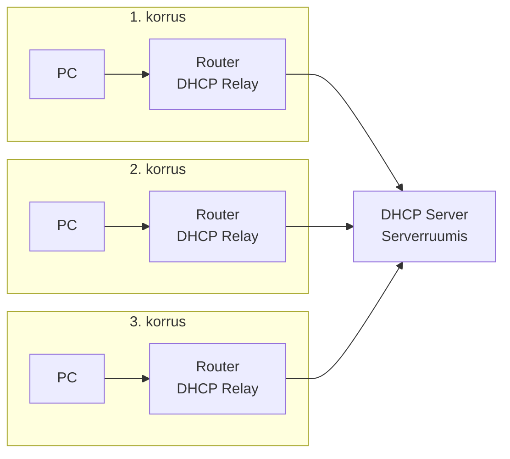
```mermaid
graph LR
    subgraph "1. korrus"
        PC1[PC] --> R1[Router<br/>DHCP Relay]
    end
    
    subgraph "2. korrus"
        PC2[PC] --> R2[Router<br/>DHCP Relay]
    end
    
    subgraph "3. korrus"
        PC3[PC] --> R3[Router<br/>DHCP Relay]
    end
    
    R1 --> DHCP[DHCP Server<br/>Serverruumis]
    R2 --> DHCP
    R3 --> DHCP
```

---

## Peatükk 7: ARP - Sild IP ja MAC vahel

### ARP - Address Resolution Protocol

ARP on nagu tõlk IP maailma (kiht 3) ja MAC maailma (kiht 2) vahel. 

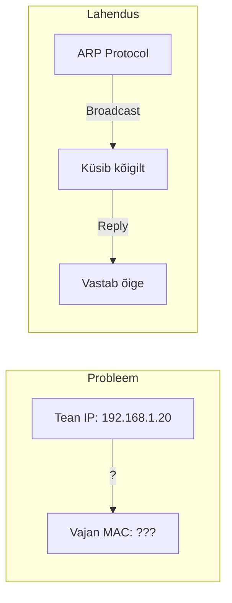
```mermaid
graph LR
    subgraph "Probleem"
        IP[Tean IP: 192.168.1.20] -->|?| MAC[Vajan MAC: ???]
    end
    
    subgraph "Lahendus"
        ARP[ARP Protocol] -->|Broadcast| ALL[Küsib kõigilt]
        ALL -->|Reply| TARGET[Vastab õige]
    end
```

**ARP päring:**

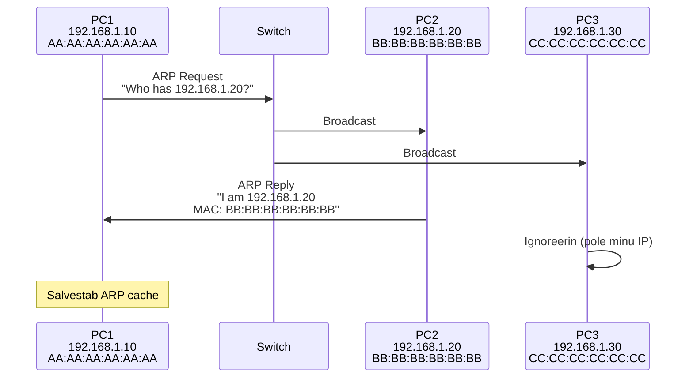
```mermaid
sequenceDiagram
    participant A as PC1<br/>192.168.1.10<br/>AA:AA:AA:AA:AA:AA
    participant S as Switch
    participant B as PC2<br/>192.168.1.20<br/>BB:BB:BB:BB:BB:BB
    participant C as PC3<br/>192.168.1.30<br/>CC:CC:CC:CC:CC:CC
    
    A->>S: ARP Request<br/>"Who has 192.168.1.20?"
    S->>B: Broadcast
    S->>C: Broadcast
    B->>A: ARP Reply<br/>"I am 192.168.1.20<br/>MAC: BB:BB:BB:BB:BB:BB"
    C->>C: Ignoreerin (pole minu IP)
    Note over A: Salvestab ARP cache
```

**ARP cache näide:**

```bash
C:\> arp -a

Interface: 192.168.1.10 --- 0x3
  Internet Address      Physical Address      Type
  192.168.1.1          00-11-22-33-44-55     dynamic
  192.168.1.20         BB-BB-BB-BB-BB-BB     dynamic
  192.168.1.30         CC-CC-CC-CC-CC-CC     dynamic
  192.168.1.255        ff-ff-ff-ff-ff-ff     static
  224.0.0.22           01-00-5e-00-00-16     static
```

**ARP tüübid:**

| Tüüp | Kirjeldus |
|------|-----------|
| **ARP Request** | Küsib MAC aadressi |
| **ARP Reply** | Vastab MAC aadressiga |
| **RARP** | Reverse ARP - küsib IP aadressi MAC järgi |
| **Proxy ARP** | Router vastab teise seadme eest |
| **Gratuitous ARP** | Teatab oma IP/MAC muutusest |

---

## Peatükk 8: Ruutimine - Kuidas pakid leiavad tee

### Staatilise ja dünaamilise ruutimise võrdlus

Ruutimine on nagu GPS navigatsioon - peab leidma parima tee sihtkohta.

**Staatiline ruutimine:**
```
ip route 192.168.2.0 255.255.255.0 10.0.0.2
ip route 0.0.0.0 0.0.0.0 192.168.1.1
```

**Dünaamiline ruutimine (OSPF näide):**
```
router ospf 1
 network 192.168.1.0 0.0.0.255 area 0
 network 10.0.0.0 0.0.0.3 area 0
```

| | Staatiline | Dünaamiline |
|--|-----------|-------------|
| **Seadistamine** | Käsitsi | Automaatne |
| **Kohanemisvõime** | Ei kohane | Kohaneb muutustega |
| **Ressursid** | Vähe CPU/RAM | Palju CPU/RAM |
| **Turvalisus** | Turvalisem | Võimalik rünnata |
| **Sobib** | Väikesed võrgud | Suured võrgud |

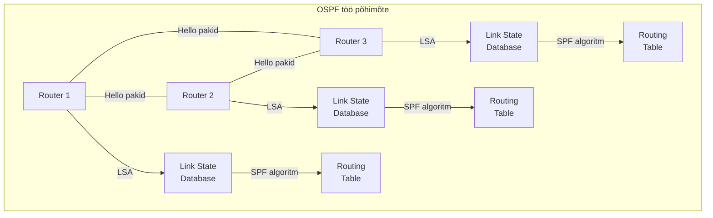
```mermaid
graph TB
    subgraph "OSPF töö põhimõte"
        R1[Router 1] ---|Hello pakid| R2[Router 2]
        R2 ---|Hello pakid| R3[Router 3]
        R3 ---|Hello pakid| R1
        
        R1 -->|LSA| DB1[Link State<br/>Database]
        R2 -->|LSA| DB2[Link State<br/>Database]
        R3 -->|LSA| DB3[Link State<br/>Database]
        
        DB1 -->|SPF algoritm| RT1[Routing<br/>Table]
        DB2 -->|SPF algoritm| RT2[Routing<br/>Table]
        DB3 -->|SPF algoritm| RT3[Routing<br/>Table]
    end
```

---

## Peatükk 9: NAT - Aadresside tõlkimine

### NAT tüübid ja toimimine

NAT (Network Address Translation) on nagu hotelli vastuvõtt - üks avalik aadress, sadu tube sees.

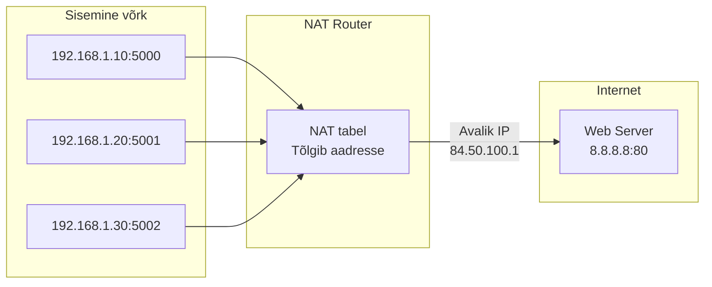
```mermaid
graph LR
    subgraph "Sisemine võrk"
        PC1[192.168.1.10:5000]
        PC2[192.168.1.20:5001]
        PC3[192.168.1.30:5002]
    end
    
    subgraph "NAT Router"
        NAT[NAT tabel<br/>Tõlgib aadresse]
    end
    
    subgraph "Internet"
        WEB[Web Server<br/>8.8.8.8:80]
    end
    
    PC1 --> NAT
    PC2 --> NAT
    PC3 --> NAT
    NAT -->|Avalik IP<br/>84.50.100.1| WEB
```

**NAT tabel näide:**

| Sisemine | Väline | Sihtkoht |
|----------|--------|----------|
| 192.168.1.10:5000 | 84.50.100.1:10000 | 8.8.8.8:80 |
| 192.168.1.20:5001 | 84.50.100.1:10001 | 1.1.1.1:443 |
| 192.168.1.30:5002 | 84.50.100.1:10002 | 4.4.4.4:22 |

---

## Peatükk 10: Turvalisus - HTTPS, SSH vs Telnet

### Krüpteeritud vs krüpteerimata

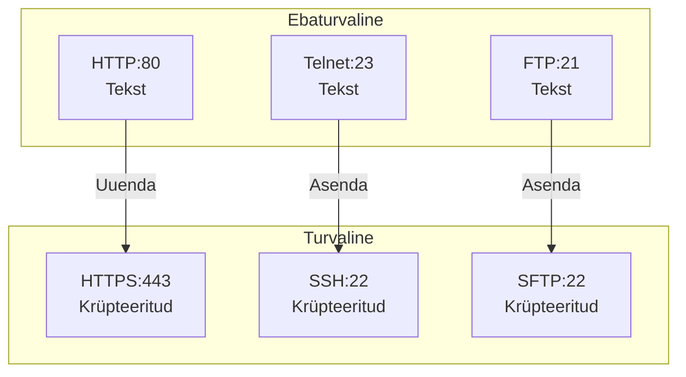
```mermaid
graph TB
    subgraph "Ebaturvaline"
        HTTP[HTTP:80<br/>Tekst]
        Telnet[Telnet:23<br/>Tekst]
        FTP[FTP:21<br/>Tekst]
    end
    
    subgraph "Turvaline"
        HTTPS[HTTPS:443<br/>Krüpteeritud]
        SSH[SSH:22<br/>Krüpteeritud]
        SFTP[SFTP:22<br/>Krüpteeritud]
    end
    
    HTTP -->|Uuenda| HTTPS
    Telnet -->|Asenda| SSH
    FTP -->|Asenda| SFTP
```

**SSL/TLS käepigistus:**

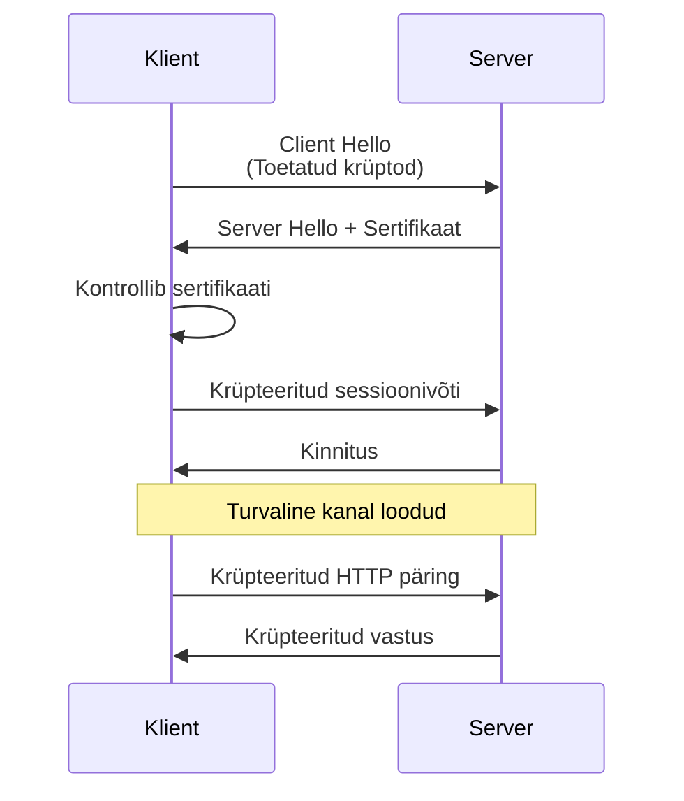
```mermaid
sequenceDiagram
    participant C as Klient
    participant S as Server
    
    C->>S: Client Hello<br/>(Toetatud krüptod)
    S->>C: Server Hello + Sertifikaat
    C->>C: Kontrollib sertifikaati
    C->>S: Krüpteeritud sessioonivõti
    S->>C: Kinnitus
    Note over C,S: Turvaline kanal loodud
    C->>S: Krüpteeritud HTTP päring
    S->>C: Krüpteeritud vastus
```

---

## Kokkuvõte ja järgmised sammud

### Mida me täna õppisime

Me läbisime teekonna bittidest brauseriteni. Nüüd teate:

1. **Miks protokollid on vajalikud** - ilma nendeta oleks kaos
2. **OSI 7 kihti** - teoreetiline mudel
3. **TCP/IP 4 kihti** - praktiline internet
4. **Olulisemad protokollid** - HTTP, DNS, DHCP, TCP/UDP
5. **Kuidas andmed liiguvad** - kapseldamine
6. **Turvalisus** - krüpteerimine on oluline

### Soovitused edasiseks õppimiseks

1. **Praktiline kogemus**: Laadige alla Cisco Packet Tracer (tasuta!)
2. **Wireshark**: Vaadake reaalseid pakette oma võrgus
3. **Sertifikaadid**: CCNA on hea algus
4. **Projektid**: Ehitage kodus oma labor

### Lõppsõnad

Protokollid on nagu keel - mida rohkem praktiseerite, seda paremini mõistate. Ärge kartke eksperimenteerida! 

Tehke Packet Traceris läbi harjutused, mida ma teile saatsin. Järgmine kord vaatame, kuidas need protokollid päris võrgus töötavad.

Küsimusi? Minu email on õppematerjalides.

Aitäh kuulamast ja kohtumiseni järgmisel nädalal, kui räägime võrgu turvalisusest!
