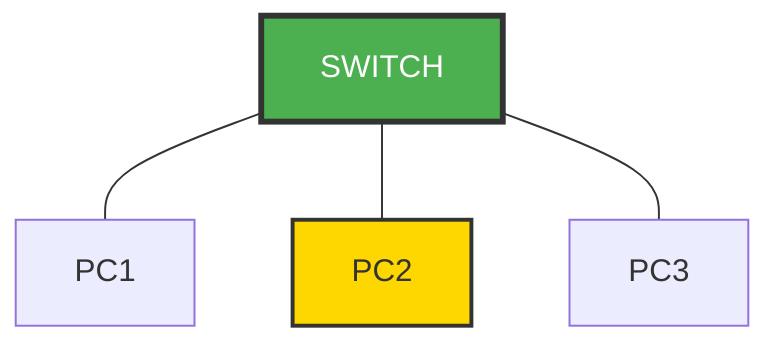
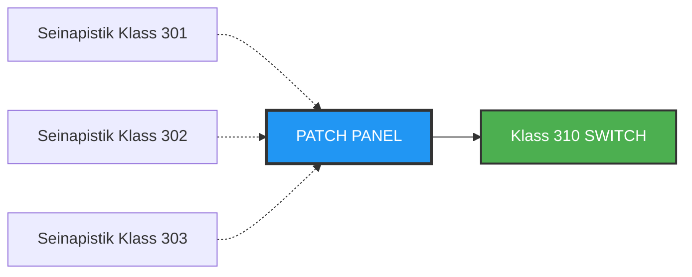

# Nädal 7: OSI Mudel - 1. OSA (Füüsiline ja Kanalikiht)

> [!TIP]
> **Video lingid (vaata kodus):**
> - [Physical Layer](https://www.youtube.com/watch?v=AHV54tqhZU0&list=PLk4NQNr6-L8onI6MaPcfsRZJOvFO3S5D6&index=6)
> - [Number Systems](https://www.youtube.com/watch?v=RdoxJsWzFKc&list=PLk4NQNr6-L8onI6MaPcfsRZJOvFO3S5D6&index=7)
> - [Data Link Layer](https://www.youtube.com/watch?v=eK4s5TQm45c&list=PLk4NQNr6-L8onI6MaPcfsRZJOvFO3S5D6&index=8)
> - [Ethernet Switching](https://www.youtube.com/watch?v=KWm7_vsfdE4&list=PLk4NQNr6-L8onI6MaPcfsRZJOvFO3S5D6&index=9)

---

## 🎯 ÕPPEVÄLJUNDID

**Selle tunni lõpuks sa tead:**

- ✅ Mis on Layer 1 ja millised seadmed seal töötavad (Hub, Repeater)
- ✅ Kuidas UTP kaabel töötab (8 juhet, Lab 6 põhjendus)
- ✅ Half-duplex vs Full-duplex erinevus
- ✅ Mis on MAC aadress ja kuidas see erineb IP aadressist
- ✅ MAC aadressi struktuur (48 bitti, 6 baiti, broadcast = `FF:FF:FF:FF:FF:FF`)
- ✅ Kuidas Ethernet kaader on üles ehitatud (FCS/CRC vigade kontrolliks)
- ✅ Mis vahe on Hub-l ja Switch-l
- ✅ Kuidas switch õpib MAC aadresse (õppimise protsess sammhaaval)
- ✅ Unicast, broadcast ja multicast erinevused

> **💡 QUIZ MÄRKUS:** Pärast tundi on lühike test nende teemade kohta!

---

## Mida me juba teame?

**Nädal 1-3:** Võrgu alused ja seadmete suhtlus.

**Nädal 4-5:** OSI mudel (7 kihti) ja andmete liikumine kihtide vahel.

**Lab 6 (eelmine tund):** EHITASIME UTP kaabli (8 juhet, T-568B, RJ-45 pistikud).

**AGA... jäi küsimus:**

> 🤔 **"Miks see kaabel töötab? Mis juhtmetes toimub? Kuidas arvuti leiab teise arvuti?"**

**Täna saame vastuse!**

---

## 🧩 OSI Mudeli Meeldetuletus

```
    ┌─────────────────────┐
    │ 7. Application      │ ← Brauserid, email
    ├─────────────────────┤
    │ 6. Presentation     │ ← JPEG, HTML
    ├─────────────────────┤
    │ 5. Session          │ ← Ühenduse hoidmine
    ├─────────────────────┤
    │ 4. Transport        │ ← TCP/UDP
    ├─────────────────────┤
    │ 3. Network          │ ← IP aadressid
    ├─────────────────────┤
    │ 2. Data Link        │ ← MAC aadressid  ← TÄNA!
    ├─────────────────────┤
    │ 1. Physical         │ ← Kaablid, signaalid ← TÄNA!
    └─────────────────────┘
```

**Meeldetrikk:** "**A**ll **P**eople **S**eem **T**o **N**eed **D**ata **P**rocessing"

---

## Miks Layer 1 ja 2 koos?

**Analoogia postkastidega:**

- **Layer 1 (Postiljon)** = Füüsiline liikumine uksest uksele
  - Ei tea, mis kirjas sees on
  - Lihtsalt kannab

- **Layer 2 (Aadress uksel)** = "Korter 5B"
  - Postiljon teab KUHU anda
  - Ei tea KES seal elab (see on Layer 3 - IP!)

**Võrgus:**
- **Layer 1** = Elektrilised signaalid (1-d ja 0-d)
- **Layer 2** = Kes saadab, kes võtab vastu (MAC)

---

## 1. FÜÜSILINE KIHT (Layer 1)


### 1.1 Mis on Layer 1?

> 📝 **QUIZ:** Layer 1 nimi on **FÜÜSILINE KIHT** (Physical Layer)

**Füüsiline kiht = kõik, mida saab KÄEGA PUUDUTADA**

| Komponent | Näide |
|-----------|-------|
| Kaablid | UTP (Lab 6 ✅), Fiber |
| Pistikud | RJ-45 |
| Signaalid | Elekter, valgus, raadio |
| Seadmed | Hub, Repeater |

**Ülesanne:** Muuta bitid (1/0) füüsilisteks signaalideks ja transportida.

---

### 1.2 Kuidas Signaalid Liiguvad?

**Näiteks mis toimub sinu kaabliga, mis sa labis valmis tegid**

#### 1.2.1 Vaskkaablid (UTP)

> 📝 **QUIZ:** UTP kaablis on **8 juhet** (4 keerdunud paari)
```
Arvuti A:                    Kaabel:                    Arvuti B:
[Bitid]                   [Elekter]                   [Bitid]
1 0 1 1  ─────────────>  +5V 0V +5V +5V  ─────────────>  1 0 1 1
```

**Straight-through kaabel (otsekaabel):**
- PIN 1-2: TX (saatmine)
- PIN 3-6: RX (vastuvõtt)
- Keerdunud paarid → vähem häireid
- 100 Mbps = 4 juhet, 1 Gbps = 8 juhet

**Auto-MDIX (tänapäev):**
- Vanal ajal: PC ↔ Switch → Straight-through, PC ↔ PC → Crossover
- Nüüd: **IGA** kaabel töötab!
- Auto-MDIX tähendab, et seade (switch või arvuti) tuvastab automaatselt, millist tüüpi kaabel on ühendatud, ja vahetab ise TX ja RX ümber kui vaja.
  
> Lab 6s õppisite KUIDAS need töötavad, praktikas pole crossover enam vaja

---
#### 1.2.2 Fiiberoptilised Kaablid


| Vask | Fiber |
|------|-------|
| Elekter | Valgus (LED/laser) |
| ~100m | Kilomeetrid |
| EMI mõjutab | Immuunne |
| Odav | Kallis |

**Huvitav fakt: Üks kaabel, 12 "kanalit"**

Fiberkaabel võib saata **12 erinevat valguse lainepikkust korraga** (WDM - Wavelength Division Multiplexing).

**Analoogia:**
- Vaskkaabel = 1 tee (ainult üks elektrisignaal)
- Fiberkaabel = 12 teed (12 erinevat valguse lainepikkust)

Nagu raadiojaamad - Raadio 2, Sky Plus, Elmar - kõik õhus korraga, aga erineval sagedusel. Sama siin, aga valgusega!

**Tulemus:** Üks õhuke klaaskiud → 12x rohkem andmeid kui üks vaskkaabel.

---

#### 1.2.3 Wireless (Juhtmevaba)

**Wi-Fi, Bluetooth:**
- Raadiolained (elektromagnetilised)
- Ei vaja kaablit
- Seinad nõrgestavad

| Tehnoloogia | Sagedus | Analoogia | Omadus |
|-------------|---------|-----------|---------|
| **Wi-Fi** | 2.4 GHz / 5 GHz | Raadio (kaugele, läbi seinte) | Multitasking |
| **Bluetooth** | 2.4 GHz | Walkie-talkie (lähile) | Väike energia |
| **5G** | 3.5 GHz | Telefonikõne | Lai katvus |

**Miks Wi-Fi vahel aeglane?**
- 2.4 GHz = läbib seinad, AGA ka mikrolaineahi kasutab 2.4 GHz! 🍕
- 5 GHz = kiirem, AGA seinte puhul nõrgem

**Reegel:** Madalam sagedus → kaugemale, läbi takistuste. Kõrgem → kiirem, aga ei läbi hästi.

---

### 1.3 Võrguseadmed (Layer 1 ja 2)

Need seadmed töötavad erinevatel kihtidel - mõned lihtsalt edastavad signaale, teised MÕTLEVAD, kuhu need saata.


---

#### 1.3.1 Hub (Jaotur) - Layer 1

> 📝 **QUIZ:** Layer 1 seadmed on **Hub** ja **Repeater**

**Mis see teeb?** Kopeerib sissetuleva signaali KÕIGILE portidele.

**Analoogia:** Megafon - kõik kuulevad kõike.

```
     [HUB]
    /  |  \
  PC1 PC2 PC3
```

PC1 saadab → HUB edastab → **kõik** saavad (ka PC3, kes ei vajanud!)

**Kasutus:** Aegunud. Asendatud switchidega.

---

#### 1.3.2 Switch (Kommutaator) - Layer 2

)
)

**Mis see teeb?** Saadab andmed AINULT õigesse kohta (õpib MAC aadresse).

**Analoogia:** Tark postiljon - teab, kes millises korteris elab.



PC1 → PC2: Switch saadab **ainult** porti 2. PC3 ei näe midagi! ✅

**Detailne töö:** Vaata jaotist 2.3 "SWITCHING"

---

#### 1.3.3 Router (Ruuter) - Layer 3


**Mis see teeb?** Ühendab ERINEVAID võrke (kasutab IP aadresse).

**Analoogia:** Lennujaama kontroll - otsustab, millise lennuki peab kuhu suunata.

```
Koduvõrk (192.168.1.x)  ←→  [ROUTER]  ←→  Internet
```

**Vahe Switch'ist:**
- Switch = sama võrgu sees (MAC aadressid, Layer 2)
- Router = erinevate võrkude vahel (IP aadressid, Layer 3)

**Õpime detailselt:** Nädal 7 - Layer 3!

---

#### 1.3.4 Patch Panel (Liidespaneel)


**Mis see teeb?** Kaablite organiseerija - kõik kaablid lähevad siia kokku.

**Analoogia:** Nagu telefonijaama vana lülitustahvel - kõik ühendused ühes kohas.

**Miks vaja?**
- ✅ Korras kaablid (ei ole spagetti)
- ✅ Kiire hooldus (ei pea seinast lahti võtma)
- ✅ Lihtne testimine (näed kohe, mis kaabel kuhu läheb)
- ✅ Professionaalne (serveriruum näeb korralik välja)

**Kuidas töötab?**


---

### 1.4 Half-Duplex vs Full-Duplex

**Kuidas suhtlemine toimub?**


**Full-Duplex eelised:**
- 2x kiirem (100 Mbps → efektiivselt 200 Mbps)
- Ei ole kollisioone
- Ei vaja CSMA/CD-d

**Tänapäeval:** Kõik switchid kasutavad full-duplex režiimi.

---

## 2. KANALIKIHT (Layer 2)


### 2.1 Mis on Layer 2?

> 📝 **QUIZ:** Layer 2 nimi on **KANALIKIHT**

**Kanalikiht = "Kuidas saata andmeid KOHALIKUS võrgus"**

Layer 1 saadab bitte → Layer 2 organiseerib need **kaadriteks** (frames) ja lisab aadressid.

**Layer 2 ülesanded:**
1. 📦 **Framing** - Pakkimine kaadriteks
2. 🏷️ **Addressing** - MAC aadressid
3. ✅ **Error Detection** - Vigade tuvastamine (CRC)
4. 🚦 **Access Control** - Kes saab kaablit kasutada

---

### 2.2 MAC Aadress

**Mis on MAC aadress?**

> 📝 **QUIZ:** MAC aadress on **48 bitti** pikk (= 6 baiti = 12 hex numbrit)

```
AA:BB:CC:DD:EE:FF
│    │    └─────── Seadme unikaalne ID (24 bitti)
└────┴──────────── Tootja ID - OUI (24 bitti)
                   (Organizational Unique Identifier)
```

**Kokku:** 48 bitti = 6 baiti = 12 hex numbrit


---

#### 2.2.1 MAC Aadressi Näited

> 📝 **QUIZ:** MAC aadressi näide: `00:1A:2B:3C:4D:5E` või `AA:BB:CC:DD:EE:FF`

| MAC Aadress | Tootja | Seade |
|-------------|--------|-------|
| `00:1A:2B:3C:4D:5E` | Dell | Arvuti |
| `00:50:56:XX:XX:XX` | VMware | Virtuaalmasin |
| `B8:27:EB:XX:XX:XX` | Raspberry Pi | IoT seade |
| `FF:FF:FF:FF:FF:FF` | - | **BROADCAST** (kõigile!) |

---

#### 2.2.2 MAC vs IP Aadress

| Omadus | MAC Aadress | IP Aadress |
|--------|-------------|------------|
| **Layer** | 2 (Data Link) | 3 (Network) |
| **Tüüp** | Füüsiline, püsiv | Loogiline, muutuv |
| **Ulatus** | Ainult KOHALIK võrk | Globaalne (internet) |
| **Näide** | `AA:BB:CC:DD:EE:FF` | `192.168.1.10` |
| **Määrab** | Tootja (riistvara) | Administrator (tarkvara) |

**Analoogia:**
- **MAC** = Sinu sünnitunnistuse number (ei muutu)
- **IP** = Sinu postiaadress (muutub, kui kolid)

---

### 2.3 Ethernet Kaader (Frame)

**Kuidas andmed liiguvad Layer 2-s?**

Andmed pakitakse Etherneti kaadritesse (frame), mis sisaldavad MAC-aadresse ja kontrolli, et võrguseadmed teaksid, kuhu andmeid saata ja kas need jõudsid vigadeta kohale.


**Kaadri osad:**

1. **Preamble (8 baiti)**
   - 7 baiti: `10101010...` (sünkroniseerimine)
   - 1 bait SFD: `10101011` ("Start Frame Delimiter" - kaader algab!)

2. **Destination MAC (6 baiti)**
   - Sihtkoha aadress (kuhu andmed lähevad)

3. **Source MAC (6 baiti)**
   - Allika aadress (kust andmed tulevad)

4. **Type/Length (2 baiti)**
   - Mis protokoll? (0x0800 = IPv4, 0x0806 = ARP, 0x86DD = IPv6)

5. **DATA (46-1500 baiti)**
   - Tegelikud andmed (Layer 3 ja kõrgemad kihid)
   - Minimum 46 baiti (kui vähem, lisatakse padding)

6. **FCS - Frame Check Sequence (4 baiti)**
   - **CRC** (Cyclic Redundancy Check)
   - Vigade tuvastamine
   - **Oluline:** CRC ainult TUVASTAB vigu, ei PARANDA neid!
   - Kui viga leitud → kaader VISATAKSE ÄRA

> 📝 **QUIZ:** Ethernet frame'is vigade kontrolliks on **FCS** (Frame Check Sequence), mis kasutab **CRC** (Cyclic Redundancy Check) algoritmi

---

### 2.4 Side Tüübid Layer 2-s


Layer 2-s on kolm viisi, kuidas seadmed omavahel suhtlevad - erinevus on selles, mitu seadet paketti vastu võtab.

| **Side Tüüp** | **Dest MAC** | **Tähendus** | **Kasutus** | **Märkused** |
|---------------|--------------|--------------|-------------|--------------|
| **Unicast** | Konkreetne MAC (nt `BB:BB:BB:BB:BB:BB`) | Üks-ühele suhtlus - ainult üks seade võtab vastu | • Veebisirvimine<br>• Failide saatmine<br>• ~90% liiklusest | Kõige levinum |
| **Broadcast** | `FF:FF:FF:FF:FF:FF` | Üks-kõigile suhtlus - KÕIK võrgus võtavad vastu | • ARP ("Kes on IP X?")<br>• DHCP (IP aadressi küsimine) | Liiga palju aeglustab võrku |
| **Multicast** | `01:00:5E:XX:XX:XX` | Üks-grupile suhtlus - ainult grupi liikmed võtavad vastu | • IPTV streaming<br>• Video konverentsid | Efektiivsem kui broadcast |

> 📝 **QUIZ:** Broadcast MAC aadress on **`FF:FF:FF:FF:FF:FF`** (kõik bitid 1)

**Näited:**
```
Unicast:    AA:AA:AA → BB:BB:BB (ainult BB võtab vastu)
Broadcast:  AA:AA:AA → FF:FF:FF (KÕIK võtavad vastu)
Multicast:  AA:AA:AA → 01:00:5E (ainult grupp võtab vastu)
```
---

## 3. SWITCHING (Kommutaatori Töö)

Nüüd saame aru, kuidas switch tegelikult töötab - kuidas ta õpib, kus seadmed asuvad, ja kuidas ta otsustab, kuhu andmeid saata. See on Layer 2 intelligentsus, mis eristab switch'i hub'ist.

### 3.1 Hub vs Switch

**Miks Switch on parem kui Hub?**

> 📝 **QUIZ:** **Hub** = saadab KÕIGILE, ei tea MAC aadresse (Layer 1)  
> 📝 **QUIZ:** **Switch** = saadab AINULT õigesse kohta, õpib MAC aadresse (Layer 2)


| Aspekt | HUB (Layer 1) | SWITCH (Layer 2) |
|--------|---------------|------------------|
| **Intelligentsus** | ❌ Ei tea MAC aadresse | ✅ Õpib MAC aadresse |
| **Liiklus** | Saadab KÕIGILE | Saadab ainult SIHTKOHTA |
| **Kollisioonid** | Palju | Ei ole (full-duplex) |
| **Turvalisus** | Madal (kõik näevad kõike) | Kõrge (isoleeritud liiklus) |
| **Kiirus** | Aeglane (jagatud ribalaius) | Kiire (dedicated ribalaius) |

---

### 3.2 Kuidas Switch Õpib MAC Aadresse?

Switch ei tea alguses midagi - tema MAC aadressi tabel on tühi. Aga iga kaadriga, mis läbi läheb, ta õpib ja saab targemaks.

> 📝 **QUIZ:** Switch õpib MAC aadresse **SOURCE MAC aadressist** ja salvestab need **MAC aadressi tabelisse**


**Õppimise protsess:**
```
     [Switch]
    /   |   \
  PC1  PC2  PC3
  .01  .02  .03
```

**1. PC1 saadab → PC2:**
- Switch loeb SOURCE MAC: `AA:AA:AA:AA:AA:01` → salvestab "PC1 on port 1"
- Switch ei tea, kus PC2 → **FLOODING** (saadab kõigile portidele)

**2. PC2 vastab → PC1:**
- Switch loeb SOURCE MAC: `BB:BB:BB:BB:BB:02` → salvestab "PC2 on port 2"
- Switch TEAB nüüd mõlemat!

**3. PC1 → PC2 (uuesti):**
- Switch vaatab tabelisse → teab, et PC2 on port 2
- Saadab **AINULT** porti 2! PC3 ei näe midagi ✅

**MAC aadressi tabel:**
```
Port | MAC Address           | Age
-----|----------------------|----
1    | AA:AA:AA:AA:AA:01    | 5s
2    | BB:BB:BB:BB:BB:02    | 5s
```

<div style="background-color: #ffe6e6; padding: 10px; border-left: 4px solid #cc0000;">

**Küsimus 1:** Kuidas switch teab, millist MAC aadressi ta vajab?

**Vastus:** Switch EI otsi ega vali MAC aadressi! Arvuti (PC1) paneb juba kaadri sisse:
```
Destination MAC: BB:BB:BB:BB:BB:02  ← PC1 teab, et tahab rääkida PC2-ga
Source MAC: AA:AA:AA:AA:AA:01      ← PC1 enda MAC
```

Switch lihtsalt:
1. Vaatab **DESTINATION MAC** kaadrist
2. Otsib oma tabelist, millises pordis see MAC on
3. Saadab ainult sellesse porti

**Switch ei otsi ega vali - ta lihtsalt VAATAB, mis kaadris juba kirjas on!**

---

**Küsimus 2:** Aga kuidas ARVUTI (PC1) teab, et Destination MAC peab olema `BB:BB:BB:BB:BB:02`?

**Vastus: ARP (Address Resolution Protocol)**

PC1 teab ainult IP aadressi (192.168.1.20), aga ei tea MAC aadressi!

**ARP protsess:**

**1. PC1 saadab ARP Request (BROADCAST):**
```
Frame:
Source MAC: AA:AA:AA:AA:AA:01 (PC1)
Destination MAC: FF:FF:FF:FF:FF:FF (KÕIGILE!)
ARP küsimus: "Kes on IP 192.168.1.20? Anna oma MAC!"
```

**2. PC2 vastab ARP Reply:**
```
Frame:
Source MAC: BB:BB:BB:BB:BB:02 (PC2)
Destination MAC: AA:AA:AA:AA:AA:01 (PC1-le)
ARP vastus: "See olen mina! Minu MAC on BB:BB:BB:BB:BB:02"
```

**3. PC1 salvestab oma ARP cache'i:**
```
IP 192.168.1.20 = MAC BB:BB:BB:BB:BB:02 ✅
```

**4. Nüüd PC1 saab luua õige frame'i:**
```
Frame:
Source MAC: AA:AA:AA:AA:AA:01
Destination MAC: BB:BB:BB:BB:BB:02 ← TEAB NÜÜD!
```

---

**Küsimus 3:** MAC aadressid töötavad ainult lokaalselt?

**Vastus: JAH!** MAC aadressid töötavad AINULT samas võrgus (Layer 2).

**Miks?**
- ARP kasutab broadcast'i (`FF:FF:FF:FF:FF:FF`)
- Broadcast ei lähe läbi ruuteri
- Ruuter peatab broadcast'i

**Samas võrgus:**
```
PC1 (192.168.1.10) → PC2 (192.168.1.20)
✅ ARP töötab, saavad otse rääkida
```

**Erinevas võrgus:**
```
PC1 (192.168.1.10) → Google (8.8.8.8)
❌ Ei saa otse - on teine võrk!
```

---

**Küsimus 4:** Kuidas siis internet töötab, kui MAC on ainult lokaalne?

**Vastus:** MAC aadressid **MUUTUVAD** iga võrgu piires! IP aadressid **JÄÄVAD SAMAKS!**

**Näide: Saadad paketti Google'ile (8.8.8.8)**

**1. Sinu koduvõrgus:**
```
Frame:
Source MAC: Sinu MAC
Destination MAC: RUUTERI MAC ← MITTE Google'i MAC!
───────────────────────────
IP Packet (sees):
Source IP: 192.168.1.10
Dest IP: 8.8.8.8 ← See jääb samaks!
```

**2. Ruuter võtab vana Layer 2 maha, paneb uue:**
```
Frame (uus):
Source MAC: Ruuteri MAC (interneti pool)
Destination MAC: Järgmise ruuteri MAC
───────────────────────────
IP Packet (SAMA):
Source IP: 192.168.1.10 ← Sama!
Dest IP: 8.8.8.8 ← Sama!
```

**3. Iga ruuter kordab:**
- Eemaldab Layer 2 (MAC)
- Paneb uue Layer 2 (järgmise hop'i MAC)
- Layer 3 (IP) jääb ALATI SAMAKS!

**Seega:**
- **Layer 2 (MAC)** = lokaalne transport, muutub iga hop'iga
- **Layer 3 (IP)** = globaalne aadress, jääb samaks kogu tee

**Analoogia:** 
- IP = sihtkoha aadress ümbriku peal (Google'i aadress)
- MAC = postiljoni käru number (muutub iga jaama juures, aga ümbriku aadress jääb samaks)

*(ARP ja IP marsruutimist õpime detailselt Layer 3-s järgmisel nädalal!)*

</div>

## Järgmine Tund: Layer 3 - Võrgukiht

**Õpime:**
- IP aadressid ja alamvõrgud
- Marsruutimine (routing)
- Kuidas andmed liiguvad erinevate võrkude vahel

**Mõtle:**
> MAC aadress töötab ainult kohalikus võrgus. Kuidas saame siis internetti? 🤔

---
